```{=openxml}
<w:p><w:pPr><w:jc w:val="center"/><w:spacing w:before="3600"/></w:pPr><w:r><w:rPr><w:b/><w:sz w:val="72"/></w:rPr><w:t>AB3</w:t></w:r></w:p>
<w:p><w:pPr><w:jc w:val="center"/><w:spacing w:before="200"/></w:pPr><w:r><w:rPr><w:sz w:val="40"/></w:rPr><w:t>Analisador de Ativos da B3</w:t></w:r></w:p>
<w:p><w:pPr><w:jc w:val="center"/><w:spacing w:before="2400"/></w:pPr><w:r><w:rPr><w:sz w:val="24"/></w:rPr><w:t>Cliente: Clube de Investimentos Neoville</w:t></w:r></w:p>
<w:p><w:pPr><w:jc w:val="center"/></w:pPr><w:r><w:rPr><w:sz w:val="24"/></w:rPr><w:t>Responsável no cliente: Prof. Marcos R. Andrade</w:t></w:r></w:p>
<w:p><w:pPr><w:jc w:val="center"/><w:spacing w:before="1200"/></w:pPr><w:r><w:rPr><w:sz w:val="24"/></w:rPr><w:t>Projeto: AB3 — Versão: 0.7</w:t></w:r></w:p>
<w:p><w:pPr><w:jc w:val="center"/><w:spacing w:before="2400"/></w:pPr><w:r><w:rPr><w:sz w:val="24"/></w:rPr><w:t>Curitiba</w:t></w:r></w:p>
<w:p><w:pPr><w:jc w:val="center"/></w:pPr><w:r><w:rPr><w:sz w:val="24"/></w:rPr><w:t>2026</w:t></w:r></w:p>
<w:p><w:r><w:br w:type="page"/></w:r></w:p>
<w:p><w:pPr><w:jc w:val="center"/><w:spacing w:before="2400"/></w:pPr><w:r><w:rPr><w:b/><w:sz w:val="40"/></w:rPr><w:t>AB3</w:t></w:r></w:p>
<w:p><w:pPr><w:jc w:val="center"/><w:spacing w:before="1200"/></w:pPr><w:r><w:rPr><w:sz w:val="24"/></w:rPr><w:t>Responsável no cliente: Prof. Marcos R. Andrade</w:t></w:r></w:p>
<w:p><w:pPr><w:jc w:val="center"/><w:spacing w:before="600"/></w:pPr><w:r><w:rPr><w:sz w:val="24"/></w:rPr><w:t>Responsáveis pelo projeto e desenvolvimento:</w:t></w:r></w:p>
<w:p><w:pPr><w:jc w:val="center"/></w:pPr><w:r><w:rPr><w:sz w:val="24"/></w:rPr><w:t>Sergio Roncato Maccari, Arthur Dal Bem Nunes,</w:t></w:r></w:p>
<w:p><w:pPr><w:jc w:val="center"/></w:pPr><w:r><w:rPr><w:sz w:val="24"/></w:rPr><w:t>Leonardo Pereira Shibata e Thales Romagna Fabrowski</w:t></w:r></w:p>
<w:p><w:pPr><w:jc w:val="center"/><w:spacing w:before="3600"/></w:pPr><w:r><w:rPr><w:sz w:val="24"/></w:rPr><w:t>Curitiba</w:t></w:r></w:p>
<w:p><w:pPr><w:jc w:val="center"/></w:pPr><w:r><w:rPr><w:sz w:val="24"/></w:rPr><w:t>2026</w:t></w:r></w:p>
<w:p><w:r><w:br w:type="page"/></w:r></w:p>
```

```{=latex}
\thispagestyle{empty}
\begin{center}
\vspace*{4cm}
{\Huge\bfseries AB3}\\[0.6em]
{\LARGE Analisador de Ativos da B3}\\[4cm]
{\large Cliente: Clube de Investimentos Neoville}\\[0.3em]
{\large Responsável no cliente: Prof. Marcos R. Andrade}\\[1.5cm]
{\large Projeto: AB3 --- Versão: 0.7}
\vfill
{\large Curitiba}\\
{\large 2026}
\end{center}
\clearpage
\thispagestyle{empty}
\begin{center}
\vspace*{4cm}
{\LARGE\bfseries AB3}\\[2cm]
{\large Responsável no cliente: Prof. Marcos R. Andrade}\\[1cm]
{\large Responsáveis pelo projeto e desenvolvimento:}\\[0.3em]
{\large Sergio Roncato Maccari, Arthur Dal Bem Nunes,}\\
{\large Leonardo Pereira Shibata e Thales Romagna Fabrowski}
\vfill
{\large Curitiba}\\
{\large 2026}
\end{center}
\clearpage
```

**Histórico de Modificações**

| Data | Versão | Descrição | Autor |
|---|---|---|---|
| 18/08/26 | 0.1 | Definição do projeto e do escopo | Sergio, Arthur, Leonardo e Thales 🟦 |
| 19/08/26 | 0.2 | Criação das questões e entrevista com o cliente | Sergio 🟦 |
| 19/08/26 | 0.3 | Definição dos requisitos e regras de negócio | Sergio 🟦 |
| 19/08/26 | 0.4 | Estimativa de esforço (Planning Poker e UCP) | Sergio, Arthur, Leonardo e Thales 🟦 |
| 19/08/26 | 0.5 | Estudo de viabilidade | Sergio 🟦 |
| 19/08/26 | 0.6 | Modelagem — casos de uso, classes, dicionário, objetos e sequência | Sergio, Arthur, Leonardo e Thales 🟦 |
| 19/08/26 | 0.7 | Protótipo das telas e conclusões | Sergio, Arthur, Leonardo e Thales 🟦 |

🟦 *[Equipe: ajustar autores e datas de cada etapa antes da entrega — o professor
usa este quadro para ver a divisão de trabalho do grupo.]*

```{=openxml}
<w:p><w:pPr><w:jc w:val="center"/></w:pPr><w:r><w:rPr><w:b/><w:sz w:val="28"/></w:rPr><w:t>SUMÁRIO</w:t></w:r></w:p>
<w:sdt><w:sdtPr><w:docPartObj><w:docPartGallery w:val="Table of Contents"/><w:docPartUnique/></w:docPartObj></w:sdtPr><w:sdtContent><w:p><w:r><w:fldChar w:fldCharType="begin" w:dirty="true"/></w:r><w:r><w:instrText xml:space="preserve"> TOC \o "1-3" \h \z \u </w:instrText></w:r><w:r><w:fldChar w:fldCharType="separate"/></w:r><w:r><w:t>Sumário gerado pelo Word: clique com o botão direito e escolha "Atualizar campo" (ou selecione tudo e pressione F9).</w:t></w:r><w:r><w:fldChar w:fldCharType="end"/></w:r></w:p></w:sdtContent></w:sdt>
```

```{=latex}
\renewcommand*\contentsname{SUMÁRIO}
\setcounter{tocdepth}{3}
\tableofcontents
```


```{=openxml}
<w:p><w:r><w:br w:type="page"/></w:r></w:p>
```

```{=latex}
\newpage
```

# LISTA DE FIGURAS

Figura 1. Sessão online de Planning Poker. 🟦  
Figura 2. Protótipo da tela de login.  
Figura 3. Janela principal com a navegação do papel Administrador.  
Figura 4. Janela principal com a navegação do papel Investidor.  
Figura 5. Protótipo do painel de análise, com gráfico de velas, médias móveis e indicadores do período.  
Figura 6. Protótipo da tela de detalhes do ativo, com fundamentos e histórico.  
Figura 7. Protótipo da tela de recomendações vigentes com justificativa.  
Figura 8. Protótipo da tela da carteira com resultado consolidado.  
Figura 9. Protótipo da tela de alertas de preço.  
Figura 10. Protótipo da tela de administração de ativos.  
Figura 11. Protótipo da tela de importação de cotações com relatório de validação.  
Figura 12. Protótipo da tela de configuração das regras de análise.  
Figura 13. Protótipo da tela de gerenciamento de usuários.  
Figura 14. Diagrama de casos de uso.  
Figura 15. Diagrama de classes do domínio do sistema.  
Figura 16. Diagrama de classes do núcleo de análise, com o padrão Strategy.  
Figura 17. Diagrama de classes da arquitetura em camadas.  
Figura 18. Diagrama de objetos da análise de um ativo.  
Figura 19. Diagrama de objetos da carteira do investidor.  
Figura 20. Diagrama de sequência para o [UC001].  
Figura 21. Diagrama de sequência para o [UC002].  
Figura 22. Diagrama de sequência para o [UC003].  
Figura 23. Diagrama de sequência para o [UC004].  
Figura 24. Diagrama de sequência para o [UC005].  
Figura 25. Diagrama de sequência para o [UC006].  
Figura 26. Diagrama de sequência para o [UC007].  
Figura 27. Diagrama de sequência para o [UC008].  
Figura 28. Diagrama de sequência para o [UC009].  
Figura 29. Diagrama de sequência para o [UC010].  
Figura 30. Diagrama de sequência para o [UC011].  
Figura 31. Diagrama de sequência para o [UC012].  
Figura 32. Diagrama de sequência para o [UC013].  
Figura 33. Diagrama de sequência para o [UC014].  
Figura 34. Diagrama de sequência para o [UC015].  
Figura 35. Diagrama de sequência para o [UC016].  
Figura 36. Diagrama de sequência para o [UC017].  
Figura 37. Diagrama de sequência para o [UC018].  


```{=openxml}
<w:p><w:r><w:br w:type="page"/></w:r></w:p>
```

```{=latex}
\newpage
```

# LISTA DE TABELAS E QUADROS

Tabela 1. Estimativa de esforço em horas para cada requisito funcional.  
Tabela 2. Cálculo do peso não ajustado dos atores (UAW).  
Tabela 3. Cálculo do peso não ajustado dos casos de uso (UUCW).  
Tabela 4. Fatores de complexidade técnica (TCF).  
Tabela 5. Fatores de ambiente (ECF).  
Quadro 1. Descrição do caso de uso UC001.  
Quadro 2. Descrição do caso de uso UC002.  
Quadro 3. Descrição do caso de uso UC003.  
Quadro 4. Descrição do caso de uso UC004.  
Quadro 5. Descrição do caso de uso UC005.  
Quadro 6. Descrição do caso de uso UC006.  
Quadro 7. Descrição do caso de uso UC007.  
Quadro 8. Descrição do caso de uso UC008.  
Quadro 9. Descrição do caso de uso UC009.  
Quadro 10. Descrição do caso de uso UC010.  
Quadro 11. Descrição do caso de uso UC011.  
Quadro 12. Descrição do caso de uso UC012.  
Quadro 13. Descrição do caso de uso UC013.  
Quadro 14. Descrição do caso de uso UC014.  
Quadro 15. Descrição do caso de uso UC015.  
Quadro 16. Descrição do caso de uso UC016.  
Quadro 17. Descrição do caso de uso UC017.  
Quadro 18. Descrição do caso de uso UC018.  
Quadro 19. Dicionário de informações da classe Usuario.  
Quadro 20. Dicionário de informações da classe Ativo (abstrata).  
Quadro 21. Dicionário de informações da classe Acao.  
Quadro 22. Dicionário de informações da classe FundoImobiliario.  
Quadro 23. Dicionário de informações da classe Cotacao.  
Quadro 24. Dicionário de informações da classe Indicador.  
Quadro 25. Dicionário de informações da classe Carteira.  
Quadro 26. Dicionário de informações da classe Posicao.  
Quadro 27. Dicionário de informações da classe Alerta.  
Quadro 28. Dicionário de informações da classe Recomendacao.  
Quadro 29. Dicionário de informações da classe RegraConfigurada.  
Quadro 30. Dicionário de informações da classe Importacao.  
Quadro 31. Dicionário de informações da interface RegraAnalise.  
Quadro 32. Dicionário de informações da classe RegraCruzamentoMedias.  
Quadro 33. Dicionário de informações da classe RegraRsi.  
Quadro 34. Dicionário de informações da classe RegraDividendYield.  
Quadro 35. Dicionário de informações da classe RegraPrecoLucro.  
Quadro 36. Dicionário de informações da classe MotorAnalise.  
Quadro 37. Dicionário de informações da classe CalculadoraIndicadores.  
Quadro 38. Dicionário de informações da classe BancoDeDados.  
Quadro 39. Dicionário de informações da classe RepositorioUsuario.  
Quadro 40. Dicionário de informações da classe RepositorioAtivo.  
Quadro 41. Dicionário de informações da classe RepositorioCotacao.  
Quadro 42. Dicionário de informações da classe RepositorioCarteira.  
Quadro 43. Dicionário de informações da classe RepositorioAlerta.  
Quadro 44. Dicionário de informações da classe RepositorioRecomendacao.  
Quadro 45. Dicionário de informações da classe RepositorioRegra.  
Quadro 46. Dicionário de informações da classe RepositorioImportacao.  
Quadro 47. Dicionário de informações da classe ServicoAutenticacao.  
Quadro 48. Dicionário de informações da classe ServicoAtivo.  
Quadro 49. Dicionário de informações da classe ServicoImportacao.  
Quadro 50. Dicionário de informações da classe ResultadoImportacao.  
Quadro 51. Dicionário de informações da classe ServicoCarteira.  
Quadro 52. Dicionário de informações da classe ResumoCarteira.  
Quadro 53. Dicionário de informações da classe LinhaResumoCarteira.  
Quadro 54. Dicionário de informações da classe ServicoAlerta.  
Quadro 55. Dicionário de informações da classe ObservadorAlerta.  
Quadro 56. Dicionário de informações da classe ServicoRecomendacao.  
Quadro 57. Dicionário de informações da classe Contexto.  
Quadro 58. Dicionário de informações da classe JanelaPrincipal.  
Quadro 59. Dicionário de informações da classe TelaLogin.  
Quadro 60. Dicionário de informações da classe TelaDashboard.  
Quadro 61. Dicionário de informações da classe TelaDetalheAtivo.  
Quadro 62. Dicionário de informações da classe TelaRecomendacoes.  
Quadro 63. Dicionário de informações da classe TelaCarteira.  
Quadro 64. Dicionário de informações da classe TelaAlertas.  
Quadro 65. Dicionário de informações da classe TelaAtivos.  
Quadro 66. Dicionário de informações da classe TelaImportacao.  
Quadro 67. Dicionário de informações da classe TelaRegras.  
Quadro 68. Dicionário de informações da classe TelaUsuarios.  
Quadro 69. Dicionário de informações da classe DialogoAtivo.  
Quadro 70. Dicionário de informações da classe DialogoOperacao.  
Quadro 71. Dicionário de informações da classe OpcaoOperacao.  
Quadro 72. Dicionário de informações da classe DialogoAlerta.  
Quadro 73. Dicionário de informações da classe OpcaoAlerta.  
Quadro 74. Dicionário de informações da classe DialogoRegra.  
Quadro 75. Dicionário de informações da classe DialogoUsuario.  
Quadro 76. Dicionário de informações da classe CartaoIndicador.  
Quadro 77. Dicionário de informações da classe GraficoCandlestick.  
Quadro 78. Dicionário de informações da classe GraficoLinha.  


```{=openxml}
<w:p><w:r><w:br w:type="page"/></w:r></w:p>
```

```{=latex}
\newpage
```

# LISTA DE ABREVIATURAS E SIGLAS

AB3: Analisador de Ativos da B3 (nome do sistema).
B3: Brasil, Bolsa, Balcão (bolsa de valores brasileira).
CSV: Comma-Separated Values (valores separados por delimitador).
DER: Diagrama Entidade-Relacionamento.
DY: Dividend Yield (rendimento de dividendos).
FII: Fundo de Investimento Imobiliário.
POO: Programação Orientada a Objetos.
P/L: Índice Preço sobre Lucro.
REU: Requisito de Experiência de Usuário.
RF: Requisito Funcional.
RN: Regra de Negócio.
RNF: Requisito Não Funcional.
RP: Restrição de Projeto.
RSI: Relative Strength Index (Índice de Força Relativa).
SGBD: Sistema Gerenciador de Banco de Dados.
SHA: Secure Hash Algorithm (algoritmo de resumo criptográfico).
SQL: Structured Query Language (Linguagem de Consulta Estruturada).
UC: Use Case (Caso de Uso).
UCP: Use Case Points (Pontos de Caso de Uso).
UML: Unified Modeling Language (Linguagem de Modelagem Unificada).


```{=openxml}
<w:p><w:r><w:br w:type="page"/></w:r></w:p>
```

```{=latex}
\newpage
```

# 1 INTRODUÇÃO

O Clube de Investimentos Neoville 🟦 é um grupo de estudos de investimentos formado
por alunos e servidores da Universidade Tecnológica Federal do Paraná (UTFPR),
Campus Curitiba, sede Neoville. O clube reúne cerca de quarenta participantes que
acompanham ativos negociados na B3 (Brasil, Bolsa, Balcão) — ações e fundos de
investimento imobiliário — com finalidade educacional. Hoje esse acompanhamento é
feito em planilhas individuais, sem padronização: cada participante mantém seus
próprios dados de cotações, calcula os próprios indicadores e chega a conclusões
que não podem ser comparadas com as dos demais.

O presente projeto tem como finalidade proporcionar ao clube um sistema único de
apoio à análise de ativos, o **AB3 — Analisador de Ativos da B3**: uma aplicação de
mesa (desktop) que centraliza o cadastro de ativos, importa o histórico de cotações
a partir de arquivos CSV, apresenta gráficos e indicadores técnicos, consolida a
carteira dos participantes e gera recomendações de compra, venda ou neutralidade
sempre acompanhadas da justificativa numérica que as produziu. O sistema destina-se
ao estudo — as recomendações são apoio à decisão, e não aconselhamento financeiro.

## 1.1 Objetivo Geral

Projetar um sistema de apoio à análise de ativos da bolsa de valores brasileira
(B3) para o Clube de Investimentos Neoville da Universidade Tecnológica Federal do
Paraná.

## 1.2 Objetivos Específicos

- Projetar um sistema para cadastro de ativos (ações e fundos imobiliários) e
  importação do histórico de cotações a partir de arquivos CSV.
- Projetar a visualização de gráficos de cotações com indicadores técnicos (médias
  móveis, índice de força relativa e volatilidade).
- Projetar um motor de análise configurável que gere recomendações justificadas de
  compra, venda ou neutralidade.
- Projetar o controle de carteira de investimentos com preço médio e resultado
  consolidado, e alertas de preço notificados ao usuário.

## 1.3 Conteúdo do Plano do Projeto

Este documento está dividido em cinco partes:

1. **Capítulo 2: Levantamento de Requisitos.** Nesta parte é apresentado o
   levantamento de requisitos, realizado com base no desenvolvimento de questões
   respondidas pelo cliente, evidenciando as suas principais demandas. Também é
   realizada a estimativa de esforço de software para cada requisito funcional,
   com o método Planning Poker, complementada pela técnica de Pontos de Caso de
   Uso (UCP).
2. **Capítulo 3: Estudo de Viabilidade.** Este capítulo explicita a viabilidade do
   projeto, examinando as ferramentas e recursos que serão utilizados.
3. **Capítulo 4: Resultados.** Nesta seção está incluído o resultado do sistema,
   aprofundando em detalhes da modelagem do projeto, como o Diagrama de Casos de
   Uso e o Diagrama de Classes da aplicação, além do protótipo das telas.
4. **Capítulo 5: Conclusões.** No capítulo 5 são apresentadas as considerações
   finais do desenvolvimento do projeto.
5. **Capítulo 6: Referências Bibliográficas.** Por fim, a última seção contém as
   referências bibliográficas utilizadas no decorrer do documento.


```{=openxml}
<w:p><w:r><w:br w:type="page"/></w:r></w:p>
```

```{=latex}
\newpage
```

# 2 LEVANTAMENTO DE REQUISITOS

Na presente seção são apresentadas perguntas organizacionais, feitas para alinhar o
projeto às necessidades do clube; econômicas, para o levantamento de custos e
viabilidade financeira; técnicas, para compreender o escopo metodológico e as
ferramentas para o desenvolvimento do projeto, bem como a capacidade do cliente de
manter o funcionamento do sistema; e perguntas operacionais, visando entender as
demandas e necessidades dos usuários do sistema. Para mais, são apontados os
requisitos funcionais e não funcionais, levantados com base nas respostas às
questões, bem como restrições do projeto e requisitos de experiência do usuário, na
finalidade de assimilar as necessidades e expectativas do cliente. Por fim, foi
levantada a estimativa de esforço de software para cada requisito funcional,
utilizando o método Planning Poker e, como verificação complementar, a técnica de
Pontos de Caso de Uso (UCP).

As respostas a seguir foram dadas pelo coordenador do clube, cliente do projeto. 🟦

## 2.1 Questões Organizacionais

1. **Quais são as principais necessidades do cliente?**

Foi relatada a necessidade de centralizar o acompanhamento dos ativos estudados
pelo clube, hoje disperso em planilhas individuais, e de padronizar a análise com
critérios objetivos: os debates nas reuniões partem de números diferentes e de
regras que cada participante aplica à sua maneira.

2. **Quais alterações deverão ser feitas na rotina do clube?**

As reuniões quinzenais passarão a partir dos dados e das recomendações exibidos
pelo sistema. Um dos membros assumirá o papel de administrador, responsável por
manter o cadastro de ativos e importar as cotações após os pregões.

3. **Qual o tempo necessário para suprir as necessidades apresentadas?**

Será necessário ao menos de três a quatro meses para o desenvolvimento de um
projeto que atenda às necessidades levantadas, de modo que o clube gostaria de
utilizar o sistema ainda neste semestre letivo.

4. **Como os novos métodos apresentados pelo projeto se diferenciam dos métodos atuais utilizados pelo clube?**

Atualmente cada participante mantém a própria planilha, sem padrão de cálculo, e as
conclusões não são comparáveis nem auditáveis. O sistema unificará a base de
cotações e aplicará as mesmas regras de análise para todos, registrando a
justificativa numérica de cada recomendação.

5. **Quais os principais benefícios que o projeto trará para o cliente?**

Manter um histórico central de cotações dos ativos estudados; gerar recomendações
sempre justificadas, que servem de material didático nas reuniões; consolidar as
carteiras com preço médio e resultado calculados automaticamente; e avisar os
participantes por alertas de preço.

6. **Existem riscos ao realizar a mudança para o novo sistema definido pelo projeto?**

Há dependência do formato dos arquivos CSV de cotações obtidos da B3 e das
corretoras — mudanças de leiaute exigiriam ajuste na importação. Há também o risco
de participantes interpretarem as recomendações como aconselhamento financeiro,
motivo pelo qual o sistema deve deixar claro seu caráter de apoio ao estudo.

7. **Como outras organizações similares resolveram necessidades similares?**

Outros clubes utilizam plataformas comerciais de análise (home brokers das
corretoras, TradingView, Status Invest). São soluções pagas ou dependentes de
internet, cujos critérios de análise não são transparentes nem configuráveis — o
que não atende ao propósito didático do clube.

## 2.2 Questões Econômicas

1. **Quanto custará o projeto, aproximadamente?**

O projeto não poderá ser custeado, visto que o clube é um grupo de estudos de uma
instituição pública, sem verba própria. O desenvolvimento será voluntário, pela
equipe do projeto.

2. **É necessário o custeio do projeto? Se sim, de que forma?**

Não. Todas as ferramentas previstas são gratuitas e de código aberto, e o sistema
executará nas máquinas já existentes dos participantes e do laboratório.

3. **Qual será o gasto para manter o sistema?**

Nenhum gasto direto. As cotações históricas são disponibilizadas gratuitamente pelo
site da B3 e pelas corretoras, e o banco de dados é embutido na aplicação, sem
servidores a manter.

4. **Haverá algum impacto significativo na verba do clube?**

Não há verba envolvida; o clube não possui receita nem despesa regulares.

5. **O sistema pode auxiliar com a verba de alguma forma?**

Indiretamente: participantes que hoje assinam plataformas de análise pagas poderão
substituí-las pelo sistema nas atividades do clube, economizando as mensalidades.

6. **Quais são os possíveis competidores do sistema no mercado?**

Plataformas de análise como Status Invest, Fundamentus e TradingView, além dos home
brokers das corretoras. Nenhuma delas, porém, é offline, gratuita e com critérios de
recomendação transparentes e configuráveis.

7. **Existe a possibilidade de oferecer o sistema a outros clientes?**

Existe. O clube pretende disponibilizar o sistema gratuitamente a outros clubes de
investimento e ligas acadêmicas, preservando os créditos da equipe.

## 2.3 Questões Técnicas

1. **Qual linguagem de programação será usada no desenvolvimento do sistema?**

A linguagem de programação utilizada será C++, com o paradigma de orientação a
objetos, pela robustez, pelo desempenho no processamento das séries de cotações e
por ser a linguagem estudada pela equipe na universidade.

2. **Como será construída a interface gráfica do sistema?**

A interface gráfica utilizará o framework Qt 6, nos módulos Widgets (telas) e
Charts (gráficos), produzindo uma aplicação desktop nativa.

3. **O sistema fará uso de banco de dados?**

Sim. Será utilizado o SGBD relacional SQLite, embutido na aplicação (sem servidor),
com no mínimo cinco tabelas.

4. **O sistema precisará de conexão com a internet?**

Não. O sistema funcionará totalmente offline, a partir das cotações importadas de
arquivos CSV — requisito do cliente, pois a sala usada pelo clube não possui rede
confiável.

5. **Qual será a ferramenta de versionamento de código utilizada?**

Durante o desenvolvimento do projeto será usada a plataforma de hospedagem GitHub,
com controle de versões Git.

6. **Como será feita a manutenção do sistema/suporte técnico após seu desenvolvimento?**

Pela própria equipe enquanto seus membros participarem do clube. O código será
documentado e acompanhado de guia de compilação e execução, permitindo que futuros
membros assumam a manutenção.

7. **Como serão obtidos os dados de cotações dos ativos?**

Por arquivos CSV no padrão brasileiro (datas dd/mm/aaaa e vírgula decimal),
exportados do site da B3 ou das corretoras e importados no sistema pelo
administrador.

## 2.4 Questões Operacionais

1. **Quais são os principais usuários desse sistema?**

O coordenador e o membro responsável pela base de dados (papel Administrador) e os
demais participantes do clube (papel Investidor).

2. **Quais funcionalidades são essenciais para o sistema?**

A importação do histórico de cotações, o gráfico de preços com médias móveis, as
recomendações justificadas de compra, venda ou neutralidade, o controle de carteira
e os alertas de preço.

3. **Quais funcionalidades são desejáveis?**

Indicadores adicionais (índice de força relativa, volatilidade), indicadores
fundamentalistas (P/L e Dividend Yield), a configuração dos parâmetros das regras
de análise e o arquivamento de alertas já disparados.

4. **Qual a preferência de interação dos clientes com o sistema (por exemplo: mobile, web, desktop)?**

Aplicação desktop, para uso nas máquinas do laboratório e nos notebooks dos
participantes (Windows e Linux).

5. **O sistema poderia auxiliar na otimização de algum processo já existente?**

Sim, na consolidação das carteiras: hoje o preço médio e o resultado de cada
participante são calculados manualmente em planilha, processo demorado e propenso a
erros.

6. **Existem prazos ou ciclos específicos considerados críticos para o sistema?**

Sim: as reuniões quinzenais do clube, antes das quais as cotações devem estar
importadas e as recomendações atualizadas, e o fechamento mensal do resultado das
carteiras.

7. **Quais recursos de usabilidade são importantes para garantir que todos utilizem bem o sistema?**

Distinguir ganhos e perdas por cor e por sinal numérico, mensagens de erro em
português indicando o motivo (e a linha, no caso da importação), navegação que
mostre a cada papel somente as opções permitidas e a indicação clara de que as
recomendações não constituem aconselhamento financeiro.


## 2.5 Requisitos Funcionais, Não Funcionais, Restrições de Projeto e Requisitos de Experiência do Usuário

Após a entrevista com o cliente e a análise das respostas, respeitando as suas
demandas, foram definidos os seguintes requisitos funcionais:

- [RF001] O usuário deve ser capaz de realizar login no sistema.
- [RF002] O administrador deve ser capaz de cadastrar ativos (ações e fundos imobiliários).
- [RF003] O administrador deve ser capaz de atualizar ativos.
- [RF004] O administrador deve ser capaz de remover ativos.
- [RF005] O administrador deve ser capaz de importar cotações de arquivos CSV.
- [RF006] O administrador deve ser capaz de configurar as regras de análise.
- [RF007] O administrador deve ser capaz de gerenciar os usuários do sistema.
- [RF008] O investidor deve ser capaz de buscar ativos por ticker ou nome.
- [RF009] O investidor deve ser capaz de visualizar o gráfico de cotações com médias móveis.
- [RF010] O investidor deve ser capaz de visualizar os indicadores técnicos do período.
- [RF011] O investidor deve ser capaz de visualizar os fundamentos e o histórico de um ativo.
- [RF012] O sistema deve gerar recomendação de compra, venda ou neutralidade para um ativo.
- [RF013] O investidor deve ser capaz de visualizar as recomendações vigentes com sua justificativa.
- [RF014] O investidor deve ser capaz de registrar a compra de um ativo na carteira.
- [RF015] O investidor deve ser capaz de registrar a venda de um ativo da carteira.
- [RF016] O investidor deve ser capaz de visualizar o resultado consolidado da carteira.
- [RF017] O investidor deve ser capaz de cadastrar alertas de preço.
- [RF018] O sistema deve disparar e notificar os alertas cuja condição foi satisfeita.
- [RF019] O investidor deve ser capaz de arquivar alertas já disparados.

Considerando a implementação do sistema, também foram levantados requisitos não
funcionais:

- [RNF001] O sistema deve funcionar sem conexão com a internet, usando as cotações já importadas.
- [RNF002] A importação de cotações deve ser atômica: um arquivo com erro estrutural não grava nenhuma linha.
- [RNF003] Reimportar o mesmo arquivo não deve duplicar cotações.
- [RNF004] As senhas devem ser armazenadas apenas como resumo criptográfico (SHA-256), nunca em texto puro.
- [RNF005] Somente o administrador deve acessar as telas de administração.
- [RNF006] Toda recomendação deve exibir a regra e os números que a justificaram.
- [RNF007] O sistema deve responder às interações da interface em menos de 2 segundos com 5 anos de histórico carregado.

Para definir limitações técnicas ao desenvolvimento do sistema, foram elaboradas as
restrições de projeto:

- [RP001] O sistema será implementado em C++ com o paradigma orientado a objetos.
- [RP002] A interface gráfica utilizará o framework Qt 6 (módulos Widgets e Charts).
- [RP003] O banco de dados será relacional (SQLite), com no mínimo 5 tabelas.
- [RP004] A compilação será feita com CMake, sem dependências externas ao Qt.

Para a interação do usuário com o sistema, foram considerados requisitos de
experiência do usuário:

- [REU001] A navegação deve exibir somente as opções permitidas ao papel do usuário.
- [REU002] Ganho e perda devem ser distinguíveis por cor e por sinal numérico.
- [REU003] Mensagens de erro devem indicar o motivo — e a linha, na importação — em português.
- [REU004] O sistema deve indicar claramente que as recomendações são apoio à decisão, não aconselhamento financeiro.


## 2.6 Estimativa de Esforço de Software com Planning Poker

Utilizamos o método Planning Poker para estimar o esforço de software com base em
cada requisito funcional levantado. A equipe reuniu-se em sessão online com cartas
da sequência de Fibonacci (1, 2, 3, 5, 8, 13, 21), revotando os requisitos em que
houve divergência até o consenso, e com base nos resultados elaboramos a
Tabela 1.

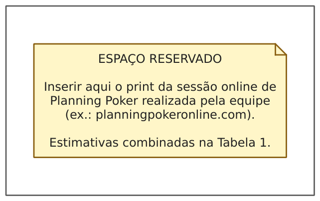

**Tabela 1. Estimativa de esforço em horas para cada requisito funcional.**

| Código do Requisito Funcional | Estimativa de esforço (horas) |
|---|---|
| [RF001] | 5 |
| [RF002] | 5 |
| [RF003] | 3 |
| [RF004] | 2 |
| [RF005] | 13 |
| [RF006] | 5 |
| [RF007] | 5 |
| [RF008] | 3 |
| [RF009] | 13 |
| [RF010] | 5 |
| [RF011] | 8 |
| [RF012] | 13 |
| [RF013] | 5 |
| [RF014] | 5 |
| [RF015] | 5 |
| [RF016] | 5 |
| [RF017] | 5 |
| [RF018] | 8 |
| [RF019] | 3 |
| **Total** | **116** |

Assim, a estimativa de esforço total para o desenvolvimento e cumprimento de todos
os requisitos funcionais foi de **116 horas** — cerca de 29 horas por integrante ao
longo do bimestre. As maiores estimativas couberam à importação transacional de
cotações [RF005], ao painel gráfico com indicadores [RF009] e ao motor de
recomendações [RF012], por concentrarem validações, cálculo numérico e regras de
negócio.

### Verificação complementar com Pontos de Caso de Uso (UCP)

Como contraprova da estimativa, aplicamos a técnica de Pontos de Caso de Uso
(KARNER, 1993), nos cinco passos apresentados em aula.

**Passo 1 — Peso dos atores (UAW).** Os dois atores do sistema, Administrador e
Investidor, interagem por interface gráfica e são, portanto, complexos (peso 3):

**Tabela 2. Cálculo do peso não ajustado dos atores (UAW).**

| Ator | Classificação | Peso |
|---|---|---|
| Administrador | Complexo (interface gráfica) | 3 |
| Investidor | Complexo (interface gráfica) | 3 |
| **UAW** | | **6** |

**Passo 2 — Peso dos casos de uso (UUCW).** Cada caso de uso foi classificado pelo
número de transações de seu fluxo de eventos:

**Tabela 3. Cálculo do peso não ajustado dos casos de uso (UUCW).**

| Caso de uso | Transações | Classificação | Peso |
|---|---|---|---|
| UC001 Fazer login | 3 | Simples | 5 |
| UC002 Cadastrar ativo | 5 | Médio | 10 |
| UC003 Atualizar ativo | 6 | Médio | 10 |
| UC004 Remover ativo | 3 | Simples | 5 |
| UC005 Importar cotações | 8 | Complexo | 15 |
| UC006 Configurar regra de análise | 5 | Médio | 10 |
| UC007 Gerenciar usuários | 6 | Médio | 10 |
| UC008 Buscar ativos | 2 | Simples | 5 |
| UC009 Visualizar painel de análise | 8 | Complexo | 15 |
| UC010 Visualizar detalhes do ativo | 4 | Médio | 10 |
| UC011 Gerar recomendações | 9 | Complexo | 15 |
| UC012 Visualizar recomendações vigentes | 5 | Médio | 10 |
| UC013 Comprar ativo | 6 | Médio | 10 |
| UC014 Vender ativo | 6 | Médio | 10 |
| UC015 Visualizar resultado da carteira | 4 | Médio | 10 |
| UC016 Cadastrar alerta | 5 | Médio | 10 |
| UC017 Avaliar e disparar alertas | 7 | Complexo | 15 |
| UC018 Arquivar alerta | 3 | Simples | 5 |
| **UUCW** | | | **180** |

Com isso, os pontos de caso de uso não ajustados são
UUCP = UAW + UUCW = 6 + 180 = **186**.

**Passo 3 — Fatores técnicos (TCF).**

**Tabela 4. Fatores de complexidade técnica (TCF).**

| Fator | Descrição | Peso | Valor (0–5) | Peso × Valor |
|---|---|---|---|---|
| F1 | Sistema distribuído | 2 | 0 | 0 |
| F2 | Desempenho / tempo de resposta | 1 | 3 | 3 |
| F3 | Eficiência do usuário final | 1 | 3 | 3 |
| F4 | Processamento interno complexo | 1 | 3 | 3 |
| F5 | Reusabilidade do código | 1 | 2 | 2 |
| F6 | Facilidade de instalação | 0,5 | 4 | 2 |
| F7 | Facilidade de uso | 0,5 | 4 | 2 |
| F8 | Portabilidade | 2 | 2 | 4 |
| F9 | Facilidade de mudança | 1 | 3 | 3 |
| F10 | Concorrência | 1 | 0 | 0 |
| F11 | Requisitos de segurança | 1 | 2 | 2 |
| F12 | Acesso por terceiros | 1 | 0 | 0 |
| F13 | Necessidade de treinamento especial | 1 | 1 | 1 |
| **TFactor** | | | | **25** |

TCF = 0,6 + (0,01 × 25) = **0,85**.

**Passo 4 — Fatores de ambiente (ECF).** Os fatores F7 e F8 têm peso negativo:
quanto maior o valor, mais eles reduzem a produtividade estimada.

**Tabela 5. Fatores de ambiente (ECF).**

| Fator | Descrição | Peso | Valor (0–5) | Peso × Valor |
|---|---|---|---|---|
| F1 | Familiaridade com o processo de desenvolvimento | 1,5 | 3 | 4,5 |
| F2 | Experiência na aplicação (domínio financeiro) | 0,5 | 2 | 1,0 |
| F3 | Experiência em orientação a objetos | 1 | 4 | 4,0 |
| F4 | Capacidade do analista líder | 0,5 | 3 | 1,5 |
| F5 | Motivação | 1 | 5 | 5,0 |
| F6 | Estabilidade dos requisitos | 2 | 4 | 8,0 |
| F7 | Equipe em tempo parcial | −1 | 5 | −5,0 |
| F8 | Dificuldade da linguagem de programação | −1 | 3 | −3,0 |
| **EFactor** | | | | **16,0** |

ECF = 1,4 − (0,03 × 16,0) = **0,92**.

**Passo 5 — Cálculo final.**
UCP = UUCP × TCF × ECF = 186 × 0,85 × 0,92 = **145,45 pontos**.

Aplicando a taxa clássica de Karner, de 20 horas por ponto, o esforço seria de
2.909 horas — valor coerente com um projeto industrial completo (levantamento,
gestão, testes formais, implantação e garantia), conduzido por equipe alocada em
tempo integral. Para o recorte desta disciplina, a leitura relevante do UCP é
relativa: os casos de uso classificados como complexos (UC005, UC009, UC011 e
UC017) correspondem exatamente aos requisitos com as maiores cartas no Planning
Poker ([RF005], [RF009], [RF012] e [RF018]), o que dá consistência às duas
técnicas. Adotamos como compromisso operacional a estimativa do Planning Poker
(116 horas de implementação), usando o UCP como medida de tamanho funcional e como
verificação da classificação de esforço entre os casos de uso.


```{=openxml}
<w:p><w:r><w:br w:type="page"/></w:r></w:p>
```

```{=latex}
\newpage
```

# 3 ESTUDO DE VIABILIDADE

Na presente seção é realizado o estudo preliminar da viabilidade organizacional,
econômica, técnica e operacional do projeto, bem como a análise dos recursos a
serem utilizados, indicando assim sua exequibilidade e as relações de
custo/benefício de sua implementação.

## 3.1 Viabilidade Organizacional

Conforme as respostas obtidas pelo levantamento de dados, o clube não dispõe hoje
de nenhum instrumento comum de acompanhamento: cada participante mantém a própria
planilha, com dados, fórmulas e critérios distintos, o que compromete a comparação
das análises e o caráter didático das reuniões. O novo sistema centraliza o
cadastro de ativos e o histórico de cotações em uma única base, aplica as mesmas
regras de análise para todos e registra a justificativa de cada recomendação —
transformando os debates de opinião em debates sobre critérios verificáveis. A
divisão em dois papéis (Administrador e Investidor) reflete a organização já
existente no clube, em que um membro é responsável pelos dados e os demais os
consomem, de modo que a implantação não exige mudança na estrutura do grupo.

## 3.2 Viabilidade Econômica

Tendo em vista a natureza do cliente — grupo de estudos de instituição pública, sem
verba —, o projeto foi concebido para custo zero. Todas as ferramentas de
desenvolvimento são gratuitas e de código aberto (compilador GCC, CMake, framework
Qt na licença LGPL, SQLite em domínio público, Git/GitHub). O sistema executa
localmente nas máquinas já existentes, sem servidores, hospedagem ou licenças, e os
dados de cotações são obtidos gratuitamente no site da B3 e nas corretoras dos
participantes. O único custo real é o tempo da equipe de desenvolvimento — estimado
em 116 horas na seção 2.6 —, assumido voluntariamente como parte da disciplina.
Como benefício econômico indireto, o sistema substitui, no uso do clube,
plataformas de análise por assinatura.

## 3.3 Viabilidade Técnica

A equipe cursou as disciplinas de programação orientada a objetos em C++ da
universidade, e as tecnologias escolhidas são maduras e amplamente documentadas: o
Qt 6 fornece os componentes de interface e de gráficos (Widgets e Charts)
necessários às telas planejadas, e o SQLite oferece um banco relacional completo
embutido na aplicação, adequado ao requisito de funcionamento offline [RNF001]. Os
algoritmos de análise técnica previstos (médias móveis simples e exponencial,
índice de força relativa e volatilidade) têm formulação clássica publicada (WILDER,
1978; MURPHY, 1999) e são implementáveis diretamente sobre as séries de cotações
importadas.

O principal risco técnico identificado é a variação de leiaute dos arquivos CSV de
cotações entre fontes. A mitigação adotada é dupla: fixar um formato de entrada
documentado (cabeçalho com seis colunas, datas dd/mm/aaaa, vírgula decimal) e
validar estruturalmente cada arquivo antes de gravar, rejeitando-o por inteiro em
caso de erro [RNF002], com mensagem indicando linha e motivo [REU003]. O risco de
perda de dados é mitigado pelo caráter transacional da importação e pela proteção
contra duplicidade [RNF003].

## 3.4 Viabilidade Operacional

O sistema será operado pelos próprios membros do clube, sem necessidade de equipe
técnica dedicada. O fluxo operacional acompanha o ciclo das reuniões: antes de cada
encontro, o administrador importa os arquivos de cotações e o sistema reavalia
recomendações e alertas; durante a reunião, os participantes consultam o painel
gráfico, as recomendações justificadas e o resultado das carteiras. A navegação por
papel [REU001] impede que participantes alterem a base por engano, e as mensagens
de erro em português [REU003] tornam a operação acessível a membros de qualquer
curso. Por ser uma aplicação desktop offline, não há dependência da infraestrutura
de rede da sala do clube.

## 3.5 Recursos a Serem Utilizados

- **Recursos humanos:** os quatro integrantes da equipe de desenvolvimento, em
  regime de tempo parcial, acumulando os papéis de analistas, projetistas e
  programadores.
- **Hardware:** os computadores pessoais da equipe e as máquinas do laboratório
  (qualquer máquina x86-64 com Windows ou Linux atende).
- **Software de desenvolvimento:** linguagem C++ (padrão C++20), framework Qt 6
  (Widgets, Charts, Sql e Test), SGBD SQLite 3, sistema de build CMake,
  versionamento Git com hospedagem no GitHub e editores Qt Creator / VS Code.
- **Dados:** arquivos CSV de cotações históricas obtidos do site da B3 e das
  corretoras dos participantes.
- **Bibliografia técnica:** obras de engenharia de software, UML e análise técnica
  listadas no Capítulo 6.


```{=openxml}
<w:p><w:r><w:br w:type="page"/></w:r></w:p>
```

```{=latex}
\newpage
```

# 4 RESULTADOS

## 4.1 Conteúdo dos Resultados

Este capítulo apresenta os resultados do projeto em duas partes. A primeira é o
protótipo das telas do sistema, já construído na tecnologia definitiva (C++ com
Qt 6) e navegável de ponta a ponta, cobrindo todos os casos de uso levantados. A
segunda é a modelagem do sistema: o Diagrama de Casos de Uso, a especificação de
cada caso de uso no padrão da disciplina, o Diagrama de Classes com o dicionário de
informações, os Diagramas de Objetos e um Diagrama de Sequência para cada caso de
uso.

### Protótipo das telas

As figuras a seguir apresentam as telas do protótipo em execução, com dados reais
importados de arquivos CSV de cotações.

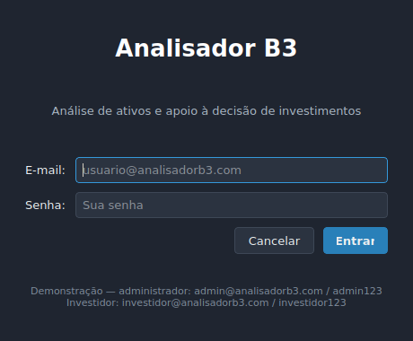

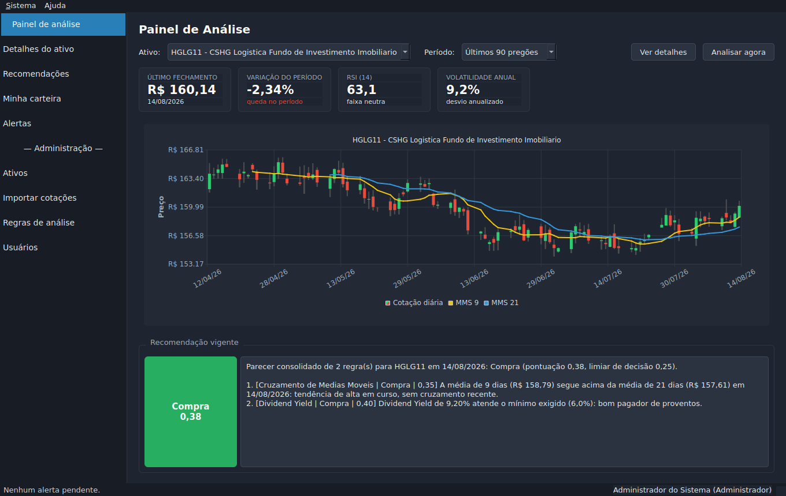

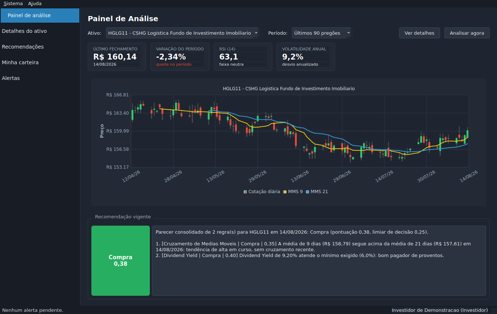

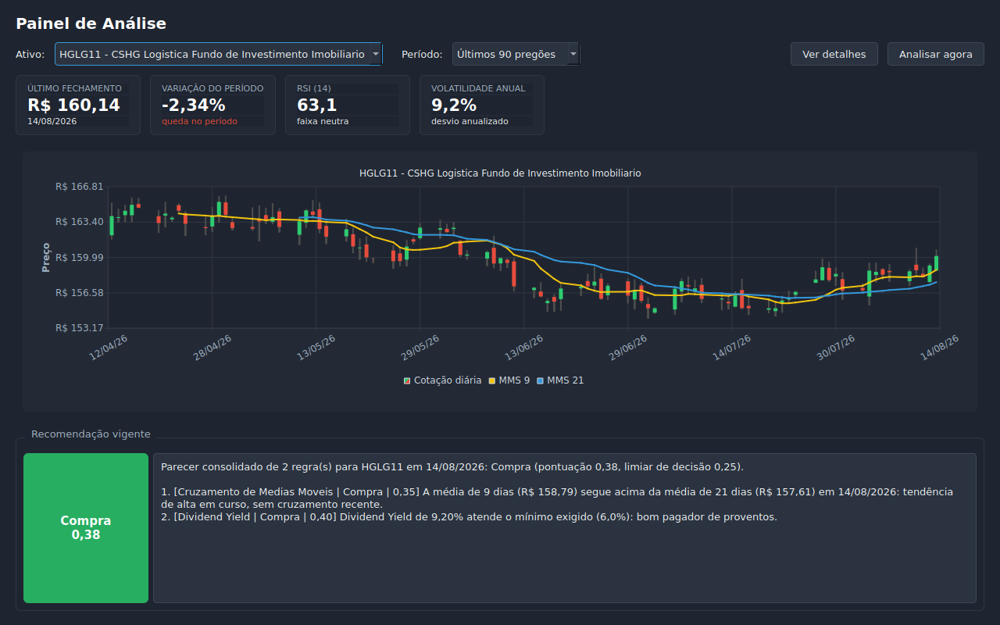

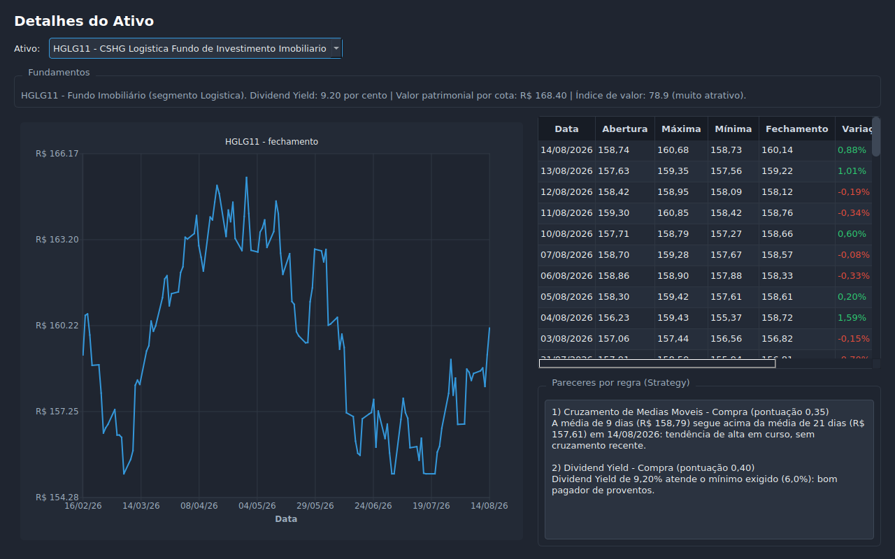

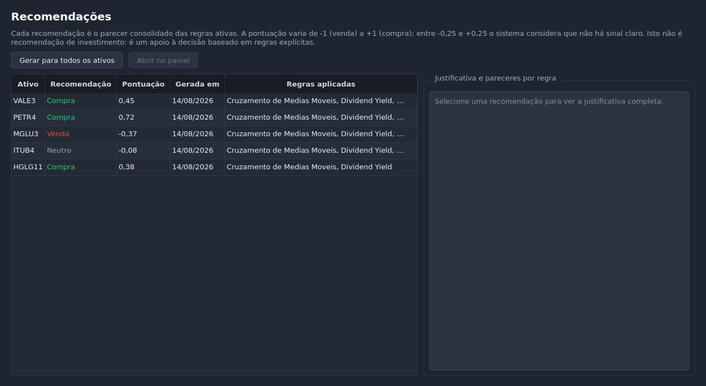

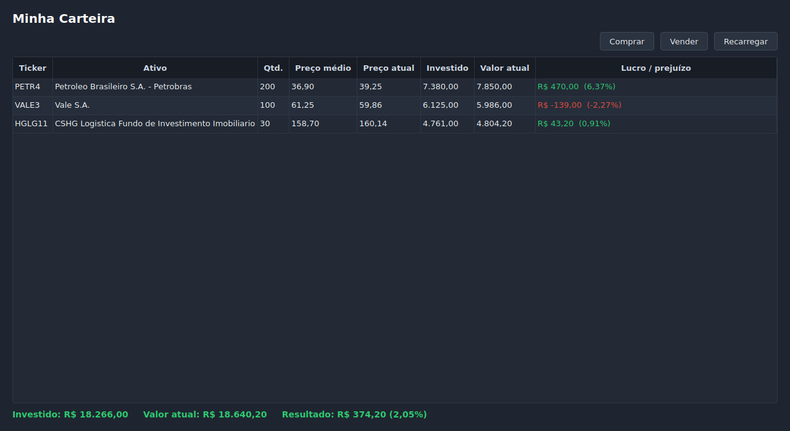

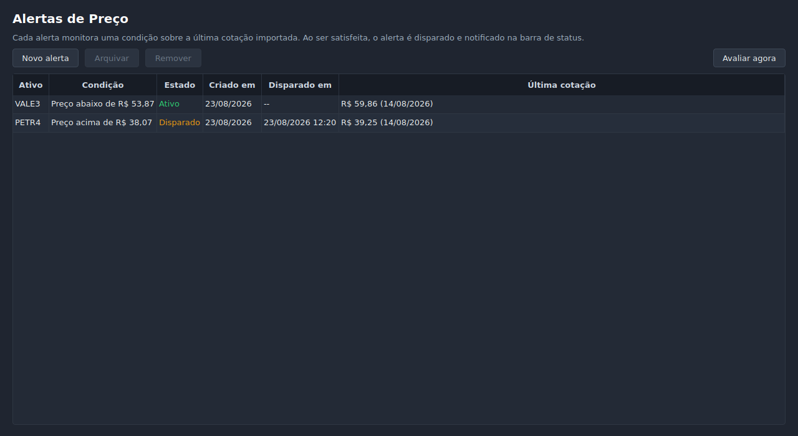

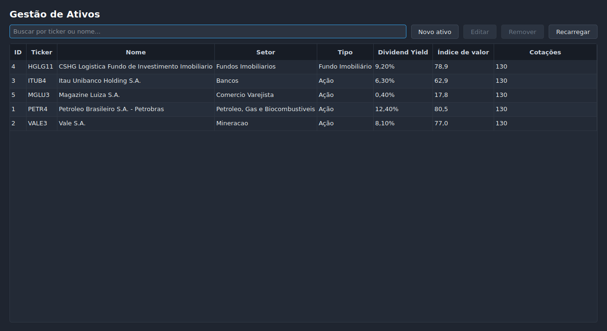

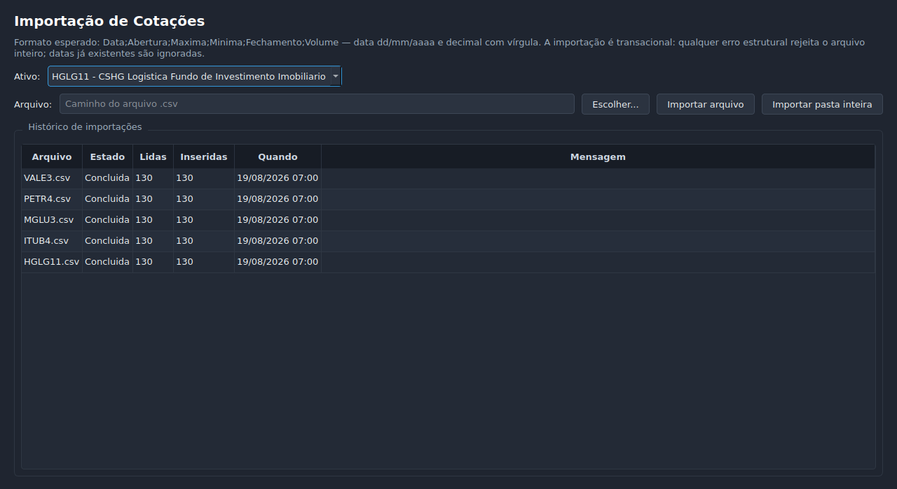

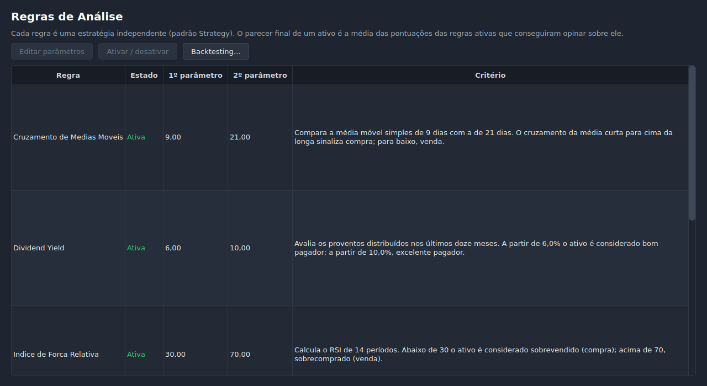

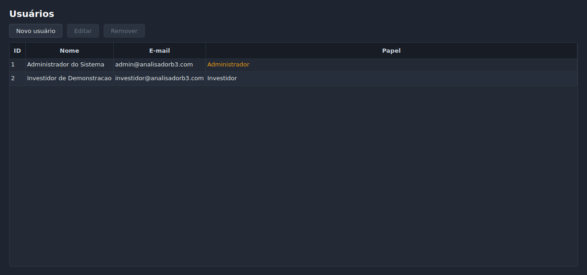

## 4.2 Modelagem

A modelagem do AB3 parte dos requisitos do Capítulo 2: cada requisito funcional é
atendido por um caso de uso (com [RF009] e [RF010] atendidos pelo mesmo UC009), e
cada caso de uso é especificado, na sequência, com seus fluxos, regras de negócio e
classes participantes.

### Diagrama de Casos de Uso

O sistema possui dois atores. O **Administrador** mantém a base — cadastro de
ativos, importação de cotações, configuração das regras de análise e gerência de
usuários. O **Investidor** consome as análises — painel gráfico, recomendações,
carteira e alertas. Todos os casos de uso exigem autenticação prévia (UC001).

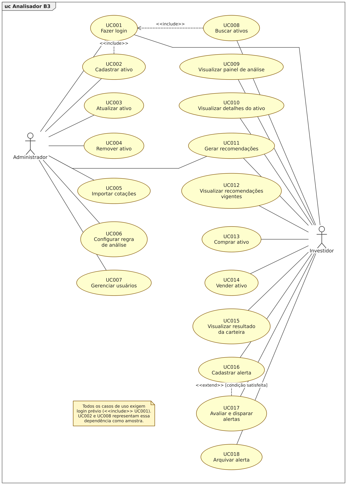

### Especificação dos casos de uso

Esta seção detalha, um a um, os casos de uso identificados no Diagrama de Casos de Uso,
seguindo o formato de especificação adotado na disciplina: identificação do caso de uso,
atores, descrição, pré-condições, pós-condições, fluxo básico numerado com a função de
cada elemento indicada entre parênteses — `(ator)`, `(sistema)`, `(classe X)` e
`(atributo)` —, regras de negócio, fluxos alternativos e fluxos de exceção. Os passos, os
campos e as mensagens reproduzidos nos quadros a seguir correspondem exatamente ao
comportamento implementado no sistema Analisador B3.

---

**Quadro 1. Descrição do caso de uso UC001.**

| | |
|---|---|
| **Nome** | UC001: Fazer login |
| **Atores** | Ator principal: Administrador / Investidor |
| **Descrição** | Caso de uso executado quando o usuário precisa se identificar no sistema para obter acesso às funcionalidades correspondentes ao seu papel. |
| **Pré-condições** | O usuário deve possuir cadastro no sistema; o banco de dados deve estar acessível. |
| **Pós-condições** | Sessão aberta com o usuário autenticado e janela principal exibindo apenas as opções permitidas ao seu papel. |

**Fluxo básico**

| Ações dos atores | Ações do sistema |
|---|---|
| 1 - O ator (administrador ou investidor) inicia o Analisador B3. (ator) | |
| | 2 - O sistema apresenta a tela de entrada com os campos: e-mail (classe Usuario), senha (classe Usuario), e com as opções Entrar e Cancelar. (sistema) |
| 3 - O ator informa o e-mail e a senha e seleciona Entrar. (ator) | |
| | 4 - O sistema verifica as informações conforme as Regras de Negócio RN001 e RN004. (sistema) (4a)(4b) |
| | 5 - O sistema recupera o usuário correspondente ao e-mail informado e compara o resumo SHA-256 da senha com o valor armazenado. (sistema) (classe Usuario) |
| | 6 - O sistema abre a sessão, registra o usuário logado com seu papel (classe Usuario) e apresenta a janela principal com as opções permitidas ao papel. (sistema) (atributo) |

**Regras de negócio**

1. **RN001** — Todos os campos obrigatórios do formulário devem estar preenchidos: o e-mail e a senha são obrigatórios.
2. **RN004** — A senha é comparada pelo resumo SHA-256 de (sal + senha); a senha em texto puro nunca é armazenada nem trafegada.

**Fluxo alternativo 1**

* A qualquer momento o usuário seleciona cancelar: o sistema descarta as informações digitadas e encerra o caso de uso, finalizando a aplicação.

**Fluxo de exceção**

- **4a** - Caso o e-mail ou a senha não tenham sido preenchidos, o sistema exibe a mensagem "Informe e-mail e senha.", limpa o campo de senha e retorna ao passo 3 do fluxo básico.
- **4b** - Caso não exista usuário com o e-mail informado ou o resumo da senha não confira, o sistema exibe a mensagem "E-mail ou senha inválidos.", limpa o campo de senha, posiciona o cursor nesse campo e retorna ao passo 3 do fluxo básico. A mensagem é propositalmente genérica, para não revelar se o e-mail existe no cadastro.

---

**Quadro 2. Descrição do caso de uso UC002.**

| | |
|---|---|
| **Nome** | UC002: Cadastrar ativo |
| **Atores** | Ator principal: Administrador |
| **Descrição** | Caso de uso executado quando o administrador necessita incluir no cadastro uma nova ação ou um novo fundo imobiliário a ser acompanhado pelo sistema. |
| **Pré-condições** | O administrador deve estar autenticado no sistema (UC001); o usuário autenticado deve possuir o papel Administrador. |
| **Pós-condições** | Ativo gravado no cadastro e apresentado na listagem de ativos. |

**Fluxo básico**

| Ações dos atores | Ações do sistema |
|---|---|
| 1 - O ator (administrador) acessa a opção Ativos e seleciona Novo ativo. (ator) | |
| | 2 - O sistema apresenta o formulário de cadastro com os campos: tipo (Ação ou Fundo Imobiliário), ticker (classe Ativo), nome (classe Ativo), setor (classe Ativo), preço/lucro (classe Acao), dividend yield (classe Acao / classe FundoImobiliario), valor de mercado (classe Acao), valor patrimonial por cota (classe FundoImobiliario) e segmento (classe FundoImobiliario). (sistema) |
| 3 - O ator seleciona o tipo do ativo. (ator) | |
| | 4 - O sistema exibe apenas os campos de fundamentos pertinentes ao tipo escolhido: preço/lucro e valor de mercado para ação (classe Acao); valor patrimonial por cota e segmento para fundo imobiliário (classe FundoImobiliario). (sistema) |
| 5 - O ator preenche os campos e seleciona Salvar. (ator) | |
| | 6 - O sistema verifica as informações conforme as Regras de Negócio RN001 e RN005. (sistema) (6a)(6b)(6c)(6d)(6e) |
| | 7 - O sistema normaliza o ticker para caixa alta, grava o ativo com seus atributos ticker, nome da empresa, setor e fundamentos (atributo) (classe Acao / classe FundoImobiliario), atualiza a listagem e exibe a mensagem "Ativo <ticker> cadastrado com sucesso.". (sistema) |

**Regras de negócio**

1. **RN001** — Todos os campos obrigatórios do formulário devem estar preenchidos: ticker, nome e setor são obrigatórios.
2. **RN005** — O ticker deve ter de 4 a 6 caracteres alfanuméricos (letras e números) e ser único no cadastro.

**Fluxo alternativo 1**

* A qualquer momento o usuário seleciona cancelar: o sistema descarta as informações digitadas e encerra o caso de uso.

**Fluxo de exceção**

- **6a** - Caso o ticker ou o nome não tenham sido preenchidos, o sistema exibe a mensagem "Preencha ao menos o ticker e o nome do ativo." e retorna ao passo 5 do fluxo básico.
- **6b** - Caso o ticker não tenha de 4 a 6 caracteres entre letras e números, o sistema exibe a mensagem "Ticker inválido: use de 4 a 6 caracteres entre letras e números (ex.: PETR4)." e retorna ao passo 5 do fluxo básico.
- **6c** - Caso o nome da empresa ou do fundo esteja vazio, o sistema exibe a mensagem "Informe o nome da empresa ou do fundo." e retorna ao passo 5 do fluxo básico.
- **6d** - Caso o setor esteja vazio, o sistema exibe a mensagem "Informe o setor do ativo." e retorna ao passo 5 do fluxo básico.
- **6e** - Caso já exista ativo cadastrado com o mesmo ticker, o sistema exibe a mensagem "Já existe um ativo cadastrado com o ticker <ticker>." e retorna ao passo 5 do fluxo básico.

---

**Quadro 3. Descrição do caso de uso UC003.**

| | |
|---|---|
| **Nome** | UC003: Atualizar ativo |
| **Atores** | Ator principal: Administrador |
| **Descrição** | Caso de uso executado quando o administrador necessita corrigir ou atualizar os dados cadastrais e os fundamentos de um ativo já existente. |
| **Pré-condições** | O administrador deve estar autenticado no sistema (UC001); deve existir ao menos um ativo cadastrado. |
| **Pós-condições** | Ativo atualizado no cadastro e listagem reapresentada com os novos valores. |

**Fluxo básico**

| Ações dos atores | Ações do sistema |
|---|---|
| 1 - O ator (administrador) acessa a opção Ativos. (ator) | |
| | 2 - O sistema apresenta a listagem com as colunas: identificador (classe Ativo), ticker (classe Ativo), nome (classe Ativo), setor (classe Ativo), tipo (classe Acao / classe FundoImobiliario), dividend yield (classe Acao / classe FundoImobiliario), índice de valor (classe Ativo) e quantidade de cotações (classe Cotacao). (sistema) |
| 3 - O ator seleciona um ativo da listagem e escolhe Editar, ou aplica duplo clique sobre a linha. (ator) | |
| | 4 - O sistema recupera o ativo selecionado e apresenta o formulário preenchido com o tipo, o ticker (classe Ativo), o nome (classe Ativo), o setor (classe Ativo) e os fundamentos correspondentes ao tipo (classe Acao / classe FundoImobiliario). (sistema) (4a) |
| 5 - O ator altera os campos desejados e seleciona Salvar. (ator) | |
| | 6 - O sistema verifica as informações conforme as Regras de Negócio RN001 e RN005. (sistema) (6a)(6b)(6c)(6d) |
| | 7 - O sistema grava as alterações no ativo (atributo), atualiza a listagem e exibe a mensagem "Ativo <ticker> atualizado.". (sistema) |

**Regras de negócio**

1. **RN001** — Todos os campos obrigatórios do formulário devem estar preenchidos: ticker, nome e setor são obrigatórios.
2. **RN005** — O ticker deve ter de 4 a 6 caracteres alfanuméricos e ser único; na atualização, o próprio ativo em edição é desconsiderado na verificação de unicidade.

**Fluxo alternativo 1**

* A qualquer momento o usuário seleciona cancelar: o sistema descarta as informações digitadas e encerra o caso de uso.

**Fluxo de exceção**

- **4a** - Caso o ativo selecionado não seja mais encontrado no cadastro, o sistema exibe a mensagem "O ativo selecionado não foi encontrado.", recarrega a listagem e encerra o caso de uso.
- **6a** - Caso o ticker ou o nome tenham sido apagados, o sistema exibe a mensagem "Preencha ao menos o ticker e o nome do ativo." e retorna ao passo 5 do fluxo básico.
- **6b** - Caso o ticker não tenha de 4 a 6 caracteres entre letras e números, o sistema exibe a mensagem "Ticker inválido: use de 4 a 6 caracteres entre letras e números (ex.: PETR4)." e retorna ao passo 5 do fluxo básico.
- **6c** - Caso o setor esteja vazio, o sistema exibe a mensagem "Informe o setor do ativo." e retorna ao passo 5 do fluxo básico.
- **6d** - Caso o ticker informado já pertença a outro ativo, o sistema exibe a mensagem "Já existe um ativo cadastrado com o ticker <ticker>." e retorna ao passo 5 do fluxo básico.

---

**Quadro 4. Descrição do caso de uso UC004.**

| | |
|---|---|
| **Nome** | UC004: Remover ativo |
| **Atores** | Ator principal: Administrador |
| **Descrição** | Caso de uso executado quando o administrador necessita excluir do cadastro um ativo que não será mais acompanhado pelo sistema. |
| **Pré-condições** | O administrador deve estar autenticado no sistema (UC001); o ativo a ser removido deve existir no cadastro. |
| **Pós-condições** | Ativo removido do cadastro, juntamente com as cotações, posições, alertas e recomendações a ele vinculados. |

**Fluxo básico**

| Ações dos atores | Ações do sistema |
|---|---|
| 1 - O ator (administrador) acessa a opção Ativos, seleciona um ativo da listagem e escolhe Remover. (ator) | |
| | 2 - O sistema apresenta a confirmação "Remover <ticker> (<nome>)? Esta ação também apaga as cotações, posições, alertas e recomendações vinculadas e não pode ser desfeita.", exibindo o ticker (classe Ativo) e o nome da empresa (classe Ativo). (sistema) |
| 3 - O ator confirma a remoção. (ator) | |
| | 4 - O sistema exclui o ativo e os registros dependentes, atualiza a listagem e exibe a mensagem "Ativo <ticker> removido.". (sistema) (atributo) (4a)(4b) |

**Regras de negócio**

1. **RN001** — A remoção só é habilitada quando há um ativo selecionado na listagem; sem seleção, os botões Editar e Remover permanecem desabilitados.

**Fluxo alternativo 1**

* A qualquer momento o usuário seleciona Não na confirmação: o sistema descarta a operação e encerra o caso de uso, mantendo o ativo no cadastro.

**Fluxo de exceção**

- **4a** - Caso nenhum ativo válido esteja selecionado, o sistema exibe a mensagem "Selecione um ativo válido para remover." e encerra o caso de uso.
- **4b** - Caso o banco de dados recuse a exclusão, o sistema exibe a mensagem de erro devolvida pela camada de persistência, mantém o ativo no cadastro e retorna ao passo 1 do fluxo básico.

---

**Quadro 5. Descrição do caso de uso UC005.**

| | |
|---|---|
| **Nome** | UC005: Importar cotações |
| **Atores** | Ator principal: Administrador |
| **Descrição** | Caso de uso executado quando o administrador necessita carregar no sistema o histórico de cotações de um ativo a partir de um arquivo CSV, de forma transacional. |
| **Pré-condições** | O administrador deve estar autenticado no sistema (UC001); deve existir ao menos um ativo cadastrado (UC002); o arquivo CSV deve estar acessível no sistema de arquivos. |
| **Pós-condições** | Cotações do arquivo gravadas para o ativo escolhido, sem duplicidades, e registro da importação incluído no histórico com seu estado, linhas lidas e linhas inseridas. |

**Fluxo básico**

| Ações dos atores | Ações do sistema |
|---|---|
| 1 - O ator (administrador) acessa a opção Importar cotações. (ator) | |
| | 2 - O sistema apresenta a tela de importação com o formato esperado ("Data;Abertura;Maxima;Minima;Fechamento;Volume", data em dd/mm/aaaa e decimal com vírgula), a lista de ativos cadastrados (classe Ativo), o campo do caminho do arquivo (classe Importacao) e o histórico das últimas importações com arquivo (classe Importacao), estado (classe Importacao), linhas lidas (classe Importacao), linhas inseridas (classe Importacao), data e hora de execução (classe Importacao) e mensagem de erro (classe Importacao). (sistema) (2a) |
| 3 - O ator seleciona o ativo de destino e escolhe o arquivo por meio da opção Escolher..., filtrando arquivos com extensão .csv. (ator) | |
| | 4 - O sistema exibe o caminho escolhido e, quando o nome do arquivo corresponde ao ticker de um ativo cadastrado (classe Ativo), seleciona automaticamente esse ativo na lista. (sistema) |
| 5 - O ator seleciona Importar arquivo. (ator) | |
| | 6 - O sistema abre o arquivo, cria o registro de importação com o arquivo (classe Importacao) e o ativo (classe Importacao) e passa o registro ao estado Validando. (sistema) (atributo) (6a)(6b)(6c) |
| | 7 - O sistema valida a primeira linha como cabeçalho e, em seguida, converte cada linha subsequente em uma cotação com data (classe Cotacao), abertura (classe Cotacao), máxima (classe Cotacao), mínima (classe Cotacao), fechamento (classe Cotacao) e volume (classe Cotacao), conforme as Regras de Negócio RN007, RN008 e RN009. (sistema) (7a)(7b)(7c)(7d)(7e)(7f)(7g)(7h) |
| | 8 - O sistema abre uma transação e grava em lote as cotações validadas, ignorando aquelas cuja data já exista para o mesmo ativo, conforme as Regras de Negócio RN010 e RN011. (sistema) (atributo) (8a)(8b) |
| | 9 - O sistema conclui o registro de importação com as linhas lidas (atributo) e as linhas inseridas (atributo) (classe Importacao), confirma a transação, atualiza o histórico e exibe o resumo "Importação concluída: <n> linha(s) lida(s), <n> inserida(s), <n> ignorada(s) por duplicidade.". (sistema) |

**Regras de negócio**

1. **RN007** — O arquivo de cotações deve ter o cabeçalho e as 6 colunas esperadas, separadas por ponto e vírgula.
2. **RN008** — A data deve estar no formato dd/mm/aaaa e os valores no padrão decimal brasileiro, com vírgula como separador decimal e ponto como separador de milhar.
3. **RN009** — Em cada cotação, a mínima deve ser menor ou igual à abertura e ao fechamento, que por sua vez devem ser menores ou iguais à máxima, e todos os preços devem ser maiores que zero.
4. **RN010** — Cotação de mesma data e mesmo ativo é ignorada, sem duplicar o registro já existente.
5. **RN011** — Qualquer erro estrutural rejeita o arquivo inteiro: nenhuma linha é gravada.

**Fluxo alternativo 1**

* A qualquer momento o usuário cancela a janela de seleção de arquivo: o sistema descarta a escolha, mantém o caminho anterior e encerra o caso de uso sem importar.

**Fluxo alternativo 2**

* No passo 3, o ator seleciona Importar pasta inteira e escolhe um diretório: o sistema percorre todos os arquivos .csv do diretório em ordem alfabética, associa cada arquivo ao ativo cujo ticker corresponde ao nome do arquivo (classe Ativo) e executa os passos 6 a 9 para cada um deles, acumulando o total de linhas lidas, inseridas e ignoradas e relacionando ao final os erros de cada arquivo. Caso o diretório não exista, o sistema exibe "Diretório <caminho> não encontrado."; caso não haja arquivos .csv, exibe "Nenhum arquivo .csv encontrado em <caminho>."; e, para cada arquivo sem ativo correspondente, acrescenta "<arquivo>: nenhum ativo cadastrado com o ticker <ticker>.".

**Fluxo de exceção**

- **2a** - Caso não exista nenhum ativo cadastrado, o sistema desabilita a opção Importar arquivo, exibe a mensagem "Cadastre um ativo antes de importar cotações." e encerra o caso de uso.
- **6a** - Caso o campo do arquivo esteja vazio, o sistema exibe a mensagem "Escolha um arquivo .csv para importar." e retorna ao passo 3 do fluxo básico.
- **6b** - Caso nenhum ativo esteja selecionado, o sistema exibe a mensagem "Selecione o ativo de destino." e retorna ao passo 3 do fluxo básico.
- **6c** - Caso o ativo informado não exista mais no cadastro, ou o arquivo não possa ser aberto para leitura, o sistema registra a importação como Rejeitada com a mensagem "Ativo informado não existe no cadastro." ou "Não foi possível abrir o arquivo <caminho>.", conforme o caso, e retorna ao passo 3 do fluxo básico.
- **7a** - Caso a primeira linha não seja um cabeçalho reconhecível, o sistema interrompe a leitura, registra o erro "Linha 1: cabeçalho inválido. Esperado "Data;Abertura;Maxima;Minima;Fechamento;Volume"." e desvia para o passo de rejeição descrito em 7h.
- **7b** - Caso uma linha não possua exatamente 6 colunas, o sistema registra o erro "Linha <n>: esperadas 6 colunas separadas por ';', encontradas <n>." e prossegue a leitura das demais linhas para relatar todos os erros do arquivo.
- **7c** - Caso a data de uma linha não esteja no formato dd/MM/aaaa, o sistema registra o erro "Linha <n>: data "<valor>" fora do formato dd/MM/aaaa." e prossegue a leitura.
- **7d** - Caso alguma coluna de preço ou de volume não contenha um número válido, o sistema registra o erro "Linha <n>: valor numérico inválido em uma das colunas de preço ou volume." e prossegue a leitura.
- **7e** - Caso algum preço seja menor ou igual a zero, o sistema registra o erro "Linha <n>: preços devem ser maiores que zero."; caso a máxima seja menor que a mínima, registra "Linha <n>: máxima (<valor>) menor que a mínima (<valor>)."; caso a abertura ou o fechamento fiquem fora do intervalo entre a mínima e a máxima, registra "Linha <n>: abertura e fechamento devem ficar entre a mínima e a máxima."; caso o volume seja negativo, registra "Linha <n>: volume negativo.". Em todos os casos o sistema prossegue a leitura.
- **7f** - Caso a mesma data apareça duas vezes no próprio arquivo, o sistema registra o erro "Linha <n>: data <dd/MM/aaaa> repetida no próprio arquivo." e prossegue a leitura.
- **7g** - Caso o arquivo não contenha nenhuma cotação válida, o sistema registra a importação como Rejeitada com a mensagem "O arquivo não contém nenhuma cotação válida." e encerra o caso de uso.
- **7h** - Caso tenha sido registrado ao menos um erro nos desvios 7a a 7f, o sistema rejeita o arquivo inteiro sem gravar nenhuma cotação, grava o registro de importação no estado Rejeitada com a primeira mensagem de erro (atributo) (classe Importacao), apresenta a lista completa de erros e exibe o resumo "Importação rejeitada: <n> erro(s) encontrado(s). Nenhuma cotação foi gravada.", retornando ao passo 3 do fluxo básico.
- **8a** - Caso a transação não possa ser iniciada, o sistema registra a importação como Rejeitada com a mensagem devolvida pelo banco de dados e retorna ao passo 3 do fluxo básico.
- **8b** - Caso a gravação em lote falhe, o sistema desfaz a transação, zera as linhas inseridas e ignoradas, registra a importação como Rejeitada com a mensagem "Falha ao gravar as cotações do arquivo." ou com o erro devolvido pelo banco e retorna ao passo 3 do fluxo básico.

---

**Quadro 6. Descrição do caso de uso UC006.**

| | |
|---|---|
| **Nome** | UC006: Configurar regra de análise |
| **Atores** | Ator principal: Administrador |
| **Descrição** | Caso de uso executado quando o administrador necessita ajustar os parâmetros de uma regra de análise ou ativá-la e desativá-la, definindo quais estratégias participam da geração das recomendações. |
| **Pré-condições** | O administrador deve estar autenticado no sistema (UC001); as regras de análise devem estar registradas no banco de dados. |
| **Pós-condições** | Regra gravada com os novos parâmetros e com o novo estado de ativação, passando a valer nas próximas análises. |

**Fluxo básico**

| Ações dos atores | Ações do sistema |
|---|---|
| 1 - O ator (administrador) acessa a opção Regras de análise. (ator) | |
| | 2 - O sistema apresenta a listagem das regras com o nome da regra (classe RegraConfigurada), o estado ativa ou inativa (classe RegraConfigurada), o primeiro parâmetro (classe RegraConfigurada), o segundo parâmetro (classe RegraConfigurada) e o critério descrito pela própria estratégia já configurada (classe RegraAnalise). (sistema) (2a) |
| 3 - O ator seleciona uma regra e escolhe Editar parâmetros, ou aplica duplo clique sobre a linha. (ator) | |
| | 4 - O sistema apresenta o formulário de configuração com o nome da regra (classe RegraConfigurada), a descrição do critério vigente (classe RegraAnalise), a opção "Regra ativa (participa da análise)" (classe RegraConfigurada), o primeiro parâmetro (classe RegraConfigurada) e o segundo parâmetro (classe RegraConfigurada). (sistema) (4a) |
| 5 - O ator altera os parâmetros e o estado de ativação e seleciona Salvar. (ator) | |
| | 6 - O sistema verifica as informações conforme as Regras de Negócio RN001 e RN018. (sistema) (6a)(6b) |
| | 7 - O sistema grava a regra com o novo parâmetro principal (atributo), o novo parâmetro secundário (atributo) e o novo estado de ativação (atributo) (classe RegraConfigurada), atualiza a listagem, exibe a mensagem "Regra <nome> atualizada." e notifica as telas de análise para recalcular com a nova configuração. (sistema) |

**Regras de negócio**

1. **RN001** — Todos os campos obrigatórios do formulário devem estar preenchidos: a regra deve possuir nome e os dois parâmetros devem ter valor informado.
2. **RN018** — Somente regras ativas participam da análise; regras inativas permanecem cadastradas, mas são ignoradas pelo motor de análise.
3. **RN019** — Uma regra sem dados suficientes se abstém, sem pontuar; a alteração de parâmetros pode fazer com que a regra passe a se abster para determinados ativos.

**Fluxo alternativo 1**

* A qualquer momento o usuário seleciona cancelar: o sistema descarta as informações digitadas e encerra o caso de uso.

**Fluxo alternativo 2**

* No passo 3, o ator seleciona uma regra e escolhe Ativar / desativar: o sistema inverte o estado de ativação da regra (classe RegraConfigurada), grava a alteração (atributo), atualiza a listagem e exibe a mensagem "Regra <nome> agora está ativa." ou "Regra <nome> agora está inativa.", conforme o novo estado.

**Fluxo de exceção**

- **2a** - Caso nenhuma regra esteja cadastrada, o sistema exibe a mensagem "Nenhuma regra cadastrada: o motor usará a configuração padrão embutida." e mantém a tela sem itens selecionáveis.
- **4a** - Caso a regra selecionada não seja mais encontrada, o sistema recarrega a listagem e encerra o caso de uso.
- **6a** - Caso os parâmetros informados sejam inválidos, isto é, negativos ou com nome de regra ausente, o sistema exibe a mensagem "Parâmetros inválidos: use valores não negativos." e retorna ao passo 5 do fluxo básico.
- **6b** - Caso o banco de dados recuse a gravação, o sistema exibe a mensagem de erro devolvida pela camada de persistência e retorna ao passo 5 do fluxo básico.

---

**Quadro 7. Descrição do caso de uso UC007.**

| | |
|---|---|
| **Nome** | UC007: Gerenciar usuários |
| **Atores** | Ator principal: Administrador |
| **Descrição** | Caso de uso executado quando o administrador necessita cadastrar, alterar ou remover usuários do sistema, definindo o papel de cada um. |
| **Pré-condições** | O administrador deve estar autenticado no sistema (UC001); o usuário autenticado deve possuir o papel Administrador. |
| **Pós-condições** | Cadastro de usuários atualizado, preservada a existência de ao menos um administrador no sistema. |

**Fluxo básico**

| Ações dos atores | Ações do sistema |
|---|---|
| 1 - O ator (administrador) acessa a opção Usuários. (ator) | |
| | 2 - O sistema apresenta a listagem de usuários com o identificador (classe Usuario), o nome (classe Usuario), o e-mail (classe Usuario) e o papel (classe Usuario). (sistema) |
| 3 - O ator seleciona Novo usuário. (ator) | |
| | 4 - O sistema apresenta o formulário com os campos: nome (classe Usuario), e-mail (classe Usuario), senha (classe Usuario) e papel, com as opções Investidor e Administrador (classe Usuario), além da orientação "A senha deve ter ao menos 6 caracteres.". (sistema) |
| 5 - O ator preenche os campos e seleciona Salvar. (ator) | |
| | 6 - O sistema verifica as informações conforme as Regras de Negócio RN001, RN002 e RN003. (sistema) (6a)(6b)(6c)(6d) |
| | 7 - O sistema normaliza o e-mail para caixa baixa, calcula o resumo SHA-256 da senha conforme a Regra de Negócio RN004, grava o usuário (atributo) (classe Usuario), atualiza a listagem e exibe a mensagem "Usuário <e-mail> cadastrado.". (sistema) |

**Regras de negócio**

1. **RN001** — Todos os campos obrigatórios do formulário devem estar preenchidos: nome, e-mail e senha são obrigatórios no cadastro.
2. **RN002** — O e-mail deve ser único no sistema.
3. **RN003** — A senha deve ter no mínimo 6 caracteres.
4. **RN004** — A senha é comparada e armazenada apenas pelo resumo SHA-256 de (sal + senha).
5. **RN006** — O último administrador não pode ser removido nem rebaixado ao papel de investidor.

**Fluxo alternativo 1**

* A qualquer momento o usuário seleciona cancelar: o sistema descarta as informações digitadas e encerra o caso de uso.

**Fluxo alternativo 2**

* No passo 3, o ator seleciona um usuário da listagem e escolhe Editar: o sistema apresenta o formulário preenchido com o nome (classe Usuario), o e-mail (classe Usuario) e o papel (classe Usuario), com o campo de senha vazio e a orientação "A senha só é alterada se o campo for preenchido (mínimo de 6 caracteres)."; ao confirmar, o sistema grava as alterações (atributo), altera a senha somente se o campo tiver sido preenchido e exibe a mensagem "Usuário atualizado.".

**Fluxo alternativo 3**

* No passo 3, o ator seleciona um usuário da listagem e escolhe Remover: o sistema apresenta a confirmação "Remover o usuário selecionado? As carteiras e alertas dele também serão apagados."; confirmada a remoção, o sistema exclui o usuário e seus registros dependentes, atualiza a listagem e exibe a mensagem "Usuário removido."; caso o ator responda Não, o sistema descarta a operação e encerra o caso de uso.

**Fluxo de exceção**

- **6a** - Caso o nome esteja vazio, o sistema exibe a mensagem "Informe o nome do usuário." e retorna ao passo 5 do fluxo básico.
- **6b** - Caso o e-mail não tenha formato válido, o sistema exibe a mensagem "Informe um e-mail válido." e retorna ao passo 5 do fluxo básico.
- **6c** - Caso a senha tenha menos de 6 caracteres, o sistema exibe a mensagem "A senha deve ter ao menos 6 caracteres." e retorna ao passo 5 do fluxo básico.
- **6d** - Caso já exista usuário com o e-mail informado, o sistema exibe a mensagem "Já existe um usuário com o e-mail <e-mail>." no cadastro, ou "O e-mail <e-mail> já pertence a outro usuário." na edição, e retorna ao passo 5 do fluxo básico.
- **6e** - Caso o ator tente rebaixar o único administrador do sistema para o papel Investidor, o sistema exibe a mensagem "Este é o único administrador: o papel não pode ser alterado." e retorna ao passo 5 do fluxo básico, conforme a Regra de Negócio RN006.
- **6f** - Caso o ator tente remover o único administrador do sistema, o sistema exibe a mensagem "O último administrador do sistema não pode ser removido." e encerra a remoção, conforme a Regra de Negócio RN006.
- **6g** - Caso o ator tente remover o próprio usuário com o qual está autenticado, o sistema exibe a mensagem "Você não pode remover o usuário com o qual está logado." e encerra a remoção.
- **6h** - Caso o usuário selecionado não seja mais encontrado, o sistema exibe a mensagem "Usuário não encontrado.", recarrega a listagem e encerra o caso de uso.

---

**Quadro 8. Descrição do caso de uso UC008.**

| | |
|---|---|
| **Nome** | UC008: Buscar ativos |
| **Atores** | Ator principal: Investidor |
| **Descrição** | Caso de uso executado quando o usuário necessita localizar um ativo no cadastro informando parte do seu ticker ou do seu nome. |
| **Pré-condições** | O usuário deve estar autenticado no sistema (UC001); deve existir ao menos um ativo cadastrado. |
| **Pós-condições** | Listagem apresentada somente com os ativos que atendem ao termo pesquisado. |

**Fluxo básico**

| Ações dos atores | Ações do sistema |
|---|---|
| 1 - O ator (investidor) digita no campo de busca parte do ticker ou do nome do ativo procurado. (ator) | |
| | 2 - O sistema consulta o cadastro comparando o termo informado com o ticker (classe Ativo) e com o nome da empresa (classe Ativo), sem diferenciar maiúsculas de minúsculas, e reapresenta a listagem apenas com os ativos correspondentes, exibindo ticker (classe Ativo), nome (classe Ativo), setor (classe Ativo), tipo (classe Acao / classe FundoImobiliario), dividend yield (classe Acao / classe FundoImobiliario), índice de valor (classe Ativo) e quantidade de cotações (classe Cotacao). (sistema) (2a)(2b) |

**Regras de negócio**

1. **RN001** — Quando o campo de busca está vazio, o sistema apresenta a listagem completa dos ativos cadastrados.

**Fluxo alternativo 1**

* A qualquer momento o usuário limpa o campo de busca: o sistema descarta o termo informado e reapresenta a listagem completa dos ativos.

**Fluxo alternativo 2**

* A qualquer momento o usuário seleciona Recarregar: o sistema consulta novamente o cadastro e reapresenta a listagem aplicando o termo de busca vigente.

**Fluxo de exceção**

- **2a** - Caso nenhum ativo atenda ao termo informado, o sistema exibe a mensagem "Nenhum ativo encontrado para "<termo>"." e apresenta a listagem vazia, retornando ao passo 1 do fluxo básico.
- **2b** - Caso não exista nenhum ativo cadastrado, o sistema exibe a mensagem "Nenhum ativo cadastrado. Use "Novo ativo" para começar." e encerra o caso de uso.

---

**Quadro 9. Descrição do caso de uso UC009.**

| | |
|---|---|
| **Nome** | UC009: Visualizar painel de análise do ativo |
| **Atores** | Ator principal: Investidor |
| **Descrição** | Caso de uso executado quando o investidor necessita acompanhar a evolução das cotações de um ativo, com médias móveis, indicadores técnicos do período e a recomendação vigente. |
| **Pré-condições** | O usuário deve estar autenticado no sistema (UC001); deve existir ao menos um ativo cadastrado (UC002); devem existir cotações importadas para o ativo escolhido (UC005). |
| **Pós-condições** | Gráfico de cotações, indicadores do período e recomendação vigente apresentados para o ativo e o período selecionados. |

**Fluxo básico**

| Ações dos atores | Ações do sistema |
|---|---|
| 1 - O ator (investidor) acessa a opção Painel de análise. (ator) | |
| | 2 - O sistema apresenta a lista dos ativos cadastrados, identificados por ticker e nome (classe Ativo), e a lista de períodos com as opções Últimos 30 pregões, Últimos 90 pregões, Últimos 180 pregões, Último ano e Série completa. (sistema) (2a) |
| 3 - O ator seleciona o ativo e o período desejados. (ator) | |
| | 4 - O sistema recupera o histórico de cotações do ativo no período, com data (classe Cotacao), abertura (classe Cotacao), máxima (classe Cotacao), mínima (classe Cotacao) e fechamento (classe Cotacao). (sistema) (4a)(4b) |
| | 5 - O sistema calcula as médias móveis simples de 9 e de 21 pregões (classe CalculadoraIndicadores) e desenha o gráfico de candles com as duas médias sobrepostas. (sistema) |
| | 6 - O sistema calcula e apresenta os cartões de indicadores do período: último fechamento com a respectiva data (classe Cotacao), variação percentual do período (classe CalculadoraIndicadores), índice de força relativa de 14 pregões com a leitura sobrevendido, faixa neutra ou sobrecomprado (classe CalculadoraIndicadores) e volatilidade anualizada (classe CalculadoraIndicadores). (sistema) (6a) |
| | 7 - O sistema consulta a recomendação vigente do ativo e apresenta o selo com o tipo Compra, Venda ou Neutro (classe Recomendacao) e a pontuação (classe Recomendacao), acompanhado da justificativa que cita as regras e os números que a sustentaram (classe Recomendacao). (sistema) (7a) |

**Regras de negócio**

1. **RN015** — A pontuação de uma recomendação varia de −1 a +1.
2. **RN016** — Pontuação maior ou igual a +0,25 corresponde a Compra; menor ou igual a −0,25 corresponde a Venda; entre esses limites, Neutro.
3. **RN019** — Uma regra ou um indicador sem dados suficientes se abstém, sem pontuar; nesse caso o cartão correspondente é apresentado vazio.

**Fluxo alternativo 1**

* A qualquer momento o usuário seleciona Analisar agora: o sistema executa o caso de uso UC011 para o ativo selecionado, invalida a recomendação anterior conforme a Regra de Negócio RN017, publica a nova recomendação (classe Recomendacao) e redesenha o painel com o novo selo e a nova justificativa.

**Fluxo alternativo 2**

* A qualquer momento o usuário seleciona Ver detalhes: o sistema encerra este caso de uso e abre o caso de uso UC010 para o ativo selecionado.

**Fluxo de exceção**

- **2a** - Caso não exista nenhum ativo cadastrado, o sistema desabilita as opções Analisar agora e Ver detalhes, apresenta a mensagem "Nenhum ativo cadastrado." na área do gráfico, limpa os cartões de indicadores e encerra o caso de uso.
- **4a** - Caso o ativo selecionado não seja encontrado no cadastro, o sistema apresenta a mensagem "Ativo não encontrado." na área do gráfico e encerra o caso de uso.
- **4b** - Caso não existam cotações importadas para o ativo no período, o sistema apresenta a mensagem "Sem cotações importadas para este ativo." na área do gráfico e retorna ao passo 3 do fluxo básico.
- **6a** - Caso a série seja curta demais para o cálculo de um indicador, o sistema apresenta o cartão correspondente vazio, sem interromper a exibição dos demais.
- **7a** - Caso não exista recomendação vigente para o ativo, o sistema apresenta o selo "Sem recomendação" e o texto "Nenhuma recomendação vigente para <ticker>. Use "Analisar agora" para gerar uma com base nas regras ativas.", retornando ao passo 3 do fluxo básico.
- **7b** - Caso o ator selecione Analisar agora e a geração falhe, o sistema exibe em uma caixa de aviso a mensagem devolvida pelo serviço de recomendação, como "Ativo não encontrado no cadastro." ou "Não foi possível publicar a recomendação gerada.", e retorna ao passo 3 do fluxo básico.

**Quadro 10. Descrição do caso de uso UC010.**

| | |
|---|---|
| **Nome** | UC010: Visualizar detalhes do ativo |
| **Atores** | Ator principal: Investidor |
| **Descrição** | Caso de uso executado quando o investidor necessita examinar os fundamentos, o histórico de cotações e o parecer de cada regra de análise de um ativo específico. |
| **Pré-condições** | Usuário autenticado no sistema; existir ao menos um ativo cadastrado; recomendável haver cotações importadas para o ativo. |
| **Pós-condições** | Fundamentos, gráfico de fechamento, histórico de cotações e pareceres por regra do ativo escolhido apresentados ao investidor. Nenhuma informação é gravada. |

**Fluxo básico**

| Ações dos atores | Ações do sistema |
|---|---|
| 1 - O ator (investidor) seleciona a opção "Detalhes do ativo" na navegação lateral. (ator) | |
| | 2 - O sistema carrega a lista de ativos cadastrados e preenche o seletor com o rótulo completo, composto por ticker (classe Ativo) e nomeEmpresa (classe Ativo). (sistema) (2a) |
| 3 - O ator escolhe o ativo desejado no seletor. (ator) | |
| | 4 - O sistema apresenta o quadro de fundamentos com ticker (classe Ativo), tipo, setor (classe Ativo), precoLucro, dividendYield e valorMercado (classe Acao) ou dividendYield, valorPatrimonialPorCota e segmento (classe FundoImobiliario), além do índice de valor calculado e de sua classificação. (sistema) (4a) |
| | 5 - O sistema recupera o histórico completo de cotações do ativo e desenha o gráfico de linha da série de fechamento, identificada por "TICKER - fechamento" (classe Cotacao). (sistema) |
| | 6 - O sistema preenche a tabela com as 60 cotações mais recentes, da mais nova para a mais antiga, exibindo data, abertura, maxima, minima, fechamento (classe Cotacao), a variação percentual do dia e o volume (classe Cotacao), com a variação destacada em verde na alta e em vermelho na baixa. (sistema) |
| | 7 - O sistema solicita ao motor de análise a reavaliação individual das regras ativas para o ativo e apresenta, no quadro "Pareceres por regra (Strategy)", a numeração, a regraAplicada, o tipo, a pontuacao e a justificativa de cada parecer (classe Recomendacao). (sistema) (7a) |

**Regras de negócio**

- **RN015** — A pontuação de uma recomendação varia de −1 a +1; os pareceres exibidos no passo 7 respeitam esse intervalo.
- **RN018** — Somente regras ativas participam da análise; regras desativadas não geram parecer no quadro do passo 7.
- **RN019** — Uma regra sem dados suficientes se abstém, sem pontuar, e por isso não aparece na lista de pareceres.
- **REU002** — Ganho e perda devem ser distinguíveis por cor e por sinal numérico, o que orienta a formatação da coluna de variação no passo 6.

**Fluxo alternativo 1**

* A qualquer momento o usuário seleciona outro ativo no seletor: o sistema repete os passos 4 a 7 para o ativo recém-escolhido.

**Fluxo alternativo 2**

* A qualquer momento o usuário chega a esta tela a partir do painel de análise, por meio da ação de detalhamento do ativo: o sistema posiciona o seletor no ativo recebido e executa os passos 4 a 7.

**Fluxo de exceção**

- **2a** - Caso não exista nenhum ativo cadastrado, o sistema exibe "Nenhum ativo cadastrado." no quadro de fundamentos, apresenta a mensagem "Sem ativo selecionado." na área do gráfico, mantém a tabela e o quadro de pareceres vazios e encerra o caso de uso.
- **4a** - Caso o ativo selecionado tenha sido removido do cadastro por outro usuário entre os passos 2 e 4, o sistema exibe "Ativo não encontrado." e encerra o caso de uso, retornando ao passo 3 quando o ator escolher outro ativo.
- **7a** - Caso nenhuma regra ativa consiga opinar sobre o ativo, o sistema exibe "Nenhuma regra ativa conseguiu opinar sobre TICKER. Verifique se há cotações importadas e fundamentos cadastrados." no quadro de pareceres e encerra o caso de uso.

**Quadro 11. Descrição do caso de uso UC011.**

| | |
|---|---|
| **Nome** | UC011: Gerar recomendações |
| **Atores** | Ator principal: Investidor (o Administrador também executa o caso de uso) |
| **Descrição** | Caso de uso executado quando o usuário solicita ao sistema o parecer consolidado das regras de análise ativas, publicando uma recomendação de compra, venda ou neutralidade para os ativos cadastrados. |
| **Pré-condições** | Usuário autenticado no sistema; existir ao menos um ativo cadastrado; existir ao menos uma regra de análise ativa; recomendável haver cotações importadas e fundamentos preenchidos. |
| **Pós-condições** | Uma recomendação no estado Vigente publicada para cada ativo analisado, com pontuação, tipo, regras aplicadas e justificativa gravadas; as recomendações anteriores dos mesmos ativos passam ao estado Invalidada. |

**Fluxo básico**

| Ações dos atores | Ações do sistema |
|---|---|
| 1 - O ator (investidor) seleciona a opção "Recomendações" na navegação lateral. (ator) | |
| | 2 - O sistema apresenta a lista de recomendações vigentes e o esclarecimento de que a pontuação varia de −1 (venda) a +1 (compra), de que entre −0,25 e +0,25 não há sinal claro e de que o parecer é apoio à decisão, não recomendação de investimento (classe Recomendacao). (sistema) |
| 3 - O ator aciona a opção "Gerar para todos os ativos". (ator) | |
| | 4 - O sistema recupera todos os ativos cadastrados (classe Ativo). (sistema) (4a) |
| | 5 - Para cada ativo, o sistema recupera o histórico de cotações (classe Cotacao) e as regras de análise em estado ativo, com nomeRegra, parametroPrincipal e parametroSecundario (classe RegraConfigurada), conforme a Regra de Negócio RN018. (sistema) (5a) |
| | 6 - O sistema monta o motor de análise, instanciando a estratégia correspondente a cada regra configurada — Cruzamento de Médias Móveis, Índice de Força Relativa, Dividend Yield e Preço sobre Lucro — e transmite a cada uma os seus parâmetros (classe RegraConfigurada). (sistema) |
| | 7 - O sistema solicita o parecer individual de cada estratégia sobre o ativo e o seu histórico, obtendo tipo, pontuacao, regraAplicada e justificativa (classe Recomendacao), conforme a Regra de Negócio RN019. (sistema) (7a) |
| | 8 - O sistema calcula a pontuação consolidada como a média aritmética das pontuações dos pareceres obtidos, limita o resultado ao intervalo de −1 a +1 e classifica o tipo em Compra, Venda ou Neutro conforme as Regras de Negócio RN015 e RN016. (sistema) (atributo) |
| | 9 - O sistema registra a data de referência da recomendação como a data da última cotação do histórico, ou a data corrente quando não houver histórico (classe Cotacao). (sistema) (atributo) |
| | 10 - O sistema compõe a justificativa com o cabeçalho consolidado — quantidade de regras, ticker, data de referência, tipo, pontuação e limiar de decisão — seguido do parecer numerado de cada regra, e registra a lista das regras aplicadas (classe Recomendacao). (sistema) (atributo) |
| | 11 - O sistema invalida a recomendação vigente anterior do mesmo ativo, conforme a Regra de Negócio RN017. (sistema) (11a) |
| | 12 - O sistema transita a nova recomendação do estado Gerada para Vigente e grava ativoId, tipo, justificativa, regraAplicada, geradaEm, estado e pontuacao (classe Recomendacao). (sistema) (atributo) (12a) |
| | 13 - O sistema repete os passos 5 a 12 para os demais ativos, atualiza a listagem de recomendações vigentes e informa "N recomendação(ões) publicada(s)." (sistema) |

**Regras de negócio**

- **RN015** — A pontuação de uma recomendação varia de −1 a +1; o valor consolidado é truncado a esse intervalo antes de ser gravado.
- **RN016** — Pontuação maior ou igual a +0,25 é classificada como Compra; menor ou igual a −0,25 como Venda; entre os dois limiares, Neutro.
- **RN017** — Ao publicar nova recomendação, a anterior do mesmo ativo é invalidada, de modo que nunca existam duas recomendações vigentes para o mesmo ativo.
- **RN018** — Somente regras ativas participam da análise.
- **RN019** — Uma regra sem dados suficientes se abstém, sem pontuar: a regra de cruzamento de médias se abstém quando não há dois pontos de cada média ou quando as médias estão praticamente coladas; a regra de força relativa se abstém quando o índice não pode ser calculado ou está na faixa neutra; a regra de dividend yield se abstém quando o indicador não está cadastrado; a regra de preço sobre lucro se abstém quando o ativo não é ação ou quando o indicador não é positivo.
- **RNF006** — Toda recomendação deve exibir a regra e os números que a justificaram.
- **REU004** — O sistema deve indicar claramente que as recomendações são apoio à decisão, não aconselhamento financeiro, conforme o texto exibido no passo 2.

**Fluxo alternativo 1**

* A qualquer momento o usuário aciona a opção "Analisar agora" no painel de análise: o sistema executa os passos 5 a 12 apenas para o ativo selecionado naquela tela e redesenha o selo de recomendação e a justificativa correspondentes.

**Fluxo alternativo 2**

* A qualquer momento o usuário altera as regras de análise na tela de administração: o sistema informa na barra de status "Regras alteradas: gere as recomendações novamente para aplicá-las.", sem alterar as recomendações já publicadas.

**Fluxo de exceção**

- **4a** - Caso não exista nenhum ativo cadastrado, nenhuma recomendação é publicada e o sistema exibe "Nenhuma recomendação foi gerada. Verifique se há ativos cadastrados:" seguido do detalhamento do último erro registrado, encerrando o caso de uso.
- **5a** - Caso o ativo tenha sido removido do cadastro durante o processamento, o sistema registra "Ativo não encontrado no cadastro.", descarta o ativo e retorna ao passo 5 para o próximo ativo da lista.
- **7a** - Caso nenhuma regra ativa consiga opinar sobre o ativo, o sistema atribui pontuação 0,00, tipo Neutro, regra aplicada "Nenhuma regra aplicável" e a justificativa "Nenhuma das N regras ativas pôde opinar sobre TICKER. Verifique se o ativo possui histórico de cotações importado e fundamentos cadastrados.", prosseguindo no passo 11.
- **11a** - Caso a invalidação da recomendação anterior falhe, o sistema registra a mensagem devolvida pelo banco de dados, não publica a nova recomendação — para não deixar duas vigentes para o mesmo ativo — e retorna ao passo 5 para o próximo ativo.
- **12a** - Caso a transição de estado seja recusada, o sistema exibe "Não foi possível publicar a recomendação gerada." e retorna ao passo 5; caso a gravação falhe, o sistema registra a mensagem devolvida pelo banco de dados e retorna ao passo 5.

**Quadro 12. Descrição do caso de uso UC012.**

| | |
|---|---|
| **Nome** | UC012: Visualizar recomendações vigentes |
| **Atores** | Ator principal: Investidor |
| **Descrição** | Caso de uso executado quando o investidor necessita consultar as recomendações vigentes e a justificativa que as sustenta. |
| **Pré-condições** | Usuário autenticado no sistema; existir ao menos uma recomendação vigente publicada pelo caso de uso UC011. |
| **Pós-condições** | Recomendações vigentes e a justificativa da recomendação selecionada apresentadas ao investidor. Nenhuma informação é gravada. |

**Fluxo básico**

| Ações dos atores | Ações do sistema |
|---|---|
| 1 - O ator (investidor) seleciona a opção "Recomendações" na navegação lateral. (ator) | |
| | 2 - O sistema recupera as recomendações no estado Vigente e apresenta, para cada uma, o ticker (classe Ativo), o tipo, a pontuacao, a data de geração e as regras aplicadas (classe Recomendacao), destacando Compra em verde, Venda em vermelho e Neutro em cinza. (sistema) (2a) (2b) |
| 3 - O ator seleciona uma linha da tabela. (ator) | |
| | 4 - O sistema apresenta, no quadro de detalhes, a justificativa gravada com a recomendação (classe Recomendacao). (sistema) |
| | 5 - O sistema reavalia as regras ativas com os dados atuais e acrescenta ao quadro a seção "--- Reavaliação regra por regra (dados atuais) ---", com regraAplicada, tipo e pontuacao de cada parecer (classe Recomendacao). (sistema) |
| 6 - O ator aciona a opção "Abrir no painel", ou dá duplo clique sobre a linha. (ator) | |
| | 7 - O sistema apresenta o painel de análise já posicionado no ativo da recomendação selecionada (classe Ativo). (sistema) |

**Regras de negócio**

- **RN016** — Pontuação maior ou igual a +0,25 é Compra; menor ou igual a −0,25 é Venda; entre elas, Neutro — critério refletido nas cores da coluna de recomendação.
- **RN018** — Somente regras ativas participam da reavaliação apresentada no passo 5.
- **RNF006** — Toda recomendação deve exibir a regra e os números que a justificaram.
- **REU002** — Ganho e perda devem ser distinguíveis por cor e por sinal numérico.
- **REU004** — O sistema deve indicar claramente que as recomendações são apoio à decisão, não aconselhamento financeiro.

**Fluxo alternativo 1**

* A qualquer momento o usuário aciona a opção "Gerar para todos os ativos": o sistema executa o caso de uso UC011 e retorna a este fluxo no passo 2, com a listagem atualizada.

**Fluxo de exceção**

- **2a** - Caso não exista nenhuma recomendação vigente, o sistema apresenta a tabela vazia e a mensagem "Nenhuma recomendação vigente. Use "Gerar para todos os ativos"." e encerra o caso de uso.
- **2b** - Caso o ativo de uma recomendação tenha sido removido do cadastro, o sistema exibe "(removido)" na coluna Ativo daquela linha e prossegue no passo 3; a ação "Abrir no painel" não localiza o ativo e o painel permanece inalterado.

**Quadro 13. Descrição do caso de uso UC013.**

| | |
|---|---|
| **Nome** | UC013: Comprar ativo |
| **Atores** | Ator principal: Investidor |
| **Descrição** | Caso de uso executado quando o investidor necessita registrar na carteira a compra de um ativo, criando uma nova posição ou incorporando a compra a uma posição existente. |
| **Pré-condições** | Usuário autenticado no sistema; existir ao menos um ativo cadastrado; o investidor possuir carteira principal, criada automaticamente no primeiro acesso à tela. |
| **Pós-condições** | Posição criada com quantidade e preço médio informados, ou posição existente atualizada com a nova quantidade e o preço médio ponderado recalculado; tabela e resumo da carteira atualizados. |

**Fluxo básico**

| Ações dos atores | Ações do sistema |
|---|---|
| 1 - O ator (investidor) seleciona a opção "Minha carteira" na navegação lateral e aciona a opção "Comprar". (ator) | |
| | 2 - O sistema localiza a carteira principal do usuário, criando-a com o nome "Carteira Principal" e a data corrente caso ainda não exista (classe Carteira). (sistema) (2a) |
| | 3 - O sistema monta a lista de ativos disponíveis, com ticker e nomeEmpresa (classe Ativo), e o preço sugerido de cada um a partir do fechamento da última cotação importada (classe Cotacao). (sistema) (3a) |
| | 4 - O sistema apresenta o formulário de compra com os campos: ativo (classe Ativo), quantidade (classe Posicao), preço unitário (classe Posicao) e data da compra (classe Posicao), preenchendo o preço com o valor sugerido e a data com a data corrente, limitada a não ser futura. (sistema) |
| 5 - O ator escolhe o ativo, informa a quantidade, o preço unitário e a data, e confirma acionando "Comprar". (ator) | |
| | 6 - O sistema valida as informações conforme as Regras de Negócio RN001 e RN013. (sistema) (6a) (6b) |
| | 7 - O sistema verifica se já existe posição do mesmo ativo na carteira. (sistema) |
| | 8 - Existindo posição, o sistema recalcula o precoMedio pela média ponderada entre o custo atual e o custo da nova compra, soma a quantidade e grava a posição atualizada (classe Posicao). (sistema) (atributo) (8a) |
| | 9 - Não existindo posição, o sistema grava uma nova posição com carteiraId, ativoId, quantidade, precoMedio e compradaEm (classe Posicao). (sistema) (atributo) (9a) |
| | 10 - O sistema atualiza a tabela e o resumo consolidado da carteira, conforme o caso de uso UC015. (sistema) |

**Regras de negócio**

- **RN001** — Todos os campos obrigatórios do formulário devem estar preenchidos.
- **RN013** — A compra de ativo já existente recalcula o preço médio ponderado, somando o custo da posição atual ao custo da nova compra e dividindo pela quantidade total.

**Fluxo alternativo 1**

* A qualquer momento o usuário seleciona cancelar: o sistema descarta as informações digitadas e encerra o caso de uso.

**Fluxo alternativo 2**

* A qualquer momento o usuário troca o ativo selecionado no formulário: o sistema substitui o preço unitário pelo fechamento da última cotação do novo ativo e exibe "Preço sugerido: último fechamento importado." ou, quando não houver cotação, "Sem cotação importada: informe o preço pago."

**Fluxo de exceção**

- **2a** - Caso a carteira não possa ser localizada nem criada, o sistema exibe a mensagem de erro devolvida pelo serviço — "Usuário inválido." ou a mensagem do banco de dados — e encerra o caso de uso.
- **3a** - Caso não exista nenhum ativo cadastrado, o sistema exibe "Nenhum ativo cadastrado para comprar." e encerra o caso de uso.
- **6a** - Caso a carteira ou o ativo não estejam identificados, o sistema exibe "Selecione a carteira e o ativo." e retorna ao passo 4.
- **6b** - Caso a quantidade informada não seja maior que zero, o sistema exibe "A quantidade comprada deve ser maior que zero."; caso o preço informado não seja maior que zero, exibe "O preço de compra deve ser maior que zero."; em ambos os casos retorna ao passo 4.
- **8a** - Caso a incorporação à posição existente não possa ser concluída, o sistema exibe "Não foi possível incorporar a compra à posição existente." e retorna ao passo 4; caso a gravação falhe, exibe a mensagem devolvida pelo banco de dados e retorna ao passo 4.
- **9a** - Caso a gravação da nova posição falhe, o sistema exibe a mensagem devolvida pelo banco de dados e retorna ao passo 4.

**Quadro 14. Descrição do caso de uso UC014.**

| | |
|---|---|
| **Nome** | UC014: Vender ativo |
| **Atores** | Ator principal: Investidor |
| **Descrição** | Caso de uso executado quando o investidor necessita registrar a venda, total ou parcial, de uma posição existente na carteira. |
| **Pré-condições** | Usuário autenticado no sistema; existir ao menos uma posição na carteira do investidor. |
| **Pós-condições** | Quantidade da posição reduzida pela quantidade vendida, mantido o preço médio; posição removida da carteira quando a quantidade chegar a zero; tabela e resumo da carteira atualizados. |

**Fluxo básico**

| Ações dos atores | Ações do sistema |
|---|---|
| 1 - O ator (investidor) seleciona a opção "Minha carteira" na navegação lateral e aciona a opção "Vender". (ator) | |
| | 2 - O sistema monta a lista de posições da carteira, com ticker e nomeEmpresa (classe Ativo), quantidade e preço atual de cada posição (classe Posicao). (sistema) (2a) |
| | 3 - O sistema apresenta o formulário de venda com os campos: ativo (classe Ativo) e quantidade (classe Posicao), limitando a quantidade máxima à posição existente e exibindo "Posição atual: N unidade(s)." (sistema) |
| 4 - O ator escolhe a posição, informa a quantidade a vender e confirma acionando "Vender". (ator) | |
| | 5 - O sistema valida as informações conforme as Regras de Negócio RN001 e RN012. (sistema) (5a) (5b) (5c) |
| | 6 - O sistema subtrai a quantidade vendida da quantidade da posição, mantendo o precoMedio inalterado (classe Posicao). (sistema) (atributo) (6a) |
| | 7 - Estando a posição zerada, o sistema a remove da carteira, conforme a Regra de Negócio RN014; caso contrário, grava a posição com a nova quantidade (classe Posicao). (sistema) (atributo) (7a) |
| | 8 - O sistema atualiza a tabela e o resumo consolidado da carteira, conforme o caso de uso UC015. (sistema) |

**Regras de negócio**

- **RN001** — Todos os campos obrigatórios do formulário devem estar preenchidos.
- **RN012** — A quantidade vendida não pode exceder a posição existente.
- **RN014** — Posição zerada é removida da carteira.

**Fluxo alternativo 1**

* A qualquer momento o usuário seleciona cancelar: o sistema descarta as informações digitadas e encerra o caso de uso.

**Fluxo alternativo 2**

* A qualquer momento o usuário troca a posição selecionada no formulário: o sistema reajusta o limite máximo de quantidade e atualiza o texto "Posição atual: N unidade(s)."

**Fluxo de exceção**

- **2a** - Caso a carteira não possua nenhuma posição, o sistema exibe "Não há posições na carteira." e encerra o caso de uso.
- **5a** - Caso a quantidade informada não seja maior que zero, o sistema exibe "A quantidade vendida deve ser maior que zero." e retorna ao passo 3.
- **5b** - Caso a posição escolhida não exista mais na carteira, o sistema exibe "Não há posição desse ativo na carteira." e retorna ao passo 3.
- **5c** - Caso a quantidade informada exceda a posição existente, o sistema exibe "Você possui apenas N unidade(s); não é possível vender M." e retorna ao passo 3.
- **6a** - Caso a baixa da quantidade não possa ser concluída, o sistema exibe "Não foi possível registrar a venda." e retorna ao passo 3.
- **7a** - Caso a remoção ou a gravação da posição falhe, o sistema exibe a mensagem devolvida pelo banco de dados e retorna ao passo 3.

**Quadro 15. Descrição do caso de uso UC015.**

| | |
|---|---|
| **Nome** | UC015: Visualizar resultado da carteira |
| **Atores** | Ator principal: Investidor |
| **Descrição** | Caso de uso executado quando o investidor necessita acompanhar o valor investido, o valor atual e o resultado de cada posição e do total da carteira. |
| **Pré-condições** | Usuário autenticado no sistema; recomendável haver posições registradas e cotações importadas para os ativos da carteira. |
| **Pós-condições** | Posições e resumo consolidado da carteira apresentados ao investidor. Nenhuma informação é gravada, exceto a criação automática da carteira principal no primeiro acesso. |

**Fluxo básico**

| Ações dos atores | Ações do sistema |
|---|---|
| 1 - O ator (investidor) seleciona a opção "Minha carteira" na navegação lateral. (ator) | |
| | 2 - O sistema localiza a carteira principal do usuário pelo usuarioId; não a encontrando, grava uma nova carteira com nome "Carteira Principal" e criadaEm igual à data corrente (classe Carteira). (sistema) (atributo) (2a) |
| | 3 - O sistema recupera as posições da carteira, com quantidade, precoMedio e o custo total de cada uma (classe Posicao). (sistema) |
| | 4 - Para cada posição, o sistema recupera o ticker e o nomeEmpresa do ativo (classe Ativo) e o fechamento da última cotação importada (classe Cotacao), adotando o próprio preço médio como preço atual quando não houver cotação. (sistema) (4a) (4b) |
| | 5 - O sistema calcula, por posição, o valor investido, o valor atual, o lucro ou prejuízo e a rentabilidade percentual (classe Posicao). (sistema) |
| | 6 - O sistema apresenta a tabela com ticker, nome do ativo, quantidade, preço médio, preço atual, valor investido, valor atual e resultado, destacando o resultado em verde quando positivo ou nulo e em vermelho quando negativo. (sistema) |
| | 7 - O sistema soma o valor investido e o valor atual de todas as posições, calcula o resultado consolidado e a rentabilidade percentual da carteira e apresenta a linha "Investido: R$ X   Valor atual: R$ Y   Resultado: R$ Z (W%)" com a mesma distinção de cor. (sistema) (7a) |

**Regras de negócio**

- **RN013** — A compra de ativo já existente recalcula o preço médio ponderado, base do valor investido apresentado.
- **RN014** — Posição zerada é removida da carteira e por isso não figura no resumo.
- **RNF001** — O sistema deve funcionar sem conexão com a internet, usando as cotações já importadas — o preço atual provém sempre da última cotação importada.
- **REU002** — Ganho e perda devem ser distinguíveis por cor e por sinal numérico.

**Fluxo alternativo 1**

* A qualquer momento o usuário aciona a opção "Recarregar": o sistema repete os passos 3 a 7 com os dados mais recentes.

**Fluxo alternativo 2**

* A qualquer momento o sistema conclui a importação de cotações: as telas dependentes são atualizadas e este caso de uso é reexecutado a partir do passo 3.

**Fluxo de exceção**

- **2a** - Caso a carteira não possa ser localizada nem criada, o sistema exibe a mensagem de erro devolvida pelo serviço — "Usuário inválido." ou a mensagem do banco de dados — e encerra o caso de uso.
- **4a** - Caso o ativo de uma posição tenha sido removido do cadastro, o sistema exibe "(removido)" na coluna Ticker e prossegue no passo 5.
- **4b** - Caso o ativo não possua cotação importada, o sistema exibe "sem cotação" na coluna Preço atual, adota o preço médio como preço atual e prossegue no passo 5, resultando em lucro ou prejuízo nulo para aquela posição.
- **7a** - Caso a carteira não possua nenhuma posição, o sistema exibe "Carteira vazia. Use "Comprar" para registrar a primeira posição.", desabilita a opção "Vender" e encerra o caso de uso.

**Quadro 16. Descrição do caso de uso UC016.**

| | |
|---|---|
| **Nome** | UC016: Cadastrar alerta |
| **Atores** | Ator principal: Investidor |
| **Descrição** | Caso de uso executado quando o investidor necessita monitorar uma condição de preço ou de variação diária sobre um ativo, para ser notificado quando ela for satisfeita. |
| **Pré-condições** | Usuário autenticado no sistema; existir ao menos um ativo cadastrado. |
| **Pós-condições** | Alerta gravado no estado Ativo, vinculado ao usuário e ao ativo, com a condição e o valor de referência informados, passando a ser avaliado pelo caso de uso UC017. |

**Fluxo básico**

| Ações dos atores | Ações do sistema |
|---|---|
| 1 - O ator (investidor) seleciona a opção "Alertas" na navegação lateral e aciona a opção "Novo alerta". (ator) | |
| | 2 - O sistema monta a lista de ativos disponíveis, com ticker e nomeEmpresa (classe Ativo), e o fechamento da última cotação importada de cada um (classe Cotacao). (sistema) (2a) |
| | 3 - O sistema apresenta o formulário com os campos: ativo (classe Ativo), condicao (classe Alerta) — com as opções "Preço acima de", "Preço abaixo de" e "Variação diária acima de" — e valorReferencia (classe Alerta). (sistema) |
| | 4 - O sistema sugere o valor de referência: para as condições de preço, 5 por cento acima ou abaixo do último fechamento, exibindo "Último fechamento de TICKER: R$ X."; para a condição de variação, o valor de 3 por cento, exibindo "O alerta dispara quando a variação do dia, em módulo, passar do valor informado." (sistema) (4a) |
| 5 - O ator escolhe o ativo, a condição e o valor de referência, e confirma acionando "Criar alerta". (ator) | |
| | 6 - O sistema valida as informações conforme as Regras de Negócio RN001 e RN022. (sistema) (6a) (6b) |
| | 7 - O sistema grava o alerta com usuarioId, ativoId, condicao, valorReferencia, estado igual a Ativo e criadoEm igual à data corrente (classe Alerta). (sistema) (atributo) (7a) |
| | 8 - O sistema atualiza a listagem de alertas e informa "Alerta criado e em monitoramento." (sistema) |

**Regras de negócio**

- **RN001** — Todos os campos obrigatórios do formulário devem estar preenchidos.
- **RN020** — O alerta só dispara quando a condição é satisfeita pela última cotação; o alerta recém-criado nasce no estado Ativo, apenas monitorando.
- **RN022** — O valor de referência do alerta deve ser maior que zero.

**Fluxo alternativo 1**

* A qualquer momento o usuário seleciona cancelar: o sistema descarta as informações digitadas e encerra o caso de uso.

**Fluxo alternativo 2**

* A qualquer momento o usuário troca o ativo ou a condição no formulário: o sistema recalcula a sugestão do valor de referência e ajusta a apresentação do campo, exibindo o prefixo "R$ " para as condições de preço e o sufixo " %" para a condição de variação.

**Fluxo alternativo 3**

* A qualquer momento o usuário seleciona um alerta na listagem e aciona "Remover": o sistema solicita a confirmação "Remover definitivamente o alerta selecionado?" e, confirmada, exclui o alerta e atualiza a listagem; recusada, mantém o alerta e encerra o caso de uso.

**Fluxo de exceção**

- **2a** - Caso não exista nenhum ativo cadastrado, o sistema exibe "Cadastre um ativo antes de criar alertas." e encerra o caso de uso.
- **4a** - Caso o ativo escolhido não possua cotações importadas, o sistema exibe "Este ativo ainda não tem cotações importadas: o alerta só será avaliado depois da importação." e prossegue no passo 5.
- **6a** - Caso o ativo do alerta não esteja identificado, o sistema exibe "Selecione o ativo do alerta." e retorna ao passo 3; caso o ativo não seja localizado no cadastro, exibe "Ativo não encontrado no cadastro." e retorna ao passo 3.
- **6b** - Caso o valor de referência não seja maior que zero, o sistema exibe "O valor de referência deve ser maior que zero." e retorna ao passo 3.
- **7a** - Caso a gravação do alerta falhe, o sistema exibe a mensagem devolvida pelo banco de dados e retorna ao passo 3.

**Quadro 17. Descrição do caso de uso UC017.**

| | |
|---|---|
| **Nome** | UC017: Avaliar e disparar alertas |
| **Atores** | Ator principal: Investidor |
| **Descrição** | Caso de uso executado quando o sistema confronta os alertas em monitoramento com a última cotação importada de cada ativo, dispara os que tiveram a condição satisfeita e notifica os observadores registrados. |
| **Pré-condições** | Usuário autenticado no sistema; existir ao menos um alerta no estado Ativo; existir cotação importada para o ativo monitorado. |
| **Pós-condições** | Alertas com condição satisfeita transitados do estado Ativo para Disparado, com a data e a hora do disparo gravadas; observadores notificados e notificação apresentada na barra de status; alertas não satisfeitos permanecem no estado Ativo. |

**Fluxo básico**

| Ações dos atores | Ações do sistema |
|---|---|
| 1 - O ator (investidor) seleciona a opção "Alertas" na navegação lateral e aciona a opção "Avaliar agora". (ator) | |
| | 2 - O sistema recupera os alertas do usuário que estão no estado Ativo, com ativoId, condicao e valorReferencia (classe Alerta). (sistema) (2a) |
| | 3 - Para cada alerta monitorado, o sistema recupera a última cotação importada do ativo (classe Cotacao). (sistema) (3a) |
| | 4 - O sistema determina o valor observado: o fechamento da última cotação para as condições "Preço acima de" e "Preço abaixo de", ou a variação percentual do dia para a condição "Variação diária acima de" (classe Cotacao) (classe Alerta). (sistema) |
| | 5 - O sistema compara o valor observado com o valorReferencia do alerta conforme a Regra de Negócio RN020, considerando o módulo do valor na condição de variação diária. (sistema) (5a) |
| | 6 - Satisfeita a condição, o sistema transita o alerta do estado Ativo para Disparado e registra disparadoEm com a data e a hora correntes (classe Alerta). (sistema) (atributo) (6a) |
| | 7 - O sistema grava o alerta atualizado e contabiliza o disparo. (sistema) (atributo) (7a) |
| | 8 - O sistema recupera o ativo do alerta (classe Ativo) e notifica todos os observadores registrados, transmitindo o alerta, o ativo e o valor observado, conforme o padrão Observer. (sistema) (8a) |
| | 9 - A janela principal, na condição de observador concreto, apresenta na barra de status, por 15 segundos, a mensagem "Alerta disparado: TICKER - CONDIÇÃO (valor observado: X)." (sistema) (classe Ativo) (classe Alerta) |
| | 10 - O sistema repete os passos 3 a 9 para os demais alertas monitorados. (sistema) |
| | 11 - O sistema atualiza a listagem de alertas, com o novo estado e a data e hora do disparo, e informa "N alerta(s) disparado(s)." (sistema) (10a) |

**Regras de negócio**

- **RN020** — O alerta só dispara quando a condição é satisfeita pela última cotação: o valor observado deve ser maior que o valor de referência na condição "Preço acima de", menor na condição "Preço abaixo de", e maior em módulo na condição "Variação diária acima de", de modo que uma queda expressiva também satisfaça a condição de variação.
- **RN021** — Somente alerta já disparado pode ser arquivado; o ciclo de vida da classe Alerta é Ativo → Disparado → Arquivado, e a transição para Disparado só é aceita a partir do estado Ativo.
- **RNF001** — O sistema deve funcionar sem conexão com a internet, usando as cotações já importadas: a avaliação usa sempre a última cotação existente na base.
- **RNF007** — O sistema deve responder às interações da interface em menos de 2 segundos com 5 anos de histórico.

**Fluxo alternativo 1**

* A qualquer momento o usuário conclui o login e a janela principal é apresentada: 400 milissegundos após a exibição o sistema executa automaticamente os passos 2 a 10, atualiza a tela de alertas e, não havendo disparo, apresenta "Nenhum alerta pendente." na barra de status.

**Fluxo alternativo 2**

* A qualquer momento a janela principal é encerrada: o sistema remove a janela da lista de observadores, de modo que nenhuma notificação seja enviada a uma janela em destruição.

**Fluxo de exceção**

- **2a** - Caso o usuário não possua alertas no estado Ativo, nenhuma condição é avaliada e o sistema exibe "Nenhum alerta atingiu a condição nesta avaliação.", encerrando o caso de uso.
- **3a** - Caso o ativo do alerta não possua cotação importada, o alerta permanece no estado Ativo, em monitoramento, e o sistema retorna ao passo 3 para o próximo alerta.
- **5a** - Caso a condição não seja satisfeita pelo valor observado, o alerta permanece no estado Ativo e o sistema retorna ao passo 3 para o próximo alerta.
- **6a** - Caso o alerta não esteja no estado Ativo no momento da transição, a máquina de estados recusa o disparo, nenhuma alteração é gravada e o sistema retorna ao passo 3 para o próximo alerta.
- **7a** - Caso a gravação do alerta disparado falhe, o sistema registra a mensagem devolvida pelo banco de dados, não contabiliza o disparo nem notifica os observadores, e retorna ao passo 3 para o próximo alerta.
- **8a** - Caso o ativo do alerta não seja localizado no cadastro, o disparo permanece gravado, porém nenhuma notificação é enviada, e o sistema retorna ao passo 3 para o próximo alerta.
- **10a** - Caso nenhum alerta tenha sido disparado na avaliação, o sistema exibe "Nenhum alerta atingiu a condição nesta avaliação." em lugar da contagem de disparos.

**Quadro 18. Descrição do caso de uso UC018.**

| | |
|---|---|
| **Nome** | UC018: Arquivar alerta |
| **Atores** | Ator principal: Investidor |
| **Descrição** | Caso de uso executado quando o investidor necessita retirar do acompanhamento corrente um alerta que já foi disparado, preservando o seu registro histórico. |
| **Pré-condições** | Usuário autenticado no sistema; existir ao menos um alerta do investidor no estado Disparado. |
| **Pós-condições** | Alerta transitado do estado Disparado para Arquivado, mantidos a condição, o valor de referência e a data e hora do disparo; listagem de alertas atualizada. |

**Fluxo básico**

| Ações dos atores | Ações do sistema |
|---|---|
| 1 - O ator (investidor) seleciona a opção "Alertas" na navegação lateral. (ator) | |
| | 2 - O sistema apresenta os alertas do usuário com ticker (classe Ativo), descrição da condicao e do valorReferencia, estado, criadoEm e disparadoEm (classe Alerta), além do fechamento e da data da última cotação do ativo (classe Cotacao), destacando o estado Ativo em verde e o estado Disparado em laranja. (sistema) |
| 3 - O ator seleciona na tabela o alerta já disparado e aciona a opção "Arquivar". (ator) | |
| | 4 - O sistema valida a transição conforme a Regra de Negócio RN021. (sistema) (4a) (4b) |
| | 5 - O sistema altera o estado do alerta para Arquivado e grava a alteração (classe Alerta). (sistema) (atributo) (5a) |
| | 6 - O sistema atualiza a listagem e informa "Alerta arquivado." (sistema) |

**Regras de negócio**

- **RN021** — Somente alerta já disparado pode ser arquivado: a transição para Arquivado é aceita apenas a partir do estado Disparado, conforme o ciclo de vida Ativo → Disparado → Arquivado da classe Alerta.

**Fluxo alternativo 1**

* A qualquer momento o usuário seleciona o alerta e aciona "Remover": o sistema solicita a confirmação "Remover definitivamente o alerta selecionado?" e, confirmada, exclui o alerta em lugar de arquivá-lo, encerrando este caso de uso.

**Fluxo de exceção**

- **4a** - Caso o alerta não seja localizado, o sistema exibe "Alerta não encontrado." em vermelho na área de mensagens e retorna ao passo 2.
- **4b** - Caso o alerta esteja no estado Ativo ou Arquivado, o sistema recusa a transição e exibe "Somente alertas já disparados podem ser arquivados (estado atual: ESTADO)." em vermelho, retornando ao passo 2.
- **5a** - Caso a gravação do alerta arquivado falhe, o sistema exibe a mensagem devolvida pelo banco de dados e retorna ao passo 2.

### Diagrama de Classes

O sistema é organizado em camadas: as telas (Qt Widgets) conversam com serviços,
que concentram as regras de negócio; os serviços usam repositórios, que isolam todo
o acesso SQL; e os repositórios operam sobre a conexão única mantida pela classe
BancoDeDados. As classes de domínio circulam entre as camadas como objetos de
valor. A Figura 15 apresenta o domínio, a
Figura 16 o núcleo de análise e a Figura 17 a
visão em camadas.

No domínio, **Ativo** é uma classe abstrata especializada por herança em **Acao** e
**FundoImobiliario**, que implementam polimorficamente os métodos `tipo()` e
`indiceValor()` — é o mecanismo que permite às telas e regras tratarem qualquer
ativo de forma uniforme.

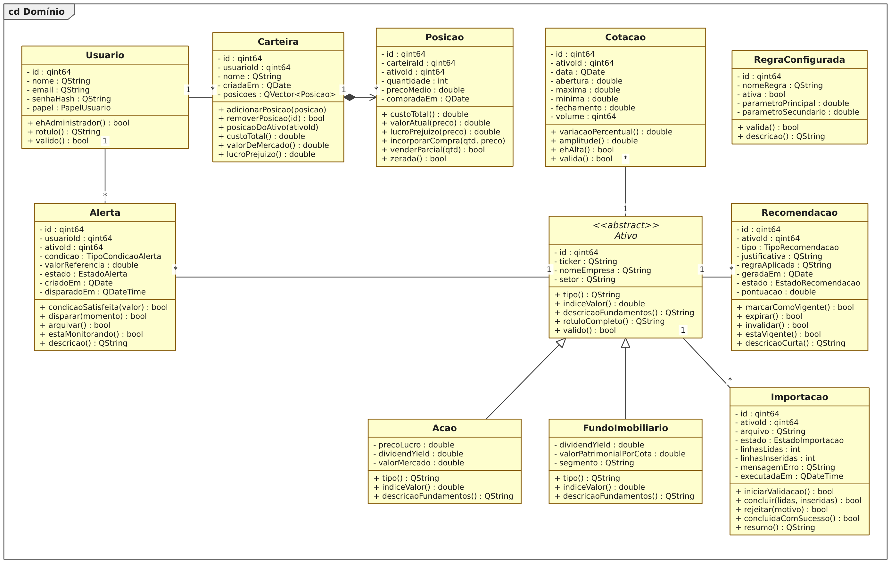

O núcleo de análise aplica o padrão de projeto **Strategy** (GAMMA et al., 2000): a
interface **RegraAnalise** define o contrato `avaliar()`, implementado por quatro
regras concretas (cruzamento de médias móveis, índice de força relativa, dividend
yield e preço sobre lucro), e o **MotorAnalise** compõe as regras ativas e
consolida seus votos em uma recomendação com pontuação entre −1 e +1 [RN015]. Uma
regra sem dados suficientes se abstém [RN019], e a decisão final aplica o limiar de
±0,25 [RN016]. Novas regras entram no sistema implementando a interface, sem
alterar o motor.

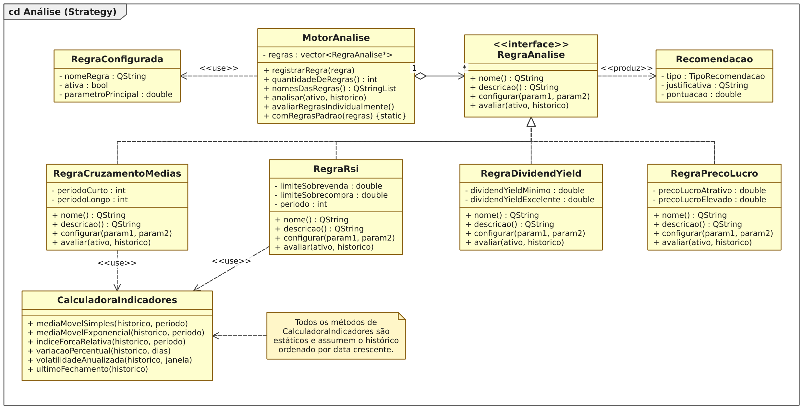

Na arquitetura em camadas destacam-se ainda três padrões: **Observer** — o
ServicoAlerta notifica os observadores registrados (a JanelaPrincipal implementa a
interface ObservadorAlerta) quando um alerta dispara [RF018]; **Repository** — um
repositório por agregado isola o SQL do restante do sistema; e **Singleton** — a
classe BancoDeDados garante uma única conexão com o arquivo SQLite.

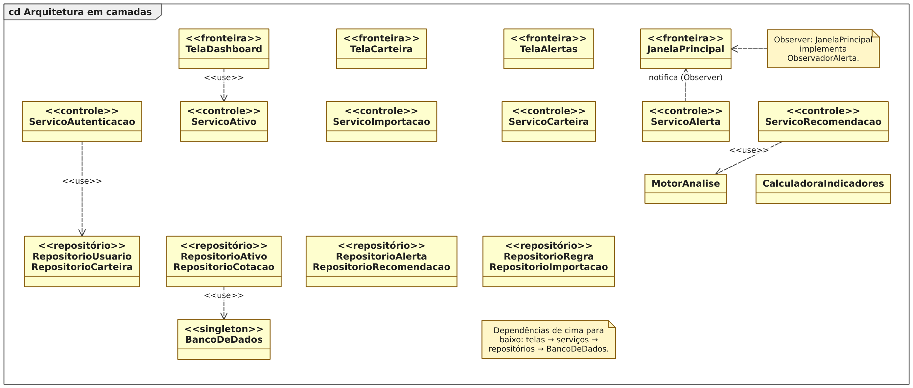

### Dicionário de informações

O Dicionário de Informações é a listagem organizada e rigorosa de todos os elementos de
dados pertinentes ao sistema, de modo que usuário e desenvolvedor conheçam com precisão o
significado, o tamanho, o tipo, o formato e o domínio de cada atributo das classes
modeladas. Ele constitui, portanto, o conjunto de metadados do Analisador B3: enquanto o
Diagrama de Classes mostra a estrutura e os relacionamentos, o Dicionário de Informações
detalha o conteúdo admissível de cada atributo, servindo de contrato entre a análise, o
projeto do banco de dados e a implementação em C++.

Os quadros desta seção descrevem as classes das camadas de **domínio**, de **análise** e de
**persistência**, exatamente como foram implementadas no código-fonte (diretórios
`src/dominio/`, `src/analise/` e `src/persistencia/`). Os nomes dos atributos são os nomes
reais dos membros das classes, com o prefixo `m_` adotado como convenção do projeto para
atributos de instância; constantes de classe aparecem em maiúsculas, sem prefixo.

Convenções adotadas nas colunas dos quadros, conforme a notação apresentada em aula:

- **Tamanho** — número de bytes ocupados pelo tipo, no caso dos tipos numéricos e lógicos,
  ou o limite máximo de caracteres adotado, no caso dos tipos textuais e de data.
- **Formato** — `9` representa dígito numérico, `X` caractere alfanumérico e `A` caractere
  alfabético; as iterações seguem a notação `{X}60` (no máximo 60), `1{X}60` (de 1 a 60) e
  `1{9}` (mínimo de um dígito, sem máximo); datas usam `dd/mm/aaaa` e as seleções são
  representadas entre colchetes, como `[Sim | Não]`.
- **Domínio** — *Contínuo* quando o atributo admite qualquer valor de um intervalo, e
  *Discreto* quando admite apenas valores determinados, caso em que são listados os valores
  e os respectivos significados.
- Atributos que referenciam outras classes do sistema (agregações, composições e
  estratégias) são declarados com tipo **Objeto (Classe)** e domínio **Discreto**, limitado
  às instâncias válidas da classe referenciada.

Em conformidade com a regra de herança aplicável ao Dicionário de Informações, as classes
especializadas `Acao` e `FundoImobiliario` repetem a descrição dos atributos herdados da
superclasse `Ativo`, acrescentando os seus atributos próprios. O quadro da classe abstrata
`Ativo` é apresentado apenas a título de documentação da raiz da hierarquia, uma vez que
essa classe não é instanciada diretamente pelo sistema.

---

**Quadro 19. Dicionário de informações da classe Usuario.**

*Usuario: identifica quem acessa o sistema, define o seu perfil de acesso e é o proprietário das carteiras e dos alertas.*

| Atributo | Descrição | Tamanho | Tipo | Formato | Domínio |
|---|---|---|---|---|---|
| m_id | Identificador único do usuário, gerado pelo banco de dados | 8 | Numérico (qint64) | 1{9} | Contínuo: 1 a 9.223.372.036.854.775.807 |
| m_nome | Nome completo do usuário | 60 | Alfanumérico (QString) | 1{X}60 | Contínuo |
| m_email | Endereço de correio eletrônico, chave natural usada no login | 80 | Alfanumérico (QString) | 1{X}80 | Contínuo, no padrão `usuario@dominio.ext` |
| m_senhaHash | Resumo criptográfico SHA-256 do sal concatenado à senha; a senha em texto puro nunca é armazenada | 64 | Alfanumérico (QString) | {X}64 | Contínuo: dígitos hexadecimais de 0 a f |
| m_papel | Perfil de acesso do usuário no sistema | 4 | Enumerado (PapelUsuario) | {A}13 | Discreto: Investidor = consulta análises, mantém carteira e alertas; Administrador = também mantém ativos, importa cotações, configura regras e gerencia usuários |

---

**Quadro 20. Dicionário de informações da classe Ativo (abstrata).**

*Ativo: raiz abstrata da hierarquia de ativos negociados na B3; concentra os dados de identificação comuns a ações e a fundos imobiliários.*

| Atributo | Descrição | Tamanho | Tipo | Formato | Domínio |
|---|---|---|---|---|---|
| m_id | Identificador único do ativo, gerado pelo banco de dados | 8 | Numérico (qint64) | 1{9} | Contínuo |
| m_ticker | Código de negociação do ativo na bolsa | 6 | Alfanumérico (QString) | 4{X}6 | Contínuo: de 4 a 6 caracteres alfanuméricos, único no sistema (RN005) |
| m_nomeEmpresa | Razão social ou nome de pregão do emissor do ativo | 80 | Alfanumérico (QString) | 1{X}80 | Contínuo |
| m_setor | Setor econômico de atuação do emissor | 40 | Alfanumérico (QString) | {X}40 | Contínuo |

---

**Quadro 21. Dicionário de informações da classe Acao.**

*Acao: ação negociada na B3; especializa Ativo acrescentando os fundamentos Preço/Lucro, Dividend Yield e Valor de Mercado.*

| Atributo | Descrição | Tamanho | Tipo | Formato | Domínio |
|---|---|---|---|---|---|
| m_id | Identificador único do ativo, herdado de Ativo | 8 | Numérico (qint64) | 1{9} | Contínuo |
| m_ticker | Código de negociação do ativo na bolsa, herdado de Ativo | 6 | Alfanumérico (QString) | 4{X}6 | Contínuo: de 4 a 6 caracteres alfanuméricos, único no sistema |
| m_nomeEmpresa | Razão social da companhia emissora, herdado de Ativo | 80 | Alfanumérico (QString) | 1{X}80 | Contínuo |
| m_setor | Setor econômico de atuação, herdado de Ativo | 40 | Alfanumérico (QString) | {X}40 | Contínuo |
| m_precoLucro | Índice Preço/Lucro: cotação dividida pelo lucro por ação; valores menores indicam ação relativamente mais barata | 8 | Numérico (double) | {9}4,99 | Contínuo: 0,00 a 9.999,99 |
| m_dividendYield | Percentual de proventos distribuídos nos últimos doze meses | 8 | Numérico (double) | {9}3,99 | Contínuo: 0,00 a 100,00 |
| m_valorMercado | Valor de mercado da companhia, em reais | 8 | Numérico (double) | {9}15,99 | Contínuo: R$ 0,00 a R$ 999.999.999.999.999,99 |
| PRECO_LUCRO_REFERENCIA | Constante de classe: índice Preço/Lucro de referência (10,0) acima do qual a pontuação fundamentalista é reduzida à metade no cálculo de indiceValor() | 8 | Numérico (double, constante) | {9}4,99 | Contínuo: valor fixo 10,00 |
| DIVIDEND_YIELD_MAXIMO | Constante de classe: Dividend Yield (8,0%) que já garante pontuação máxima no critério de proventos | 8 | Numérico (double, constante) | {9}3,99 | Contínuo: valor fixo 8,00 |

---

**Quadro 22. Dicionário de informações da classe FundoImobiliario.**

*FundoImobiliario: fundo de investimento imobiliário negociado na B3; especializa Ativo acrescentando Dividend Yield, Valor Patrimonial por Cota e segmento de atuação.*

| Atributo | Descrição | Tamanho | Tipo | Formato | Domínio |
|---|---|---|---|---|---|
| m_id | Identificador único do ativo, herdado de Ativo | 8 | Numérico (qint64) | 1{9} | Contínuo |
| m_ticker | Código de negociação do fundo na bolsa, herdado de Ativo | 6 | Alfanumérico (QString) | 4{X}6 | Contínuo: de 4 a 6 caracteres alfanuméricos, único no sistema |
| m_nomeEmpresa | Nome do fundo, herdado de Ativo | 80 | Alfanumérico (QString) | 1{X}80 | Contínuo |
| m_setor | Setor econômico de atuação, herdado de Ativo | 40 | Alfanumérico (QString) | {X}40 | Contínuo |
| m_dividendYield | Percentual de rendimentos distribuídos nos últimos doze meses | 8 | Numérico (double) | {9}3,99 | Contínuo: 0,00 a 100,00 |
| m_valorPatrimonialPorCota | Valor patrimonial de cada cota do fundo, em reais | 8 | Numérico (double) | {9}6,99 | Contínuo: R$ 0,00 a R$ 999.999,99 |
| m_segmento | Segmento imobiliário de atuação do fundo | 30 | Alfanumérico (QString) | {X}30 | Discreto: Logística; Lajes Corporativas; Papel; Shoppings; Renda Urbana; Híbrido |
| DIVIDEND_YIELD_MAXIMO | Constante de classe: Dividend Yield (12,0%) que já garante pontuação máxima no critério de rendimentos | 8 | Numérico (double, constante) | {9}3,99 | Contínuo: valor fixo 12,00 |
| VALOR_PATRIMONIAL_REFERENCIA | Constante de classe: valor patrimonial por cota de referência (R$ 200,00) para pontuação máxima de solidez | 8 | Numérico (double, constante) | {9}6,99 | Contínuo: valor fixo 200,00 |

---

**Quadro 23. Dicionário de informações da classe Cotacao.**

*Cotacao: cotação diária de um ativo no formato candle OHLCV (abertura, máxima, mínima, fechamento e volume); é a base de todos os cálculos técnicos do sistema.*

| Atributo | Descrição | Tamanho | Tipo | Formato | Domínio |
|---|---|---|---|---|---|
| m_id | Identificador único da cotação, gerado pelo banco de dados | 8 | Numérico (qint64) | 1{9} | Contínuo |
| m_ativoId | Identificador do ativo a que a cotação pertence | 8 | Numérico (qint64) | 1{9} | Discreto: identificadores existentes na classe Ativo |
| m_data | Data do pregão a que se refere a cotação | 10 | Data (QDate) | dd/mm/aaaa | Contínuo: 01/01/1990 até a data corrente |
| m_abertura | Preço do primeiro negócio do pregão, em reais | 8 | Numérico (double) | {9}9,99 | Contínuo: maior que R$ 0,00 |
| m_maxima | Maior preço negociado no pregão, em reais | 8 | Numérico (double) | {9}9,99 | Contínuo: maior ou igual à abertura e ao fechamento (RN009) |
| m_minima | Menor preço negociado no pregão, em reais | 8 | Numérico (double) | {9}9,99 | Contínuo: menor ou igual à abertura e ao fechamento (RN009) |
| m_fechamento | Preço do último negócio do pregão, em reais; é o valor usado nos indicadores técnicos | 8 | Numérico (double) | {9}9,99 | Contínuo: maior que R$ 0,00 |
| m_volume | Quantidade total de títulos negociados no pregão | 8 | Numérico (qint64) | {9}18 | Contínuo: maior ou igual a zero |

---

**Quadro 24. Dicionário de informações da classe Indicador.**

*Indicador: valor de um indicador técnico calculado para uma data específica da série histórica, produzido pela CalculadoraIndicadores.*

| Atributo | Descrição | Tamanho | Tipo | Formato | Domínio |
|---|---|---|---|---|---|
| nome | Nome do indicador, formado pela sigla e pelo período utilizado | 20 | Alfanumérico (QString) | 1{X}20 | Discreto: MMS n = média móvel simples de n períodos; MME n = média móvel exponencial de n períodos; RSI n = índice de força relativa de n períodos |
| data | Data do pregão a que o valor calculado se refere | 10 | Data (QDate) | dd/mm/aaaa | Contínuo |
| valor | Valor numérico calculado do indicador na data | 8 | Numérico (double) | {9}9,99 | Contínuo: preços em reais para as médias móveis; 0,00 a 100,00 para o RSI |

---

**Quadro 25. Dicionário de informações da classe Carteira.**

*Carteira: carteira de investimentos de um usuário; agrega, por composição, as posições dos ativos que ele possui.*

| Atributo | Descrição | Tamanho | Tipo | Formato | Domínio |
|---|---|---|---|---|---|
| m_id | Identificador único da carteira, gerado pelo banco de dados | 8 | Numérico (qint64) | 1{9} | Contínuo |
| m_usuarioId | Identificador do usuário proprietário da carteira | 8 | Numérico (qint64) | 1{9} | Discreto: identificadores existentes na classe Usuario |
| m_nome | Nome atribuído à carteira pelo usuário | 40 | Alfanumérico (QString) | 1{X}40 | Contínuo |
| m_criadaEm | Data de criação da carteira | 10 | Data (QDate) | dd/mm/aaaa | Contínuo |
| m_posicoes | Coleção das posições que compõem a carteira, uma por ativo distinto | Variável | Objeto (Posicao) | — | Discreto: instâncias válidas da classe Posicao vinculadas a esta carteira |

---

**Quadro 26. Dicionário de informações da classe Posicao.**

*Posicao: posição de um ativo dentro de uma carteira, com a quantidade detida, o preço médio ponderado de aquisição e a data da compra.*

| Atributo | Descrição | Tamanho | Tipo | Formato | Domínio |
|---|---|---|---|---|---|
| m_id | Identificador único da posição, gerado pelo banco de dados | 8 | Numérico (qint64) | 1{9} | Contínuo |
| m_carteiraId | Identificador da carteira a que a posição pertence | 8 | Numérico (qint64) | 1{9} | Discreto: identificadores existentes na classe Carteira |
| m_ativoId | Identificador do ativo detido na posição | 8 | Numérico (qint64) | 1{9} | Discreto: identificadores existentes na classe Ativo |
| m_quantidade | Quantidade de títulos do ativo atualmente detida | 4 | Numérico (int) | {9}9 | Contínuo: maior que zero; posição zerada é removida da carteira (RN014) |
| m_precoMedio | Preço médio ponderado de aquisição do ativo, em reais, recalculado a cada nova compra (RN013) | 8 | Numérico (double) | {9}9,99 | Contínuo: maior que R$ 0,00 |
| m_compradaEm | Data da compra que originou a posição | 10 | Data (QDate) | dd/mm/aaaa | Contínuo |

---

**Quadro 27. Dicionário de informações da classe Alerta.**

*Alerta: condição de preço ou de variação cadastrada por um usuário sobre um ativo, monitorada pelo sistema a cada nova cotação.*

| Atributo | Descrição | Tamanho | Tipo | Formato | Domínio |
|---|---|---|---|---|---|
| m_id | Identificador único do alerta, gerado pelo banco de dados | 8 | Numérico (qint64) | 1{9} | Contínuo |
| m_usuarioId | Identificador do usuário que cadastrou o alerta | 8 | Numérico (qint64) | 1{9} | Discreto: identificadores existentes na classe Usuario |
| m_ativoId | Identificador do ativo monitorado pelo alerta | 8 | Numérico (qint64) | 1{9} | Discreto: identificadores existentes na classe Ativo |
| m_condicao | Tipo de condição monitorada | 4 | Enumerado (TipoCondicaoAlerta) | {A}21 | Discreto: PrecoAcimaDe = dispara quando o fechamento supera o valor de referência; PrecoAbaixoDe = dispara quando o fechamento fica abaixo do valor de referência; VariacaoDiariaAcimaDe = dispara quando a variação percentual do dia supera o valor de referência |
| m_valorReferencia | Valor com que a cotação é comparada: preço em reais ou variação percentual, conforme a condição | 8 | Numérico (double) | {9}9,99 | Contínuo: maior que zero (RN022) |
| m_estado | Estado do alerta na sua máquina de estados | 4 | Enumerado (EstadoAlerta) | {A}9 | Discreto: Ativo = ainda em monitoração; Disparado = condição satisfeita e usuário notificado; Arquivado = encerrado pelo usuário após o disparo |
| m_criadoEm | Data de cadastro do alerta | 10 | Data (QDate) | dd/mm/aaaa | Contínuo |
| m_disparadoEm | Data e hora do disparo do alerta; permanece nulo enquanto o alerta não dispara | 19 | Data e hora (QDateTime) | dd/mm/aaaa hh:mm:ss | Contínuo, admitindo valor nulo |

---

**Quadro 28. Dicionário de informações da classe Recomendacao.**

*Recomendacao: parecer de compra, venda ou neutralidade gerado pelo MotorAnalise para um ativo, acompanhado da pontuação e da justificativa numérica que o sustentam.*

| Atributo | Descrição | Tamanho | Tipo | Formato | Domínio |
|---|---|---|---|---|---|
| m_id | Identificador único da recomendação, gerado pelo banco de dados | 8 | Numérico (qint64) | 1{9} | Contínuo |
| m_ativoId | Identificador do ativo a que a recomendação se refere | 8 | Numérico (qint64) | 1{9} | Discreto: identificadores existentes na classe Ativo |
| m_tipo | Tipo do parecer emitido | 4 | Enumerado (TipoRecomendacao) | {A}7 | Discreto: Compra = pontuação maior ou igual a +0,25; Venda = pontuação menor ou igual a −0,25; Neutro = pontuação entre os dois limiares (RN016) |
| m_justificativa | Texto que apresenta, regra a regra, os números que levaram à conclusão (RNF006) | 500 | Alfanumérico (QString) | {X}500 | Contínuo |
| m_regraAplicada | Nome canônico da regra ou das regras que produziram o parecer | 120 | Alfanumérico (QString) | {X}120 | Discreto: Cruzamento de Medias Moveis; Indice de Forca Relativa; Dividend Yield; Preco sobre Lucro; ou a combinação delas |
| m_geradaEm | Data em que a recomendação foi produzida | 10 | Data (QDate) | dd/mm/aaaa | Contínuo |
| m_estado | Estado da recomendação na sua máquina de estados | 4 | Enumerado (EstadoRecomendacao) | {A}10 | Discreto: Gerada = produzida e ainda não publicada; Vigente = publicada ao investidor; Expirada = perdeu validade pelo decurso do tempo; Invalidada = substituída por análise mais recente (RN017) |
| m_pontuacao | Pontuação agregada das regras que opinaram: negativa indica venda, positiva indica compra e próxima de zero indica ausência de sinal claro | 8 | Numérico (double) | −9,99 a 9,99 | Contínuo: −1,00 a +1,00 (RN015) |
| LIMIAR_DECISAO | Constante de classe: limiar de pontuação (0,25) que separa o parecer Neutro dos pareceres de Compra e de Venda | 8 | Numérico (double, constante) | 9,99 | Contínuo: valor fixo 0,25 |

---

**Quadro 29. Dicionário de informações da classe RegraConfigurada.**

*RegraConfigurada: configuração persistida de uma regra de análise; permite ligar, desligar e reparametrizar as estratégias do motor sem recompilar o sistema.*

| Atributo | Descrição | Tamanho | Tipo | Formato | Domínio |
|---|---|---|---|---|---|
| m_id | Identificador único da configuração, gerado pelo banco de dados | 8 | Numérico (qint64) | 1{9} | Contínuo |
| m_nomeRegra | Nome canônico da estratégia, que deve coincidir com o nome devolvido por RegraAnalise::nome() | 60 | Alfanumérico (QString) | 1{X}60 | Discreto: Cruzamento de Medias Moveis; Indice de Forca Relativa; Dividend Yield; Preco sobre Lucro |
| m_ativa | Indica se a regra participa da análise; somente as regras ativas são executadas (RN018) | 1 | Lógico (bool) | [Sim \| Não] | Discreto: 1 = Sim, regra em uso; 0 = Não, regra desligada |
| m_parametroPrincipal | Primeiro parâmetro da regra; o significado depende da estratégia: período da média curta, limite de sobrevenda, Dividend Yield mínimo ou Preço/Lucro atrativo | 8 | Numérico (double) | {9}4,99 | Contínuo: maior ou igual a zero |
| m_parametroSecundario | Segundo parâmetro da regra: período da média longa, limite de sobrecompra, Dividend Yield excelente ou Preço/Lucro elevado | 8 | Numérico (double) | {9}4,99 | Contínuo: maior ou igual a zero |

---

**Quadro 30. Dicionário de informações da classe Importacao.**

*Importacao: registro de auditoria de uma carga de cotações a partir de arquivo CSV, com o resultado da validação e as contagens de linhas processadas.*

| Atributo | Descrição | Tamanho | Tipo | Formato | Domínio |
|---|---|---|---|---|---|
| m_id | Identificador único da importação, gerado pelo banco de dados | 8 | Numérico (qint64) | 1{9} | Contínuo |
| m_ativoId | Identificador do ativo cujas cotações foram importadas | 8 | Numérico (qint64) | 1{9} | Discreto: identificadores existentes na classe Ativo |
| m_arquivo | Caminho completo do arquivo CSV processado | 255 | Alfanumérico (QString) | 1{X}255 | Contínuo |
| m_estado | Estado da importação na sua máquina de estados | 4 | Enumerado (EstadoImportacao) | {A}9 | Discreto: Pendente = registrada e ainda não processada; Validando = arquivo em conferência; Concluida = cotações gravadas com sucesso; Rejeitada = arquivo recusado, sem gravar nenhuma linha (RN011) |
| m_linhasLidas | Quantidade de linhas de dados lidas do arquivo | 4 | Numérico (int) | {9}9 | Contínuo: maior ou igual a zero |
| m_linhasInseridas | Quantidade de cotações efetivamente gravadas; é menor que as linhas lidas quando há cotações já existentes (RN010) | 4 | Numérico (int) | {9}9 | Contínuo: de zero até o valor de m_linhasLidas |
| m_mensagemErro | Motivo da rejeição, indicando a linha e a causa do problema, em português (REU003) | 255 | Alfanumérico (QString) | {X}255 | Contínuo; vazio quando a importação é concluída com sucesso |
| m_executadaEm | Data e hora em que a importação foi processada | 19 | Data e hora (QDateTime) | dd/mm/aaaa hh:mm:ss | Contínuo, admitindo valor nulo enquanto pendente |

---

**Quadro 31. Dicionário de informações da interface RegraAnalise.**

*RegraAnalise: interface do padrão de projeto Strategy; define o contrato que toda regra de análise deve cumprir para ser combinada pelo MotorAnalise. Por ser uma interface, não possui atributos, sendo descrita por suas operações.*

| Método | Descrição | Retorno | Parâmetros | Domínio do retorno |
|---|---|---|---|---|
| nome() | Nome canônico da regra; deve ser idêntico ao gravado em RegraConfigurada para que a fábrica do motor localize a estratégia | Alfanumérico (QString) | — | Discreto: Cruzamento de Medias Moveis; Indice de Forca Relativa; Dividend Yield; Preco sobre Lucro |
| descricao() | Explicação do critério aplicado pela regra, exibida ao administrador na tela de configuração de regras | Alfanumérico (QString) | — | Contínuo: até 255 caracteres |
| configurar() | Ajusta os parâmetros da estratégia com os valores lidos de RegraConfigurada | Sem retorno (void) | parametroPrincipal, parametroSecundario (double) | — |
| avaliar() | Avalia o ativo diante da sua série histórica e devolve a recomendação justificada, ou nenhuma opinião quando os dados são insuficientes ou o critério não se aplica ao tipo do ativo (RN019) | Objeto opcional (Recomendacao) | ativo (Ativo), historico (coleção de Cotacao) | Discreto: instância de Recomendacao com pontuação de −1,00 a +1,00, ou ausência de parecer |

---

**Quadro 32. Dicionário de informações da classe RegraCruzamentoMedias.**

*RegraCruzamentoMedias: estratégia técnica que compara duas médias móveis; sinaliza compra quando a média curta cruza para cima da média longa e venda no cruzamento inverso.*

| Atributo | Descrição | Tamanho | Tipo | Formato | Domínio |
|---|---|---|---|---|---|
| m_periodoCurto | Quantidade de pregões da média móvel curta, configurada pelo parâmetro principal da regra | 4 | Numérico (int) | {9}3 | Contínuo: 2 a 200 pregões; valor padrão 9 |
| m_periodoLongo | Quantidade de pregões da média móvel longa, configurada pelo parâmetro secundário da regra | 4 | Numérico (int) | {9}3 | Contínuo: maior que m_periodoCurto, até 200 pregões; valor padrão 21 |

---

**Quadro 33. Dicionário de informações da classe RegraRsi.**

*RegraRsi: estratégia técnica baseada no Índice de Força Relativa de Wilder; indica compra em situação de sobrevenda e venda em situação de sobrecompra.*

| Atributo | Descrição | Tamanho | Tipo | Formato | Domínio |
|---|---|---|---|---|---|
| m_limiteSobrevenda | Valor do RSI abaixo do qual o ativo é considerado descontado, gerando sinal de compra | 8 | Numérico (double) | {9}3,99 | Contínuo: 0,00 a 100,00; valor padrão 30,00 |
| m_limiteSobrecompra | Valor do RSI acima do qual o ativo é considerado esticado, gerando sinal de venda | 8 | Numérico (double) | {9}3,99 | Contínuo: 0,00 a 100,00, maior que m_limiteSobrevenda; valor padrão 70,00 |
| m_periodo | Quantidade de pregões usada no cálculo do RSI | 4 | Numérico (int) | {9}3 | Contínuo: 2 a 200 pregões; valor padrão 14 |

---

**Quadro 34. Dicionário de informações da classe RegraDividendYield.**

*RegraDividendYield: estratégia fundamentalista que avalia o percentual de proventos distribuídos; aplica-se tanto a ações quanto a fundos imobiliários, lendo o fundamento de forma polimórfica.*

| Atributo | Descrição | Tamanho | Tipo | Formato | Domínio |
|---|---|---|---|---|---|
| m_dividendYieldMinimo | Dividend Yield a partir do qual o ativo passa a ser considerado atrativo | 8 | Numérico (double) | {9}3,99 | Contínuo: 0,00 a 100,00; valor padrão 6,00 |
| m_dividendYieldExcelente | Dividend Yield a partir do qual o ativo recebe a pontuação máxima do critério | 8 | Numérico (double) | {9}3,99 | Contínuo: 0,00 a 100,00, maior que m_dividendYieldMinimo; valor padrão 10,00 |

---

**Quadro 35. Dicionário de informações da classe RegraPrecoLucro.**

*RegraPrecoLucro: estratégia fundamentalista que avalia o índice Preço/Lucro; aplica-se somente a ações e abstém-se de opinar quando o ativo é um fundo imobiliário.*

| Atributo | Descrição | Tamanho | Tipo | Formato | Domínio |
|---|---|---|---|---|---|
| m_precoLucroAtrativo | Índice Preço/Lucro até o qual a ação é considerada barata, gerando sinal de compra | 8 | Numérico (double) | {9}4,99 | Contínuo: maior que 0,00; valor padrão 8,00 |
| m_precoLucroElevado | Índice Preço/Lucro a partir do qual a ação é considerada cara, gerando sinal de venda | 8 | Numérico (double) | {9}4,99 | Contínuo: maior que m_precoLucroAtrativo; valor padrão 20,00 |

---

**Quadro 36. Dicionário de informações da classe MotorAnalise.**

*MotorAnalise: contexto do padrão Strategy; guarda as estratégias ativas, executa cada uma delas sobre o ativo e agrega os pareceres em uma única recomendação justificada.*

| Atributo | Descrição | Tamanho | Tipo | Formato | Domínio |
|---|---|---|---|---|---|
| m_regras | Coleção das estratégias de análise registradas no motor, na ordem de execução; o motor assume a propriedade dos objetos | Variável | Objeto (RegraAnalise) | — | Discreto: instâncias de RegraCruzamentoMedias, RegraRsi, RegraDividendYield e RegraPrecoLucro correspondentes às regras ativas |

---

**Quadro 37. Dicionário de informações da classe CalculadoraIndicadores.**

*CalculadoraIndicadores: classe utilitária de cálculos técnicos sobre séries históricas ordenadas por data; todas as suas operações são estáticas, de modo que ela mantém apenas a constante de anualização.*

| Atributo | Descrição | Tamanho | Tipo | Formato | Domínio |
|---|---|---|---|---|---|
| PREGOES_POR_ANO | Constante de classe: quantidade de pregões considerada em um ano (252), usada na anualização da volatilidade | 4 | Numérico (int, constante) | {9}3 | Contínuo: valor fixo 252 |

---

**Quadro 38. Dicionário de informações da classe BancoDeDados.**

*BancoDeDados: fachada única de acesso ao banco SQLite (padrão Singleton); abre a conexão, aplica as migrações versionadas e oferece controle explícito de transação às operações que precisam ser atômicas.*

| Atributo | Descrição | Tamanho | Tipo | Formato | Domínio |
|---|---|---|---|---|---|
| m_conexao | Conexão aberta com o banco de dados, compartilhada por todos os repositórios | Variável | Objeto (QSqlDatabase) | — | Discreto: conexão aberta ou conexão inválida |
| m_caminhoBanco | Caminho do arquivo de banco de dados em uso | 255 | Alfanumérico (QString) | 1{X}255 | Contínuo |
| m_ultimoErro | Mensagem do último erro ocorrido na abertura, na migração ou no controle de transação | 255 | Alfanumérico (QString) | {X}255 | Contínuo; vazio quando não há erro |
| NOME_CONEXAO | Constante de classe: nome lógico da conexão Qt utilizada pela aplicação | 20 | Alfanumérico (QString, constante) | {X}20 | Discreto: valor fixo `analisador-b3` |

---

**Quadro 39. Dicionário de informações da classe RepositorioUsuario.**

*RepositorioUsuario: repositório da tabela usuario; converte objetos Usuario em linhas do banco e vice-versa, isolando o restante do sistema do SQL e utilizando sempre consultas parametrizadas.*

| Atributo | Descrição | Tamanho | Tipo | Formato | Domínio |
|---|---|---|---|---|---|
| m_ultimoErro | Mensagem do último erro de banco ocorrido nas operações de gravação, remoção ou consulta de usuários | 255 | Alfanumérico (QString) | {X}255 | Contínuo; vazio quando a última operação teve sucesso |

---

**Quadro 40. Dicionário de informações da classe RepositorioAtivo.**

*RepositorioAtivo: repositório da tabela ativo; grava e recupera a hierarquia Ativo, Acao e FundoImobiliario em uma única relação, usando a coluna tipo como discriminador e devolvendo a subclasse concreta correspondente.*

| Atributo | Descrição | Tamanho | Tipo | Formato | Domínio |
|---|---|---|---|---|---|
| m_ultimoErro | Mensagem do último erro de banco ocorrido nas operações sobre ativos, inclusive na verificação de unicidade do ticker | 255 | Alfanumérico (QString) | {X}255 | Contínuo; vazio quando a última operação teve sucesso |

---

**Quadro 41. Dicionário de informações da classe RepositorioCotacao.**

*RepositorioCotacao: repositório da tabela cotacao; grava as séries históricas em lote de forma idempotente, apoiando-se no índice de unicidade por ativo e data, e devolve os históricos ordenados por data crescente.*

| Atributo | Descrição | Tamanho | Tipo | Formato | Domínio |
|---|---|---|---|---|---|
| m_ultimoErro | Mensagem do último erro de banco ocorrido na inserção em lote ou nas consultas de série histórica | 255 | Alfanumérico (QString) | {X}255 | Contínuo; vazio quando a última operação teve sucesso |

---

**Quadro 42. Dicionário de informações da classe RepositorioCarteira.**

*RepositorioCarteira: repositório das tabelas carteira e posicao; por serem uma composição no domínio, toda carteira recuperada já vem com as suas posições carregadas, e a gravação de posição atualiza a existente em vez de duplicá-la.*

| Atributo | Descrição | Tamanho | Tipo | Formato | Domínio |
|---|---|---|---|---|---|
| m_ultimoErro | Mensagem do último erro de banco ocorrido nas operações sobre carteiras e posições | 255 | Alfanumérico (QString) | {X}255 | Contínuo; vazio quando a última operação teve sucesso |

---

**Quadro 43. Dicionário de informações da classe RepositorioAlerta.**

*RepositorioAlerta: repositório da tabela alerta; preserva no banco os textos canônicos do estado e da condição, mantendo válida a máquina de estados do domínio.*

| Atributo | Descrição | Tamanho | Tipo | Formato | Domínio |
|---|---|---|---|---|---|
| m_ultimoErro | Mensagem do último erro de banco ocorrido nas operações sobre alertas | 255 | Alfanumérico (QString) | {X}255 | Contínuo; vazio quando a última operação teve sucesso |

---

**Quadro 44. Dicionário de informações da classe RepositorioRecomendacao.**

*RepositorioRecomendacao: repositório da tabela recomendacao; guarda a saída do MotorAnalise e invalida as recomendações anteriores do ativo quando uma nova análise é publicada.*

| Atributo | Descrição | Tamanho | Tipo | Formato | Domínio |
|---|---|---|---|---|---|
| m_ultimoErro | Mensagem do último erro de banco ocorrido na gravação, na consulta ou na invalidação de recomendações | 255 | Alfanumérico (QString) | {X}255 | Contínuo; vazio quando a última operação teve sucesso |

---

**Quadro 45. Dicionário de informações da classe RepositorioRegra.**

*RepositorioRegra: repositório da tabela regra_configurada; é a fonte dos parâmetros com que o MotorAnalise monta as estratégias, permitindo ligar, desligar e reparametrizar regras sem recompilar o sistema.*

| Atributo | Descrição | Tamanho | Tipo | Formato | Domínio |
|---|---|---|---|---|---|
| m_ultimoErro | Mensagem do último erro de banco ocorrido nas operações sobre as configurações de regras | 255 | Alfanumérico (QString) | {X}255 | Contínuo; vazio quando a última operação teve sucesso |

---

**Quadro 46. Dicionário de informações da classe RepositorioImportacao.**

*RepositorioImportacao: repositório da tabela importacao; mantém o histórico de auditoria das cargas de arquivos CSV, com o estado final e as contagens de linhas de cada execução.*

| Atributo | Descrição | Tamanho | Tipo | Formato | Domínio |
|---|---|---|---|---|---|
| m_ultimoErro | Mensagem do último erro de banco ocorrido na gravação ou na consulta do histórico de importações | 255 | Alfanumérico (QString) | {X}255 | Contínuo; vazio quando a última operação teve sucesso |

**Quadro 47. Dicionário de informações da classe ServicoAutenticacao.**

*Concentra as regras de negócio de autenticação e de gestão de usuários: valida credenciais, aplica o resumo criptográfico SHA-256 sobre o sal concatenado à senha (RN004), garante a unicidade do e-mail (RN002), o tamanho mínimo da senha (RN003) e impede a remoção ou o rebaixamento do último administrador (RN006).*

| Atributo | Descrição | Tamanho | Tipo | Formato | Domínio |
| :---- | :---- | :---- | :---- | :---- | :---- |
| SAL | Constante de classe com o sal fixo da aplicação, concatenado à senha antes do cálculo do resumo criptográfico. Valor `aps-b3-2026` | 11 | QString | Alfanumérico | N/A |
| TAMANHO_MINIMO_SENHA | Constante de classe com o número mínimo de caracteres aceito para a senha (RN003). Valor 6 | 4 | int | Numérico | Discreto |
| m_repositorio | Referência ao repositório de usuários, injetada pelo Contexto; é por ela que o serviço consulta e grava os dados persistidos | N/A | RepositorioUsuario& | Objeto | N/A |
| m_ultimoErro | Mensagem do último erro de validação ou de persistência, recuperada pela interface gráfica por meio de `ultimoErro()` | 255 | QString | Alfanumérico | N/A |

**Quadro 48. Dicionário de informações da classe ServicoAtivo.**

*Concentra as regras de negócio do cadastro de ativos, validando o formato e a unicidade do ticker (RN005) e os campos obrigatórios (RN001); devolve os ativos como ponteiros para a classe base Ativo, preservando o polimorfismo entre Acao e FundoImobiliario.*

| Atributo | Descrição | Tamanho | Tipo | Formato | Domínio |
| :---- | :---- | :---- | :---- | :---- | :---- |
| m_repositorio | Referência ao repositório de ativos, injetada pelo Contexto; realiza a leitura e a gravação dos ativos no banco de dados | N/A | RepositorioAtivo& | Objeto | N/A |
| m_ultimoErro | Mensagem do último erro de validação ou de persistência, exibida pela tela que solicitou a operação | 255 | QString | Alfanumérico | N/A |

**Quadro 49. Dicionário de informações da classe ServicoImportacao.**

*Responsável pela carga de cotações a partir de arquivos CSV no padrão brasileiro. A operação é transacional: o arquivo inteiro é lido e validado em memória antes de qualquer escrita, de modo que um único erro estrutural rejeita todo o arquivo (RN011); cotações de mesma data e mesmo ativo são ignoradas, tornando a importação idempotente (RN010).*

| Atributo | Descrição | Tamanho | Tipo | Formato | Domínio |
| :---- | :---- | :---- | :---- | :---- | :---- |
| COLUNAS_ESPERADAS | Constante de classe com o número de colunas exigidas no arquivo (Data, Abertura, Máxima, Mínima, Fechamento e Volume), conforme RN007. Valor 6 | 4 | int | Numérico | Discreto |
| SEPARADOR | Constante de classe com o caractere separador de campos do arquivo exportado pela B3. Valor ponto e vírgula | 2 | QChar | Caractere | N/A |
| m_repositorioCotacao | Referência ao repositório de cotações, destino das linhas validadas | N/A | RepositorioCotacao& | Objeto | N/A |
| m_repositorioAtivo | Referência ao repositório de ativos, usada para casar o nome do arquivo com o ticker cadastrado na importação de diretório | N/A | RepositorioAtivo& | Objeto | N/A |
| m_repositorioImportacao | Referência ao repositório de importações, onde é registrado o histórico de cada execução com o respectivo estado | N/A | RepositorioImportacao& | Objeto | N/A |
| m_ultimoErro | Mensagem do último erro ocorrido na importação | 255 | QString | Alfanumérico | N/A |

**Quadro 50. Dicionário de informações da classe ResultadoImportacao.**

*Estrutura de dados devolvida pelo ServicoImportacao ao término de cada carga; reúne o desfecho da operação e os números que alimentam o relatório apresentado na TelaImportacao.*

| Atributo | Descrição | Tamanho | Tipo | Formato | Domínio |
| :---- | :---- | :---- | :---- | :---- | :---- |
| sucesso | Indica se o arquivo foi aceito e gravado; falso quando houve erro estrutural e nada foi persistido | 1 | bool | Lógico | Discreto |
| linhasLidas | Quantidade de linhas de dados lidas do arquivo, excluído o cabeçalho | 4 | int | Numérico | Discreto |
| linhasInseridas | Quantidade de cotações efetivamente gravadas no banco de dados | 4 | int | Numérico | Discreto |
| linhasIgnoradas | Quantidade de cotações descartadas por já existirem para o mesmo ativo e a mesma data (RN010) | 4 | int | Numérico | Discreto |
| erros | Lista das mensagens de erro, cada uma indicando o número da linha e o motivo da recusa (REU003) | N/A | QStringList | Lista de texto | N/A |

**Quadro 51. Dicionário de informações da classe ServicoCarteira.**

*Concentra as regras de negócio da carteira de investimentos: a compra recalcula o preço médio ponderado da posição (RN013), a venda nunca excede a quantidade existente (RN012) e a posição zerada é removida (RN014). O resumo consolidado cruza as posições com a última cotação de cada ativo para apurar o lucro ou o prejuízo.*

| Atributo | Descrição | Tamanho | Tipo | Formato | Domínio |
| :---- | :---- | :---- | :---- | :---- | :---- |
| m_repositorioCarteira | Referência ao repositório de carteiras e posições, injetada pelo Contexto | N/A | RepositorioCarteira& | Objeto | N/A |
| m_repositorioCotacao | Referência ao repositório de cotações, usada para obter o último fechamento de cada ativo no cálculo do resumo | N/A | RepositorioCotacao& | Objeto | N/A |
| m_repositorioAtivo | Referência ao repositório de ativos, usada para obter o ticker e o nome exibidos em cada linha do resumo | N/A | RepositorioAtivo& | Objeto | N/A |
| m_ultimoErro | Mensagem do último erro de validação, exibida pela TelaCarteira | 255 | QString | Alfanumérico | N/A |

**Quadro 52. Dicionário de informações da classe ResumoCarteira.**

*Estrutura de dados com o resultado consolidado da carteira, calculada por ServicoCarteira::calcularResumo e apresentada no rodapé da TelaCarteira (RF016).*

| Atributo | Descrição | Tamanho | Tipo | Formato | Domínio |
| :---- | :---- | :---- | :---- | :---- | :---- |
| valorInvestido | Soma do custo de aquisição de todas as posições, isto é, quantidade multiplicada pelo preço médio | 8 | double | Decimal (R$) | Contínuo |
| valorAtual | Soma do valor de mercado de todas as posições, avaliado pela última cotação de cada ativo | 8 | double | Decimal (R$) | Contínuo |
| lucroPrejuizo | Diferença entre o valor atual e o valor investido; positivo indica lucro e negativo indica prejuízo (REU002) | 8 | double | Decimal (R$) | Contínuo |
| rentabilidadePercentual | Relação percentual entre o lucro ou prejuízo e o valor investido | 8 | double | Decimal (%) | Contínuo |
| linhas | Coleção das linhas detalhadas do resumo, uma por posição da carteira | N/A | QVector\<LinhaResumoCarteira\> | Lista de objetos | N/A |

**Quadro 53. Dicionário de informações da classe LinhaResumoCarteira.**

*Estrutura de dados que representa uma linha do resumo da carteira: reúne os dados da posição e os valores calculados a partir da última cotação do ativo.*

| Atributo | Descrição | Tamanho | Tipo | Formato | Domínio |
| :---- | :---- | :---- | :---- | :---- | :---- |
| ativoId | Identificador do ativo a que a posição se refere | 8 | qint64 | Numérico | Discreto |
| ticker | Código de negociação do ativo, exibido na primeira coluna da tabela | 6 | QString | Alfanumérico | Discreto |
| nomeAtivo | Nome da empresa ou do fundo correspondente ao ativo | 120 | QString | Alfanumérico | Contínuo |
| quantidade | Quantidade de cotas ou ações mantidas na posição | 4 | int | Numérico | Discreto |
| precoMedio | Preço médio ponderado de aquisição da posição (RN013) | 8 | double | Decimal (R$) | Contínuo |
| precoAtual | Preço de fechamento da última cotação importada para o ativo | 8 | double | Decimal (R$) | Contínuo |
| valorInvestido | Custo de aquisição da posição: quantidade multiplicada pelo preço médio | 8 | double | Decimal (R$) | Contínuo |
| valorAtual | Valor de mercado da posição: quantidade multiplicada pelo preço atual | 8 | double | Decimal (R$) | Contínuo |
| lucroPrejuizo | Diferença entre o valor atual e o valor investido da posição | 8 | double | Decimal (R$) | Contínuo |
| rentabilidadePercentual | Relação percentual entre o lucro ou prejuízo e o valor investido da posição | 8 | double | Decimal (%) | Contínuo |
| temCotacao | Indica se existe cotação importada para o ativo; quando falso, os valores de mercado não são apurados | 1 | bool | Lógico | Discreto |

**Quadro 54. Dicionário de informações da classe ServicoAlerta.**

*Responsável pelo monitoramento dos alertas de preço e sujeito do padrão Observer: compara cada alerta monitorado com a última cotação do ativo, dispara os que satisfazem a condição (RN020) e notifica os observadores registrados, sem conhecer a janela concreta que exibirá a mensagem.*

| Atributo | Descrição | Tamanho | Tipo | Formato | Domínio |
| :---- | :---- | :---- | :---- | :---- | :---- |
| m_repositorioAlerta | Referência ao repositório de alertas, injetada pelo Contexto | N/A | RepositorioAlerta& | Objeto | N/A |
| m_repositorioCotacao | Referência ao repositório de cotações, usada para obter a última cotação de cada ativo monitorado | N/A | RepositorioCotacao& | Objeto | N/A |
| m_repositorioAtivo | Referência ao repositório de ativos, usada para identificar o ativo na notificação enviada ao observador | N/A | RepositorioAtivo& | Objeto | N/A |
| m_observadores | Coleção dos observadores registrados que serão notificados a cada disparo de alerta (padrão Observer) | N/A | std::vector\<ObservadorAlerta\*\> | Lista de ponteiros | N/A |
| m_ultimoErro | Mensagem do último erro de validação, como o valor de referência não positivo (RN022) | 255 | QString | Alfanumérico | N/A |

**Quadro 55. Dicionário de informações da classe ObservadorAlerta.**

*Interface abstrata do padrão Observer. Não possui atributos: declara apenas a operação de notificação que as classes interessadas em receber os disparos de alerta devem implementar — no sistema, a JanelaPrincipal.*

| Atributo | Descrição | Tamanho | Tipo | Formato | Domínio |
| :---- | :---- | :---- | :---- | :---- | :---- |
| alertaDisparado(alerta, ativo, valorObservado) | Método virtual puro chamado uma vez por alerta disparado, recebendo o alerta, o ativo correspondente e o valor que satisfez a condição | N/A | void | Método | N/A |
| ~ObservadorAlerta() | Destrutor virtual, necessário para a destruição correta dos observadores concretos por meio da interface | N/A | virtual | Método | N/A |

**Quadro 56. Dicionário de informações da classe ServicoRecomendacao.**

*Orquestra o motor de análise: monta o MotorAnalise com as regras ativas do banco (RN018), gera a recomendação do ativo e administra o seu ciclo de vida, publicando a nova recomendação como vigente e invalidando a anterior do mesmo ativo (RN017).*

| Atributo | Descrição | Tamanho | Tipo | Formato | Domínio |
| :---- | :---- | :---- | :---- | :---- | :---- |
| COTACOES_MINIMAS | Constante de classe com a quantidade mínima de cotações necessária para que o motor consiga emitir parecer técnico. Valor 2 | 4 | int | Numérico | Discreto |
| m_repositorioRecomendacao | Referência ao repositório de recomendações, onde as recomendações são persistidas e consultadas | N/A | RepositorioRecomendacao& | Objeto | N/A |
| m_repositorioCotacao | Referência ao repositório de cotações, fonte da série histórica submetida às regras | N/A | RepositorioCotacao& | Objeto | N/A |
| m_repositorioAtivo | Referência ao repositório de ativos, usada para recuperar os fundamentos avaliados pelas regras e para gerar recomendações para todos os ativos | N/A | RepositorioAtivo& | Objeto | N/A |
| m_repositorioRegra | Referência ao repositório de regras configuradas, de onde são lidas as regras ativas e os seus parâmetros | N/A | RepositorioRegra& | Objeto | N/A |
| m_ultimoErro | Mensagem do último erro ocorrido na geração da recomendação | 255 | QString | Alfanumérico | N/A |

**Quadro 57. Dicionário de informações da classe Contexto.**

*Contexto da aplicação: é o proprietário dos repositórios e dos serviços e torna explícita a injeção de dependência entre as camadas, pois as telas recebem uma referência ao Contexto e nunca criam repositórios. Os repositórios são declarados antes dos serviços para garantir a ordem correta de inicialização e destruição.*

| Atributo | Descrição | Tamanho | Tipo | Formato | Domínio |
| :---- | :---- | :---- | :---- | :---- | :---- |
| usuarioLogado | Usuário autenticado na sessão corrente; o seu papel determina as telas visíveis na navegação (REU001, RNF005) | N/A | Usuario | Objeto | N/A |
| repositorioUsuario | Repositório de acesso à tabela de usuários | N/A | RepositorioUsuario | Objeto | N/A |
| repositorioAtivo | Repositório de acesso à tabela de ativos, com a construção polimórfica de Acao e FundoImobiliario | N/A | RepositorioAtivo | Objeto | N/A |
| repositorioCotacao | Repositório de acesso à tabela de cotações | N/A | RepositorioCotacao | Objeto | N/A |
| repositorioCarteira | Repositório de acesso às tabelas de carteira e de posição | N/A | RepositorioCarteira | Objeto | N/A |
| repositorioAlerta | Repositório de acesso à tabela de alertas | N/A | RepositorioAlerta | Objeto | N/A |
| repositorioRecomendacao | Repositório de acesso à tabela de recomendações | N/A | RepositorioRecomendacao | Objeto | N/A |
| repositorioRegra | Repositório de acesso à tabela de regras configuradas | N/A | RepositorioRegra | Objeto | N/A |
| repositorioImportacao | Repositório de acesso à tabela de importações | N/A | RepositorioImportacao | Objeto | N/A |
| servicoAutenticacao | Serviço de autenticação e de gestão de usuários | N/A | ServicoAutenticacao | Objeto | N/A |
| servicoAtivo | Serviço de manutenção do cadastro de ativos | N/A | ServicoAtivo | Objeto | N/A |
| servicoImportacao | Serviço de importação de cotações a partir de arquivos CSV | N/A | ServicoImportacao | Objeto | N/A |
| servicoCarteira | Serviço de operações e de consolidação da carteira | N/A | ServicoCarteira | Objeto | N/A |
| servicoAlerta | Serviço de monitoramento e disparo de alertas | N/A | ServicoAlerta | Objeto | N/A |
| servicoRecomendacao | Serviço de geração e publicação de recomendações | N/A | ServicoRecomendacao | Objeto | N/A |

**Quadro 58. Dicionário de informações da classe JanelaPrincipal.**

*Janela principal do sistema, composta por uma navegação lateral e por uma pilha de páginas com as telas; os itens exibidos dependem do papel do usuário autenticado (REU001, RNF005). Implementa a interface ObservadorAlerta e, por isso, é o observador concreto do padrão Observer: recebe do ServicoAlerta cada disparo e o apresenta na barra de estado (RF018).*

| Atributo | Descrição | Tamanho | Tipo | Formato | Domínio |
| :---- | :---- | :---- | :---- | :---- | :---- |
| m_contexto | Referência ao contexto da aplicação, repassada a todas as telas construídas pela janela | N/A | Contexto& | Objeto | N/A |
| m_navegacao | Lista da navegação lateral, com um item por tela permitida ao papel do usuário | N/A | Objeto (QListWidget\*) | Componente gráfico | N/A |
| m_paginas | Pilha de páginas que exibe uma tela por vez, sincronizada com o item selecionado na navegação | N/A | Objeto (QStackedWidget\*) | Componente gráfico | N/A |
| m_rotuloUsuario | Rótulo com o nome e o papel do usuário autenticado, exibido no cabeçalho | N/A | Objeto (QLabel\*) | Componente gráfico | N/A |
| m_telaDashboard | Página do painel de análise do ativo (UC009) | N/A | Objeto (TelaDashboard\*) | Componente gráfico | N/A |
| m_telaDetalhe | Página de detalhe do ativo (UC010) | N/A | Objeto (TelaDetalheAtivo\*) | Componente gráfico | N/A |
| m_telaRecomendacoes | Página das recomendações vigentes (UC012) | N/A | Objeto (TelaRecomendacoes\*) | Componente gráfico | N/A |
| m_telaCarteira | Página da carteira do investidor (UC013, UC014 e UC015) | N/A | Objeto (TelaCarteira\*) | Componente gráfico | N/A |
| m_telaAlertas | Página de alertas de preço (UC016, UC017 e UC018) | N/A | Objeto (TelaAlertas\*) | Componente gráfico | N/A |
| m_telaAtivos | Página de manutenção do cadastro de ativos, exclusiva do administrador (UC002 a UC004 e UC008) | N/A | Objeto (TelaAtivos\*) | Componente gráfico | N/A |
| m_telaImportacao | Página de importação de cotações, exclusiva do administrador (UC005) | N/A | Objeto (TelaImportacao\*) | Componente gráfico | N/A |
| m_telaRegras | Página de configuração das regras de análise, exclusiva do administrador (UC006) | N/A | Objeto (TelaRegras\*) | Componente gráfico | N/A |
| m_telaUsuarios | Página de gestão de usuários, exclusiva do administrador (UC007) | N/A | Objeto (TelaUsuarios\*) | Componente gráfico | N/A |
| m_desejaTrocarUsuario | Indica que a janela foi fechada pela ação "Trocar usuário", para que o programa principal reabra a tela de login | 1 | bool | Lógico | Discreto |

**Quadro 59. Dicionário de informações da classe TelaLogin.**

*Tela de autenticação, apresentada como diálogo modal antes da janela principal (UC001); se o usuário cancelar, a aplicação encerra sem abrir o sistema. A mensagem de erro não revela qual dos dois campos falhou.*

| Atributo | Descrição | Tamanho | Tipo | Formato | Domínio |
| :---- | :---- | :---- | :---- | :---- | :---- |
| m_servico | Referência ao serviço de autenticação, responsável por validar as credenciais informadas | N/A | ServicoAutenticacao& | Objeto | N/A |
| m_campoEmail | Campo de entrada do endereço de e-mail do usuário | N/A | Objeto (QLineEdit\*) | Componente gráfico | N/A |
| m_campoSenha | Campo de entrada da senha, com o conteúdo mascarado na digitação | N/A | Objeto (QLineEdit\*) | Componente gráfico | N/A |
| m_botaoEntrar | Botão que aciona a tentativa de autenticação | N/A | Objeto (QPushButton\*) | Componente gráfico | N/A |
| m_rotuloErro | Rótulo que exibe a mensagem de credenciais inválidas | N/A | Objeto (QLabel\*) | Componente gráfico | N/A |
| m_usuarioAutenticado | Usuário devolvido pelo serviço após a autenticação bem-sucedida; válido somente depois do aceite do diálogo | N/A | Usuario | Objeto | N/A |

**Quadro 60. Dicionário de informações da classe TelaDashboard.**

*Painel principal do investidor (UC009): apresenta o gráfico de candles com as médias móveis sobrepostas (RF009), os cartões com os indicadores técnicos do período (RF010) e a recomendação vigente do ativo com a justificativa completa (RNF006).*

| Atributo | Descrição | Tamanho | Tipo | Formato | Domínio |
| :---- | :---- | :---- | :---- | :---- | :---- |
| PERIODOS | Constante de classe com os períodos de histórico oferecidos no seletor, em dias. Valores 30, 90, 180, 365 e 0, sendo 0 a série inteira | 20 | int[] | Vetor numérico | Discreto |
| QUANTIDADE_PERIODOS | Constante de classe com a quantidade de opções do seletor de período. Valor 5 | 4 | int | Numérico | Discreto |
| m_contexto | Referência ao contexto da aplicação, por onde a tela alcança os serviços e os repositórios | N/A | Contexto& | Objeto | N/A |
| m_campoAtivo | Seletor do ativo em exibição, recarregado a cada entrada na tela com preservação da seleção | N/A | Objeto (QComboBox\*) | Componente gráfico | N/A |
| m_campoPeriodo | Seletor do período de histórico apresentado no gráfico e usado no cálculo dos indicadores | N/A | Objeto (QComboBox\*) | Componente gráfico | N/A |
| m_botaoAnalisar | Botão que solicita ao ServicoRecomendacao a geração de nova recomendação para o ativo em exibição | N/A | Objeto (QPushButton\*) | Componente gráfico | N/A |
| m_botaoDetalhar | Botão que solicita a abertura da tela de detalhe do ativo em exibição | N/A | Objeto (QPushButton\*) | Componente gráfico | N/A |
| m_grafico | Gráfico de candles com as médias móveis curta e longa sobrepostas | N/A | Objeto (GraficoCandlestick\*) | Componente gráfico | N/A |
| m_cartaoFechamento | Cartão com o último preço de fechamento do período | N/A | Objeto (CartaoIndicador\*) | Componente gráfico | N/A |
| m_cartaoVariacao | Cartão com a variação do período, colorida conforme o sinal (REU002) | N/A | Objeto (CartaoIndicador\*) | Componente gráfico | N/A |
| m_cartaoRsi | Cartão com o índice de força relativa calculado para o período | N/A | Objeto (CartaoIndicador\*) | Componente gráfico | N/A |
| m_cartaoVolatilidade | Cartão com a volatilidade apurada no período | N/A | Objeto (CartaoIndicador\*) | Componente gráfico | N/A |
| m_selo | Rótulo em destaque com o tipo da recomendação vigente: Compra, Venda ou Neutro (RN016) | N/A | Objeto (QLabel\*) | Componente gráfico | N/A |
| m_justificativa | Área de texto com a justificativa da recomendação, incluindo a regra aplicada e os números que a sustentam (RNF006) | N/A | Objeto (QTextBrowser\*) | Componente gráfico | N/A |

**Quadro 61. Dicionário de informações da classe TelaDetalheAtivo.**

*Tela de detalhe do ativo (UC010): exibe os fundamentos cadastrados, o gráfico de linha do preço de fechamento, a tabela com as cotações mais recentes e o parecer de cada regra de análise, detalhando o padrão Strategy regra por regra (RF011).*

| Atributo | Descrição | Tamanho | Tipo | Formato | Domínio |
| :---- | :---- | :---- | :---- | :---- | :---- |
| LINHAS_TABELA | Constante de classe com a quantidade de cotações apresentadas na tabela, das mais recentes para as mais antigas. Valor 60 | 4 | int | Numérico | Discreto |
| m_contexto | Referência ao contexto da aplicação | N/A | Contexto& | Objeto | N/A |
| m_campoAtivo | Seletor do ativo detalhado | N/A | Objeto (QComboBox\*) | Componente gráfico | N/A |
| m_rotuloFundamentos | Rótulo com os fundamentos do ativo, variáveis conforme se trate de ação ou de fundo imobiliário | N/A | Objeto (QLabel\*) | Componente gráfico | N/A |
| m_grafico | Gráfico de linha do preço de fechamento do ativo | N/A | Objeto (GraficoLinha\*) | Componente gráfico | N/A |
| m_tabelaCotacoes | Tabela com data, abertura, máxima, mínima, fechamento e volume das cotações importadas | N/A | Objeto (QTableWidget\*) | Componente gráfico | N/A |
| m_pareceres | Área de texto com o parecer individual de cada regra de análise aplicada ao ativo | N/A | Objeto (QTextBrowser\*) | Componente gráfico | N/A |

**Quadro 62. Dicionário de informações da classe TelaRecomendacoes.**

*Tela das recomendações vigentes (UC012): apresenta a lista consolidada por ativo e, no painel lateral, o detalhamento do parecer de cada regra do padrão Strategy, atendendo à exigência de que toda recomendação exiba a regra e os números que a justificaram (RNF006).*

| Atributo | Descrição | Tamanho | Tipo | Formato | Domínio |
| :---- | :---- | :---- | :---- | :---- | :---- |
| m_contexto | Referência ao contexto da aplicação | N/A | Contexto& | Objeto | N/A |
| m_tabela | Tabela das recomendações vigentes, com ticker, tipo, pontuação, regra aplicada e data de geração | N/A | Objeto (QTableWidget\*) | Componente gráfico | N/A |
| m_detalhes | Área de texto com o detalhamento regra a regra da recomendação selecionada | N/A | Objeto (QTextBrowser\*) | Componente gráfico | N/A |
| m_rotuloMensagem | Rótulo de retorno das operações, informando êxito ou erro da geração das recomendações | N/A | Objeto (QLabel\*) | Componente gráfico | N/A |
| m_botaoAbrir | Botão que solicita a abertura do painel de análise no ativo selecionado | N/A | Objeto (QPushButton\*) | Componente gráfico | N/A |

**Quadro 63. Dicionário de informações da classe TelaCarteira.**

*Tela da carteira do investidor (UC013, UC014 e UC015): lista as posições com preço médio, preço atual e lucro ou prejuízo destacado por cor e por sinal (REU002), e apresenta o resumo consolidado no rodapé.*

| Atributo | Descrição | Tamanho | Tipo | Formato | Domínio |
| :---- | :---- | :---- | :---- | :---- | :---- |
| m_contexto | Referência ao contexto da aplicação | N/A | Contexto& | Objeto | N/A |
| m_carteiraId | Identificador da carteira do usuário autenticado, obtido ou criado na primeira entrada na tela | 8 | qint64 | Numérico | Discreto |
| m_tabela | Tabela das posições, uma linha por ativo em carteira | N/A | Objeto (QTableWidget\*) | Componente gráfico | N/A |
| m_rotuloResumo | Rótulo do rodapé com valor investido, valor atual, lucro ou prejuízo e rentabilidade percentual | N/A | Objeto (QLabel\*) | Componente gráfico | N/A |
| m_rotuloMensagem | Rótulo de retorno das operações de compra e de venda | N/A | Objeto (QLabel\*) | Componente gráfico | N/A |
| m_botaoVender | Botão de venda, habilitado somente quando há uma posição selecionada | N/A | Objeto (QPushButton\*) | Componente gráfico | N/A |

**Quadro 64. Dicionário de informações da classe TelaAlertas.**

*Tela de alertas do investidor (UC016, UC017 e UC018): permite cadastrar, remover e arquivar alertas e acionar a avaliação, que percorre os alertas monitorados e dispara os que atingiram a condição; as notificações chegam à JanelaPrincipal pelo padrão Observer.*

| Atributo | Descrição | Tamanho | Tipo | Formato | Domínio |
| :---- | :---- | :---- | :---- | :---- | :---- |
| m_contexto | Referência ao contexto da aplicação | N/A | Contexto& | Objeto | N/A |
| m_tabela | Tabela dos alertas do usuário, com ativo, condição, valor de referência, estado e datas | N/A | Objeto (QTableWidget\*) | Componente gráfico | N/A |
| m_botaoArquivar | Botão de arquivamento, aplicável somente a alerta já disparado (RN021) | N/A | Objeto (QPushButton\*) | Componente gráfico | N/A |
| m_botaoRemover | Botão de exclusão do alerta selecionado | N/A | Objeto (QPushButton\*) | Componente gráfico | N/A |
| m_rotuloMensagem | Rótulo de retorno das operações, com o número de alertas disparados na avaliação | N/A | Objeto (QLabel\*) | Componente gráfico | N/A |

**Quadro 65. Dicionário de informações da classe TelaAtivos.**

*Tela de manutenção do cadastro de ativos, exclusiva do administrador (UC002, UC003, UC004 e UC008): lista os ativos com os seus fundamentos e a quantidade de cotações importadas, permitindo cadastrar, editar, remover e filtrar por ticker ou por nome.*

| Atributo | Descrição | Tamanho | Tipo | Formato | Domínio |
| :---- | :---- | :---- | :---- | :---- | :---- |
| m_contexto | Referência ao contexto da aplicação | N/A | Contexto& | Objeto | N/A |
| m_campoBusca | Campo de filtro por ticker ou por parte do nome da empresa (RF008) | N/A | Objeto (QLineEdit\*) | Componente gráfico | N/A |
| m_tabela | Tabela dos ativos cadastrados, com tipo, ticker, nome, setor, fundamentos e número de cotações | N/A | Objeto (QTableWidget\*) | Componente gráfico | N/A |
| m_botaoEditar | Botão de edição do ativo selecionado | N/A | Objeto (QPushButton\*) | Componente gráfico | N/A |
| m_botaoRemover | Botão de remoção do ativo selecionado | N/A | Objeto (QPushButton\*) | Componente gráfico | N/A |
| m_rotuloMensagem | Rótulo de retorno das operações de cadastro, edição e remoção | N/A | Objeto (QLabel\*) | Componente gráfico | N/A |

**Quadro 66. Dicionário de informações da classe TelaImportacao.**

*Tela de importação de cotações, exclusiva do administrador (UC005): permite importar um arquivo CSV para um ativo específico ou um diretório inteiro, casando o nome TICKER.csv com o cadastro, e exibe o relatório completo da operação e o histórico das importações anteriores.*

| Atributo | Descrição | Tamanho | Tipo | Formato | Domínio |
| :---- | :---- | :---- | :---- | :---- | :---- |
| m_contexto | Referência ao contexto da aplicação | N/A | Contexto& | Objeto | N/A |
| m_campoAtivo | Seletor do ativo de destino das cotações do arquivo | N/A | Objeto (QComboBox\*) | Componente gráfico | N/A |
| m_campoArquivo | Campo com o caminho do arquivo CSV escolhido | 255 | Objeto (QLineEdit\*) | Componente gráfico | N/A |
| m_botaoImportar | Botão que aciona a importação do arquivo selecionado | N/A | Objeto (QPushButton\*) | Componente gráfico | N/A |
| m_rotuloResumo | Rótulo com o resumo da operação: linhas lidas, inseridas e ignoradas | N/A | Objeto (QLabel\*) | Componente gráfico | N/A |
| m_areaErros | Área de texto com a relação dos erros, indicando a linha e o motivo de cada recusa (REU003) | N/A | Objeto (QPlainTextEdit\*) | Componente gráfico | N/A |
| m_tabelaHistorico | Tabela do histórico das importações, com arquivo, estado, contagens e data de execução | N/A | Objeto (QTableWidget\*) | Componente gráfico | N/A |

**Quadro 67. Dicionário de informações da classe TelaRegras.**

*Tela de configuração das regras de análise, exclusiva do administrador (UC006): permite ativar, desativar e reparametrizar as estratégias sem recompilar o sistema, uma vez que o MotorAnalise lê essas configurações a cada análise (RN018).*

| Atributo | Descrição | Tamanho | Tipo | Formato | Domínio |
| :---- | :---- | :---- | :---- | :---- | :---- |
| m_contexto | Referência ao contexto da aplicação | N/A | Contexto& | Objeto | N/A |
| m_tabela | Tabela das regras configuradas, com nome, situação de ativação e parâmetros | N/A | Objeto (QTableWidget\*) | Componente gráfico | N/A |
| m_botaoEditar | Botão de edição dos parâmetros da regra selecionada | N/A | Objeto (QPushButton\*) | Componente gráfico | N/A |
| m_botaoAlternar | Botão que ativa ou desativa a regra selecionada | N/A | Objeto (QPushButton\*) | Componente gráfico | N/A |
| m_rotuloMensagem | Rótulo de retorno das operações de configuração | N/A | Objeto (QLabel\*) | Componente gráfico | N/A |

**Quadro 68. Dicionário de informações da classe TelaUsuarios.**

*Tela de gestão de usuários, exclusiva do administrador (UC007): apresenta os usuários cadastrados e aciona o cadastro, a edição e a remoção; as regras de negócio de unicidade do e-mail, tamanho mínimo da senha e proteção do último administrador permanecem no ServicoAutenticacao.*

| Atributo | Descrição | Tamanho | Tipo | Formato | Domínio |
| :---- | :---- | :---- | :---- | :---- | :---- |
| m_contexto | Referência ao contexto da aplicação | N/A | Contexto& | Objeto | N/A |
| m_tabela | Tabela dos usuários cadastrados, com nome, e-mail e papel | N/A | Objeto (QTableWidget\*) | Componente gráfico | N/A |
| m_botaoEditar | Botão de edição do usuário selecionado | N/A | Objeto (QPushButton\*) | Componente gráfico | N/A |
| m_botaoRemover | Botão de remoção do usuário selecionado, sujeito à proteção do último administrador (RN006) | N/A | Objeto (QPushButton\*) | Componente gráfico | N/A |
| m_rotuloMensagem | Rótulo de retorno das operações de cadastro, edição e remoção | N/A | Objeto (QLabel\*) | Componente gráfico | N/A |

**Quadro 69. Dicionário de informações da classe DialogoAtivo.**

*Diálogo de cadastro e de edição de ativos: o tipo escolhido determina quais campos de fundamentos ficam habilitados e qual subclasse concreta de Ativo é construída, evidenciando o polimorfismo entre Acao e FundoImobiliario.*

| Atributo | Descrição | Tamanho | Tipo | Formato | Domínio |
| :---- | :---- | :---- | :---- | :---- | :---- |
| INDICE_ACAO | Constante de classe com o índice da opção "Ação" no seletor de tipo. Valor 0 | 4 | int | Numérico | Discreto |
| INDICE_FUNDO | Constante de classe com o índice da opção "Fundo Imobiliário" no seletor de tipo. Valor 1 | 4 | int | Numérico | Discreto |
| m_campoTipo | Seletor do tipo do ativo, que determina a subclasse construída | N/A | Objeto (QComboBox\*) | Componente gráfico | N/A |
| m_campoTicker | Campo do código de negociação, de 4 a 6 caracteres alfanuméricos (RN005) | 6 | Objeto (QLineEdit\*) | Componente gráfico | N/A |
| m_campoNome | Campo do nome da empresa ou do fundo | 120 | Objeto (QLineEdit\*) | Componente gráfico | N/A |
| m_campoSetor | Campo do setor de atuação do ativo | 60 | Objeto (QLineEdit\*) | Componente gráfico | N/A |
| m_campoPrecoLucro | Campo do índice preço/lucro, habilitado apenas para ações | N/A | Objeto (QDoubleSpinBox\*) | Componente gráfico | N/A |
| m_campoDividendYield | Campo do rendimento de dividendos em percentual, comum aos dois tipos | N/A | Objeto (QDoubleSpinBox\*) | Componente gráfico | N/A |
| m_campoValorMercado | Campo do valor de mercado, habilitado apenas para ações | N/A | Objeto (QDoubleSpinBox\*) | Componente gráfico | N/A |
| m_campoValorPatrimonial | Campo do valor patrimonial por cota, habilitado apenas para fundos imobiliários | N/A | Objeto (QDoubleSpinBox\*) | Componente gráfico | N/A |
| m_campoSegmento | Campo do segmento do fundo imobiliário, habilitado apenas para esse tipo | 60 | Objeto (QLineEdit\*) | Componente gráfico | N/A |
| m_rotuloPrecoLucro | Rótulo do campo de preço/lucro, oculto quando o tipo escolhido é fundo imobiliário | N/A | Objeto (QLabel\*) | Componente gráfico | N/A |
| m_rotuloValorMercado | Rótulo do campo de valor de mercado, oculto quando o tipo escolhido é fundo imobiliário | N/A | Objeto (QLabel\*) | Componente gráfico | N/A |
| m_rotuloValorPatrimonial | Rótulo do campo de valor patrimonial por cota, oculto quando o tipo escolhido é ação | N/A | Objeto (QLabel\*) | Componente gráfico | N/A |
| m_rotuloSegmento | Rótulo do campo de segmento, oculto quando o tipo escolhido é ação | N/A | Objeto (QLabel\*) | Componente gráfico | N/A |
| m_idEmEdicao | Identificador do ativo em edição, preservado na construção do objeto; vale zero no cadastro de ativo novo | 8 | qint64 | Numérico | Discreto |

**Quadro 70. Dicionário de informações da classe DialogoOperacao.**

*Diálogo de compra e de venda de ativos na carteira: o mesmo formulário atende às duas operações; no modo Compra solicita preço e data, e no modo Venda limita a quantidade à posição existente e dispensa o preço, pois a venda apenas reduz a posição registrada (RN012).*

| Atributo | Descrição | Tamanho | Tipo | Formato | Domínio |
| :---- | :---- | :---- | :---- | :---- | :---- |
| m_modo | Modo de operação do diálogo: Compra ou Venda | 4 | Modo (enumeração) | Enumerado | Discreto |
| m_opcoes | Coleção dos ativos oferecidos no diálogo, com os limites aplicáveis a cada operação | N/A | QVector\<OpcaoOperacao\> | Lista de objetos | N/A |
| m_campoAtivo | Seletor do ativo objeto da operação | N/A | Objeto (QComboBox\*) | Componente gráfico | N/A |
| m_campoQuantidade | Campo da quantidade negociada, limitado à posição existente no modo Venda | N/A | Objeto (QSpinBox\*) | Componente gráfico | N/A |
| m_campoPreco | Campo do preço unitário de compra, sugerido a partir da última cotação | N/A | Objeto (QDoubleSpinBox\*) | Componente gráfico | N/A |
| m_campoData | Campo da data da compra | N/A | Objeto (QDateEdit\*) | Componente gráfico | N/A |
| m_rotuloPreco | Rótulo do campo de preço, oculto no modo Venda | N/A | Objeto (QLabel\*) | Componente gráfico | N/A |
| m_rotuloData | Rótulo do campo de data, oculto no modo Venda | N/A | Objeto (QLabel\*) | Componente gráfico | N/A |
| m_rotuloLimite | Rótulo informativo com a quantidade máxima disponível para venda do ativo escolhido | N/A | Objeto (QLabel\*) | Componente gráfico | N/A |

**Quadro 71. Dicionário de informações da classe OpcaoOperacao.**

*Estrutura de dados que descreve um ativo oferecido no DialogoOperacao, com o preço sugerido e o limite de quantidade aplicáveis à operação.*

| Atributo | Descrição | Tamanho | Tipo | Formato | Domínio |
| :---- | :---- | :---- | :---- | :---- | :---- |
| ativoId | Identificador do ativo correspondente à opção | 8 | qint64 | Numérico | Discreto |
| rotulo | Texto apresentado no seletor, formado pelo ticker e pelo nome do ativo | 130 | QString | Alfanumérico | Contínuo |
| precoSugerido | Preço proposto para a compra, obtido da última cotação importada do ativo | 8 | double | Decimal (R$) | Contínuo |
| quantidadeMaxima | Quantidade máxima passível de venda, igual à posição existente na carteira | 4 | int | Numérico | Discreto |

**Quadro 72. Dicionário de informações da classe DialogoAlerta.**

*Diálogo de cadastro de alerta de preço: reúne o ativo monitorado, a condição de disparo e o valor de referência, que deve ser maior que zero (RN022). As condições oferecidas correspondem aos valores da enumeração TipoCondicaoAlerta do domínio.*

| Atributo | Descrição | Tamanho | Tipo | Formato | Domínio |
| :---- | :---- | :---- | :---- | :---- | :---- |
| m_opcoes | Coleção dos ativos oferecidos no diálogo, com o último fechamento de cada um | N/A | QVector\<OpcaoAlerta\> | Lista de objetos | N/A |
| m_campoAtivo | Seletor do ativo a ser monitorado pelo alerta | N/A | Objeto (QComboBox\*) | Componente gráfico | N/A |
| m_campoCondicao | Seletor da condição de disparo: preço acima de, preço abaixo de ou variação diária acima de | N/A | Objeto (QComboBox\*) | Componente gráfico | N/A |
| m_campoValor | Campo do valor de referência comparado à última cotação do ativo (RN020) | N/A | Objeto (QDoubleSpinBox\*) | Componente gráfico | N/A |
| m_rotuloAjuda | Rótulo auxiliar com a sugestão baseada no último fechamento do ativo escolhido | N/A | Objeto (QLabel\*) | Componente gráfico | N/A |

**Quadro 73. Dicionário de informações da classe OpcaoAlerta.**

*Estrutura de dados que descreve um ativo oferecido no DialogoAlerta, com o último fechamento usado como valor sugerido para a condição.*

| Atributo | Descrição | Tamanho | Tipo | Formato | Domínio |
| :---- | :---- | :---- | :---- | :---- | :---- |
| ativoId | Identificador do ativo correspondente à opção | 8 | qint64 | Numérico | Discreto |
| rotulo | Texto apresentado no seletor, formado pelo ticker e pelo nome do ativo | 130 | QString | Alfanumérico | Contínuo |
| ultimoFechamento | Preço de fechamento da última cotação importada, proposto como valor de referência | 8 | double | Decimal (R$) | Contínuo |

**Quadro 74. Dicionário de informações da classe DialogoRegra.**

*Diálogo de configuração de uma regra de análise do padrão Strategy. O nome da regra não é editável, pois é a chave que o MotorAnalise utiliza para instanciar a estratégia concreta; são ajustáveis apenas os parâmetros e a situação de ativação.*

| Atributo | Descrição | Tamanho | Tipo | Formato | Domínio |
| :---- | :---- | :---- | :---- | :---- | :---- |
| m_regra | Cópia da regra recebida, base do objeto devolvido com os valores informados no formulário | N/A | RegraConfigurada | Objeto | N/A |
| m_campoAtiva | Caixa de seleção que define se a regra participa das análises (RN018) | N/A | Objeto (QCheckBox\*) | Componente gráfico | N/A |
| m_campoPrincipal | Campo do primeiro parâmetro da regra, com duas casas decimais e faixa de 0,00 a 100.000,00 | N/A | Objeto (QDoubleSpinBox\*) | Componente gráfico | N/A |
| m_campoSecundario | Campo do segundo parâmetro da regra, com duas casas decimais e faixa de 0,00 a 100.000,00 | N/A | Objeto (QDoubleSpinBox\*) | Componente gráfico | N/A |
| m_rotuloDescricao | Rótulo explicativo do significado dos parâmetros da regra em configuração | N/A | Objeto (QLabel\*) | Componente gráfico | N/A |

**Quadro 75. Dicionário de informações da classe DialogoUsuario.**

*Diálogo de cadastro e de edição de usuários, exclusivo do administrador: no cadastro a senha é obrigatória e, na edição, deixar o campo em branco mantém a senha atual.*

| Atributo | Descrição | Tamanho | Tipo | Formato | Domínio |
| :---- | :---- | :---- | :---- | :---- | :---- |
| m_ehEdicao | Indica se o diálogo foi aberto em modo de edição de usuário existente | 1 | bool | Lógico | Discreto |
| m_original | Cópia do usuário recebido, cujo identificador e resumo de senha são preservados na edição | N/A | Usuario | Objeto | N/A |
| m_campoNome | Campo do nome do usuário | 120 | Objeto (QLineEdit\*) | Componente gráfico | N/A |
| m_campoEmail | Campo do endereço de e-mail, que deve ser único no sistema (RN002) | 120 | Objeto (QLineEdit\*) | Componente gráfico | N/A |
| m_campoSenha | Campo da senha, com o conteúdo mascarado e mínimo de 6 caracteres no cadastro (RN003) | 60 | Objeto (QLineEdit\*) | Componente gráfico | N/A |
| m_campoPapel | Seletor do papel do usuário: Administrador ou Investidor | N/A | Objeto (QComboBox\*) | Componente gráfico | N/A |
| m_rotuloAjuda | Rótulo auxiliar que informa as regras de preenchimento da senha conforme o modo do diálogo | N/A | Objeto (QLabel\*) | Componente gráfico | N/A |

**Quadro 76. Dicionário de informações da classe CartaoIndicador.**

*Componente gráfico compacto para a apresentação de um indicador no painel: exibe o título, o valor em destaque e uma linha de detalhe que pode ser colorida conforme o sinal do número, atendendo à exigência de distinguir ganho e perda por cor e por sinal (REU002).*

| Atributo | Descrição | Tamanho | Tipo | Formato | Domínio |
| :---- | :---- | :---- | :---- | :---- | :---- |
| m_rotuloTitulo | Rótulo com o nome do indicador apresentado no cartão | 40 | Objeto (QLabel\*) | Componente gráfico | N/A |
| m_rotuloValor | Rótulo com o valor principal do indicador, em destaque tipográfico | 20 | Objeto (QLabel\*) | Componente gráfico | N/A |
| m_rotuloDetalhe | Rótulo com a informação complementar, colorido em verde para valores positivos, em vermelho para negativos e em cinza para zero | 40 | Objeto (QLabel\*) | Componente gráfico | N/A |

**Quadro 77. Dicionário de informações da classe GraficoCandlestick.**

*Componente gráfico que desenha o gráfico de candles (abertura, máxima, mínima e fechamento) com as médias móveis sobrepostas, construído com o módulo Qt Charts (RF009). Ao instalar um gráfico novo, destrói explicitamente o anterior, pois a troca do gráfico apenas libera a posse do objeto substituído.*

| Atributo | Descrição | Tamanho | Tipo | Formato | Domínio |
| :---- | :---- | :---- | :---- | :---- | :---- |
| MAXIMO_ROTULOS_EIXO | Constante de classe com o número máximo de rótulos exibidos no eixo de datas, para preservar a legibilidade. Valor 12 | 4 | int | Numérico | Discreto |

**Quadro 78. Dicionário de informações da classe GraficoLinha.**

*Componente gráfico que desenha a linha do preço de fechamento do ativo, utilizado na tela de detalhe e em visualizações secundárias (RF011). Assim como o gráfico de candles, destrói o gráfico anterior a cada redesenho, evitando o vazamento de memória.*

| Atributo | Descrição | Tamanho | Tipo | Formato | Domínio |
| :---- | :---- | :---- | :---- | :---- | :---- |
| definirDados(titulo, cotacoes) | Método que recebe a série de cotações já ordenada por data e redesenha a linha de fechamento. A classe não declara atributos próprios: herda o estado do componente QChartView e mantém o gráfico corrente sob a posse dele | N/A | void | Método | N/A |
| mostrarMensagem(mensagem) | Método que substitui o gráfico por uma mensagem, empregado quando não há cotações suficientes para o desenho | N/A | void | Método | N/A |

### Diagrama de Objetos

Os diagramas de objetos a seguir mostram instâncias do sistema em dois momentos
representativos, com os valores reais da base de demonstração. A
Figura 18 captura o instante em que o motor de análise avalia a ação
PETR4 e produz uma recomendação de compra; a Figura 19 mostra a
carteira de um investidor com três posições e seus preços médios.

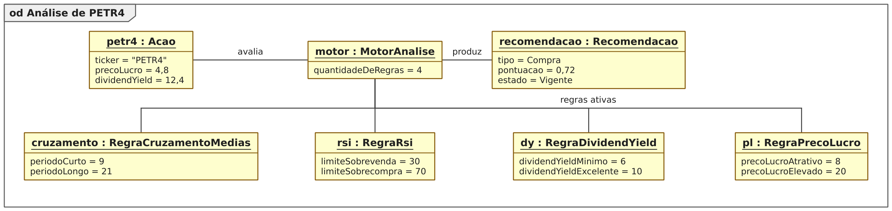

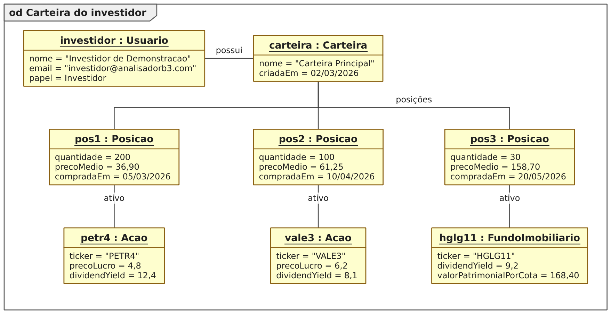

### Diagramas de Sequência

Cada caso de uso possui um Diagrama de Sequência do seu fluxo básico, seguindo as
camadas da arquitetura: o ator interage com uma tela ou diálogo, que aciona o
serviço responsável; o serviço aplica as regras de negócio e usa os repositórios,
que executam o SQL sobre a conexão do BancoDeDados. As mensagens são numeradas
hierarquicamente e os retornos relevantes aparecem tracejados.

![Figura 20. Diagrama de sequência para o [UC001].](figuras/seq-uc001.png)

![Figura 21. Diagrama de sequência para o [UC002].](figuras/seq-uc002.png)

![Figura 22. Diagrama de sequência para o [UC003].](figuras/seq-uc003.png)

![Figura 23. Diagrama de sequência para o [UC004].](figuras/seq-uc004.png)

![Figura 24. Diagrama de sequência para o [UC005].](figuras/seq-uc005.png)

![Figura 25. Diagrama de sequência para o [UC006].](figuras/seq-uc006.png)

![Figura 26. Diagrama de sequência para o [UC007].](figuras/seq-uc007.png)

![Figura 27. Diagrama de sequência para o [UC008].](figuras/seq-uc008.png)

![Figura 28. Diagrama de sequência para o [UC009].](figuras/seq-uc009.png)

![Figura 29. Diagrama de sequência para o [UC010].](figuras/seq-uc010.png)

![Figura 30. Diagrama de sequência para o [UC011].](figuras/seq-uc011.png)

![Figura 31. Diagrama de sequência para o [UC012].](figuras/seq-uc012.png)

![Figura 32. Diagrama de sequência para o [UC013].](figuras/seq-uc013.png)

![Figura 33. Diagrama de sequência para o [UC014].](figuras/seq-uc014.png)

![Figura 34. Diagrama de sequência para o [UC015].](figuras/seq-uc015.png)

![Figura 35. Diagrama de sequência para o [UC016].](figuras/seq-uc016.png)

![Figura 36. Diagrama de sequência para o [UC017].](figuras/seq-uc017.png)

![Figura 37. Diagrama de sequência para o [UC018].](figuras/seq-uc018.png)


```{=openxml}
<w:p><w:r><w:br w:type="page"/></w:r></w:p>
```

```{=latex}
\newpage
```

# 5 CONCLUSÕES

Este Plano do Projeto consolidou o ciclo de análise do sistema AB3 — Analisador de
Ativos da B3. A partir da entrevista com o cliente foram levantados 19 requisitos
funcionais, 7 não funcionais, 4 restrições de projeto e 4 requisitos de experiência
do usuário, todos rastreáveis aos 18 casos de uso especificados no padrão da
disciplina e às classes do Diagrama de Classes — cada informação citada nos fluxos
dos casos de uso existe como atributo no dicionário de informações, e cada caso de
uso possui seu Diagrama de Sequência.

O estudo de viabilidade confirmou a exequibilidade do projeto no contexto do
cliente: custo zero em ferramentas, funcionamento offline e operação pelos próprios
membros do clube. A estimativa de esforço combinou duas técnicas — Planning Poker
(116 horas) e Pontos de Caso de Uso (145,45 UCP) — que convergiram na
identificação dos pontos de maior complexidade: a importação transacional de
cotações, o painel gráfico de análise e o motor de recomendações.

Destaca-se que o protótipo apresentado no Capítulo 4 já foi construído na
tecnologia definitiva (C++ com Qt 6 e SQLite), navegável em todos os casos de uso e
calculando indicadores reais sobre cotações importadas — o que antecipa riscos
técnicos que só apareceriam na implementação e dá segurança às estimativas
apresentadas.

## 5.1 Trabalhos Futuros

Para o segundo bimestre, o projeto prossegue com: a modelagem dinâmica complementar
(Diagramas de Comunicação, mapeamento Entidade-Relacionamento, Diagramas de Estados
e de Atividades); o endurecimento do sistema com a cobertura dos fluxos de exceção
especificados e testes automatizados; e a preparação dos Testes de Validação, com a
demonstração de cada caso de uso mapeada ao seu Diagrama de Sequência. Como
evoluções além do escopo da disciplina, vislumbram-se a atualização automática de
cotações via API quando houver conexão, novas regras de análise (MACD e Bandas de
Bollinger) e o backtesting das regras sobre o histórico importado.


```{=openxml}
<w:p><w:r><w:br w:type="page"/></w:r></w:p>
```

```{=latex}
\newpage
```

# 6 REFERÊNCIAS BIBLIOGRÁFICAS

B3 — BRASIL, BOLSA, BALCÃO. **Cotações históricas**. Disponível em:
https://www.b3.com.br/pt_br/market-data-e-indices/servicos-de-dados/market-data/historico/.
Acesso em: ago. 2026.

BOOCH, G.; RUMBAUGH, J.; JACOBSON, I. **UML: guia do usuário**. 2. ed. Rio de
Janeiro: Elsevier, 2005.

FOWLER, M. **UML essencial: um breve guia para a linguagem-padrão de modelagem de
objetos**. 3. ed. Porto Alegre: Bookman, 2005.

GAMMA, E.; HELM, R.; JOHNSON, R.; VLISSIDES, J. **Padrões de projeto: soluções
reutilizáveis de software orientado a objetos**. Porto Alegre: Bookman, 2000.

GRENNING, J. **Planning Poker or how to avoid analysis paralysis while release
planning**. Hawthorn Woods: Renaissance Software Consulting, 2002.

KARNER, G. **Resource estimation for Objectory projects**. Kista: Objective Systems
SF AB, 1993.

MURPHY, J. J. **Technical analysis of the financial markets**. New York: New York
Institute of Finance, 1999.

PRESSMAN, R. S.; MAXIM, B. R. **Engenharia de software: uma abordagem
profissional**. 8. ed. Porto Alegre: AMGH, 2016.

SOMMERVILLE, I. **Engenharia de software**. 9. ed. São Paulo: Pearson Prentice
Hall, 2011.

SQLITE CONSORTIUM. **SQLite documentation**. Disponível em:
https://sqlite.org/docs.html. Acesso em: ago. 2026.

THE QT COMPANY. **Qt 6 documentation**. Disponível em: https://doc.qt.io/qt-6/.
Acesso em: ago. 2026.

WILDER, J. W. **New concepts in technical trading systems**. Greensboro: Trend
Research, 1978.
